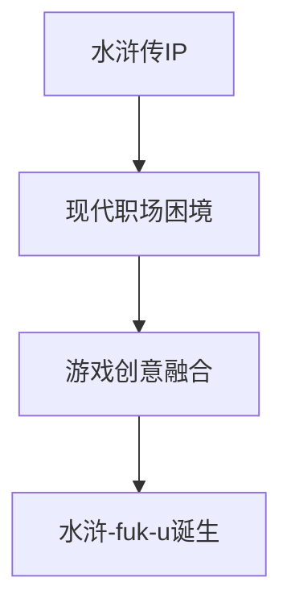
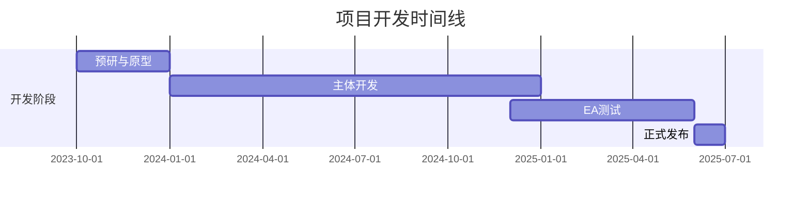

### 《水浒-fuk-u》项目简介文档

---

#### 一、项目背景与起源

**1.1 创意起源**


**1.2 项目愿景**
- 重新诠释水浒精神在现代的意义
- 探讨职场生存与反抗的永恒主题
- 通过游戏形式传递社会价值反思

#### 二、项目定位

**2.1 游戏类型**
- 主类型：单机策略卡牌RPG
- 副类型：职场模拟、剧情驱动
- 特色要素：肉鸽元素、社交系统

**2.2 发行平台**
| 平台 | 发售优先级 | 预期上线时间 | 特殊优化 |
|------|------------|--------------|----------|
| PC（Steam） | 第一优先 | 2025 Q2 | 高清材质 |
| PC（Epic） | 第一优先 | 2025 Q2 | 独占内容 |
| 移动端 | 后续规划 | 2026 Q1 | 触控优化 |

#### 三、项目规模

**3.1 开发周期**


**3.2 团队规模**
| 职能 | 人数 | 主要职责 | 时间投入 |
|------|------|----------|----------|
| 程序开发 | 15人 | 核心系统开发 | 全职 |
| 游戏策划 | 8人 | 系统与关卡设计 | 全职 |
| 美术设计 | 12人 | 视觉资产制作 | 全职 |
| 测试团队 | 6人 | 品质保证 | 全职 |
| 运营团队 | 4人 | 市场与社区 | 全职 |

#### 四、核心创新点

**4.1 游戏玩法创新**
- **双层叙事系统**：
  ```mermaid
  graph LR
  A[古代武侠] -->|现代演绎| B[职场战斗]
  B -->|系统映射| C[技能转化]
  C -->|玩法融合| D[独特体验]
  ```

- **场景互动机制**：
  | 古代元素 | 现代转化 | 玩法效果 |
  |----------|----------|----------|
  | 武艺切磋 | 职场PK | 竞争晋升 |
  | 结义情谊 | 办公室社交 | 关系养成 |
  | 江湖情报 | 公司八卦 | 信息收集 |

**4.2 技术创新点**
- 自研水墨渲染系统
- AI驱动的NPC行为系统
- 动态剧情生成系统
- 创新的卡牌战斗引擎

#### 五、技术路线

**5.1 核心技术选型**
| 技术领域 | 选型方案 | 技术优势 | 风险控制 |
|----------|----------|----------|----------|
| 游戏引擎 | Unity 2022 LTS | 稳定性好，生态丰富 | 版本锁定 |
| 渲染技术 | URP | 性能优秀，跨平台 | 预留升级空间 |
| 网络方案 | 单机+云存档 | 实现简单，易维护 | 存档加密 |
| AI系统 | 自研行为树 | 灵活可控 | 预设备案 |

**5.2 关键技术难点**
1. 水墨风格的实时渲染
2. 大规模NPC行为模拟
3. 动态任务生成系统
4. 复杂的技能连携系统

#### 六、亮点特色

**6.1 游戏特色**
- 水墨赛博朋克美术风格
- 独特的职场生存玩法
- 深度的社交关系系统
- 丰富的剧情分支选择

**6.2 商业特色**
- 创新的商业模式设计
- 多元的变现方式
- 强大的IP价值开发
- 良好的口碑积累潜力

#### 七、预期目标

**7.1 商业目标**
| 目标指标 | 数值预期 | 达成周期 | 评估方式 |
|----------|----------|----------|----------|
| 首月销量 | 50万份 | 30天 | 平台数据 |
| 首年收入 | 5000万 | 12个月 | 财务报表 |
| 口碑评分 | 8.5+ | 持续 | 平台评分 |

**7.2 产品目标**
- 打造独特的游戏品类
- 建立稳定的用户群体
- 形成可持续的内容生态
- 积累品牌影响力

#### 八、风险评估

**8.1 主要风险点**
| 风险类型 | 风险等级 | 应对措施 | 预案准备 |
|----------|----------|----------|----------|
| 题材风险 | 中 | 合规性评估 | 多版本准备 |
| 技术风险 | 中 | 充分测试 | 替代方案 |
| 市场风险 | 低 | 差异化竞争 | 营销策略 |
| 运营风险 | 低 | 社区维护 | 危机公关 |

**8.2 风险控制**
- 建立完整的风险预警系统
- 制定详细的应急响应方案
- 保持产品策略的灵活性
- 维护良好的用户关系

---

#### 九、后续规划

1. 建立完整的项目管理体系
2. 细化各系统技术方案
3. 完善风险控制体系
4. 制定详细的里程碑计划
5. 构建高效的团队协作流程
