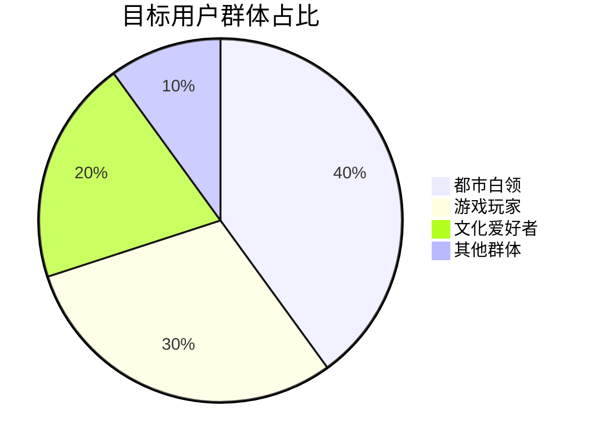
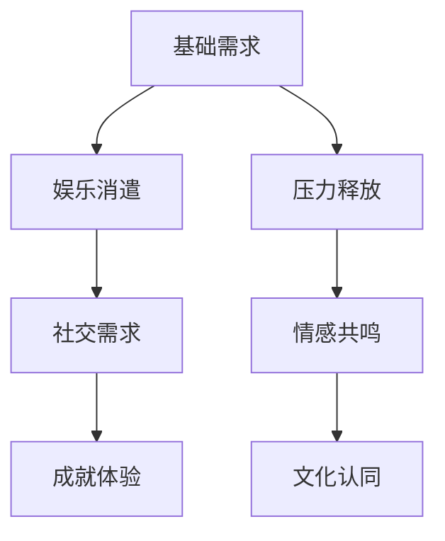
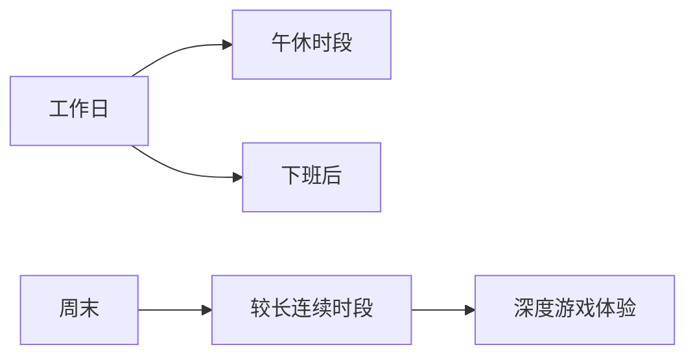
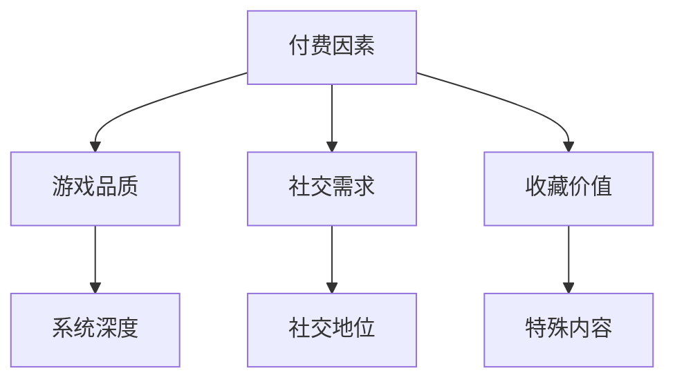
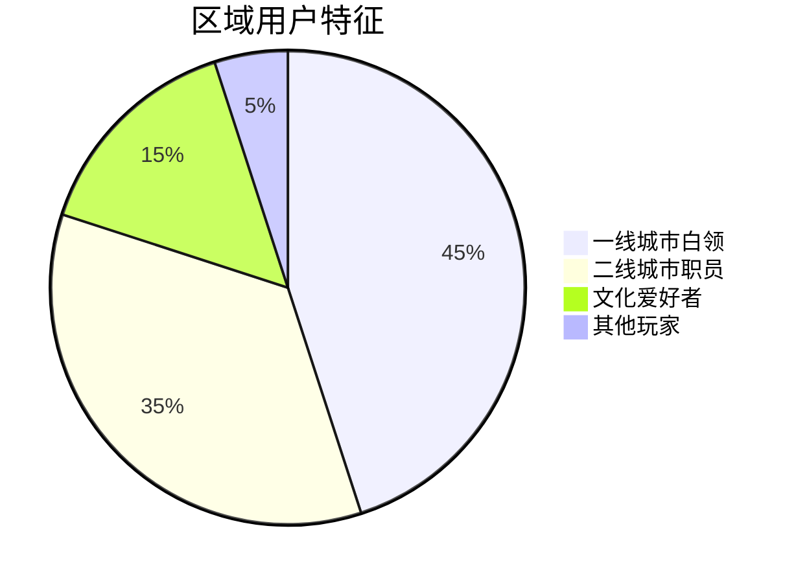
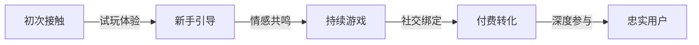

### 《水浒-fuk-u》目标受众分析文档

---

#### 一、核心用户画像

**1.1 主要用户群体分布**

**1.2 用户画像详解**

1. **都市白领**
   | 特征维度 | 描述 | 游戏诉求 | 变现潜力 |
   |----------|------|----------|----------|
   | 年龄 | 25-35岁 | 压力释放 | 高 |
   | 职业 | 公司职员 | 共鸣感 | 中高 |
   | 收入 | 8k-25k/月 | 社交需求 | 稳定 |
   | 时间投入 | 工作日2h/天 | 碎片化游戏 | - |

2. **游戏玩家**
   | 特征维度 | 描述 | 游戏诉求 | 变现潜力 |
   |----------|------|----------|----------|
   | 年龄 | 18-35岁 | 游戏体验 | 中 |
   | 游戏偏好 | 策略/卡牌/RPG | 玩法创新 | 高 |
   | 游戏习惯 | 每日3-4h | 深度内容 | 稳定 |
   | 消费习惯 | 愿意为好游戏付费 | 品质要求 | - |

3. **文化爱好者**
   | 特征维度 | 描述 | 游戏诉求 | 变现潜力 |
   |----------|------|----------|----------|
   | 年龄 | 20-45岁 | 文化体验 | 中 |
   | 文化兴趣 | 传统文学/历史 | IP还原度 | 低 |
   | 消费特征 | 注重文化价值 | 内容深度 | 不稳定 |
   | 参与度 | 深度但间歇性 | 剧情体验 | - |

#### 二、用户需求分析

**2.1 核心需求层级**

**2.2 需求特征分析**
| 需求类型 | 表现形式 | 满足方式 | 重要程度 |
|----------|----------|----------|----------|
| 压力释放 | 对抗企业BOSS | 战斗系统 | ★★★★★ |
| 情感共鸣 | 职场困境共情 | 剧情设计 | ★★★★☆ |
| 社交需求 | 工会组建 | 社交系统 | ★★★★☆ |
| 成就体验 | 角色成长 | 养成系统 | ★★★★☆ |
| 文化认同 | IP还原度 | 世界观设计 | ★★★☆☆ |

#### 三、用户行为特征

**3.1 游戏时间分布**

**3.2 玩家行为模式**
| 时段 | 行为特征 | 游戏内容 | 设计建议 |
|------|----------|----------|----------|
| 早晚通勤 | 碎片化游戏 | 每日任务 | 简单快捷 |
| 午休时间 | 短期休闲 | 社交互动 | 轻度内容 |
| 下班后 | 中度投入 | 主线剧情 | 故事性强 |
| 周末 | 深度体验 | 副本挑战 | 高难内容 |

#### 四、消费能力评估

**4.1 消费层级分布**
| 用户层级 | 月均消费 | 占比 | 消费特征 |
|----------|----------|------|----------|
| 重度付费 | >500元 | 5% | 追求完整体验 |
| 中度付费 | 100-500元 | 15% | 性价比导向 |
| 轻度付费 | <100元 | 40% | 选择性消费 |
| 免费用户 | 0元 | 40% | 纯体验派 |

**4.2 付费意愿分析**

#### 五、地域分布预测

**5.1 核心市场分布**
| 地区 | 用户占比 | 特征 | 运营策略 |
|------|----------|------|----------|
| 一线城市 | 45% | 高压职场 | 共鸣营销 |
| 二线城市 | 35% | 中等压力 | 性价比 |
| 其他城市 | 20% | 文化认同 | 文化营销 |

**5.2 区域特征分析**

#### 六、用户增长路径

**6.1 获取渠道**
| 渠道 | 预期占比 | 获取成本 | 用户质量 |
|------|----------|----------|----------|
| 社交媒体 | 35% | 中 | 高 |
| 游戏平台 | 30% | 低 | 中 |
| 口碑传播 | 20% | 低 | 高 |
| 其他渠道 | 15% | 低 | 中 |

**6.2 用户转化路径**

#### 七、用户留存策略

**7.1 留存节点设计**
| 时间节点 | 关键内容 | 激励措施 | 预期留存率 |
|----------|----------|----------|------------|
| 首日 | 新手体验 | 丰厚奖励 | 80% |
| 7日 | 社交建立 | 社交礼包 | 50% |
| 30日 | 公会系统 | 公会特权 | 30% |
| 90日 | 深度内容 | 专属内容 | 20% |

**7.2 长期运营策略**
- 定期推出新剧情内容
- 举办社区互动活动
- 保持游戏内容更新
- 维护玩家社交关系

#### 八、风险因素

**8.1 用户流失风险**
| 风险点 | 影响程度 | 防范措施 | 应对策略 |
|--------|----------|----------|----------|
| 内容枯竭 | 高 | 预制内容 | 动态生成 |
| 社交断层 | 中 | 社交激励 | 匹配优化 |
| 难度失衡 | 中 | 数值平衡 | 难度调节 |
| 审美疲劳 | 低 | 风格创新 | 定期更新 |

---

#### 九、改进建议

1. 加强游戏与职场文化的结合
2. 优化碎片化游戏体验
3. 增强社交系统的趣味性
4. 提供更多个性化内容
5. 完善用户反馈机制
