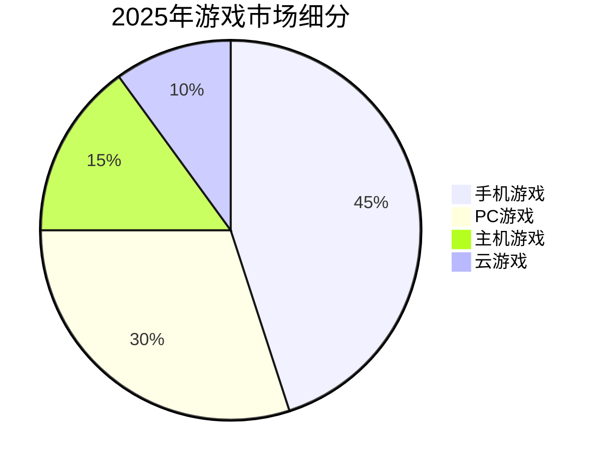
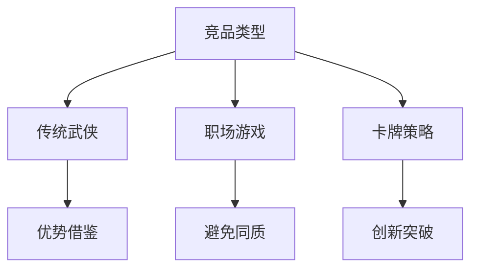
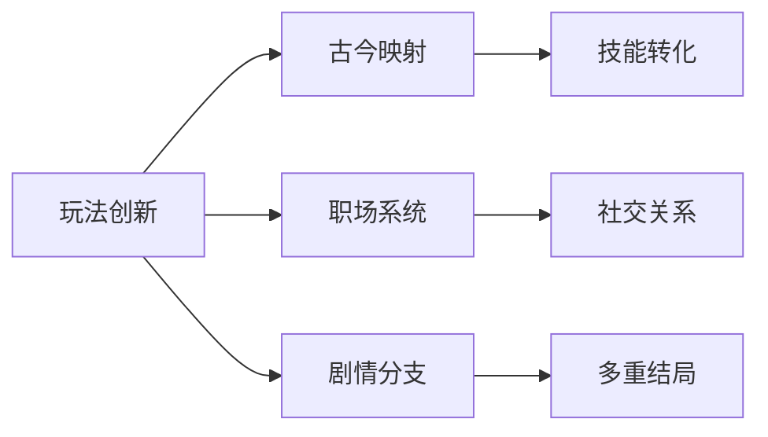
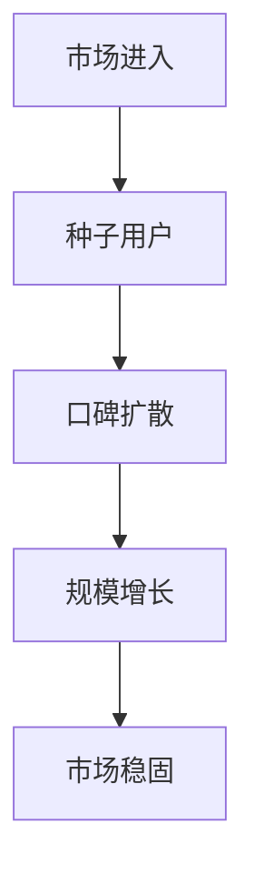
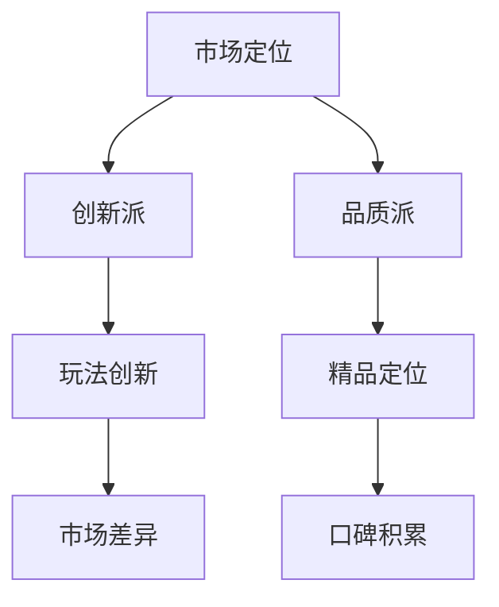
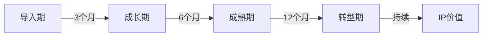
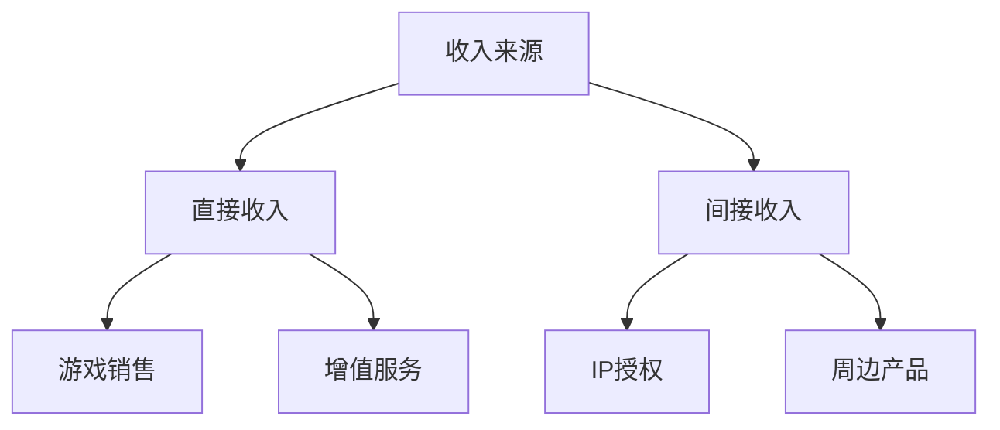

### 《水浒-fuk-u》市场定位文档

---

#### 一、市场环境分析

**1.1 游戏市场现状**

**1.2 市场机遇与挑战**
| 机遇 | 挑战 | 应对策略 | 优先级 |
|------|------|----------|---------|
| 国风游戏热潮 | 题材同质化 | 创新玩法 | 高 |
| 职场题材空白 | 内容敏感性 | 隐喻表达 | 高 |
| IP价值提升 | 版权风险 | 再创作 | 中 |
| 付费意愿增强 | 竞品丰富 | 差异化 | 中 |

#### 二、竞品分析

**2.1 直接竞品分析**
| 游戏名 | 类型 | 优势 | 劣势 | 市场表现 |
|--------|------|------|------|----------|
| 修仙打工人 | 放置类 | 轻度休闲 | 深度不足 | MAU 100w |
| 职场人生 | 模拟经营 | 真实还原 | 玩法单一 | MAU 50w |
| 公司模拟器 | 策略类 | 系统完善 | 题材刻板 | MAU 80w |

**2.2 间接竞品分析**

#### 三、差异化定位

**3.1 核心差异点**
| 维度 | 差异化特征 | 实现方式 | 预期效果 |
|------|------------|----------|----------|
| 题材融合 | 古今结合 | 双线叙事 | 新鲜感 |
| 玩法创新 | 卡牌+养成 | 系统联动 | 深度感 |
| 美术风格 | 水墨赛博 | 视觉冲突 | 独特性 |
| 社交系统 | 职场关系 | 多维互动 | 粘性 |

**3.2 创新点分析**

#### 四、市场策略

**4.1 目标市场细分**
| 市场群体 | 规模预估 | 增长潜力 | 营销策略 |
|----------|----------|----------|----------|
| 核心玩家 | 100万 | 高 | 玩法导向 |
| 水墨粉丝 | 50万 | 中 | 美术导向 |
| 职场人群 | 200万 | 高 | 共鸣导向 |
| IP粉丝 | 80万 | 中 | 情怀导向 |

**4.2 市场渗透路径**

#### 五、竞争策略

**5.1 差异化战略**
| 竞争维度 | 具体策略 | 执行方案 | 预期效果 |
|----------|----------|----------|----------|
| 产品形态 | 双线叙事 | 古今结合 | 独特性 |
| 内容深度 | 多重结局 | 分支剧情 | 可玩性 |
| 社交系统 | 职场关系 | 多维互动 | 粘性 |
| 商业模式 | 合理付费 | 价值导向 | 收入稳定 |

**5.2 市场占位**

#### 六、产品生命周期

**6.1 各阶段策略**
| 阶段 | 重点策略 | 运营方向 | 预期目标 |
|------|----------|----------|----------|
| 导入期 | 话题营销 | 内容推广 | 品牌认知 |
| 成长期 | 口碑积累 | 社区运营 | 用户增长 |
| 成熟期 | 内容更新 | 活动运营 | 收入稳定 |
| 衰退期 | IP延展 | 价值转化 | 价值延续 |

**6.2 生命周期规划**

#### 七、商业模式

**7.1 收入结构**
| 收入类型 | 占比 | 增长潜力 | 可持续性 |
|----------|------|----------|----------|
| 游戏本体 | 40% | 中 | 高 |
| 付费DLC | 25% | 高 | 中 |
| 订阅服务 | 20% | 高 | 高 |
| 周边衍生 | 15% | 中 | 中 |

**7.2 盈利模式**

#### 八、风险评估

**8.1 市场风险**
| 风险类型 | 风险等级 | 应对措施 | 预案 |
|----------|----------|----------|------|
| 政策风险 | 高 | 合规审核 | 预留修改 |
| 竞品风险 | 中 | 差异创新 | 特色强化 |
| 市场风险 | 中 | 持续调研 | 策略调整 |
| 口碑风险 | 低 | 品质把控 | 及时响应 |

**8.2 风险控制**
- 建立完整的风险评估体系
- 制定详细的应急预案
- 保持产品策略灵活性
- 重视用户反馈收集

---

#### 九、发展建议

1. 强化产品差异化特色
2. 深化职场题材内容
3. 完善社交系统设计
4. 规划长期运营方案
5. 建立IP价值体系
