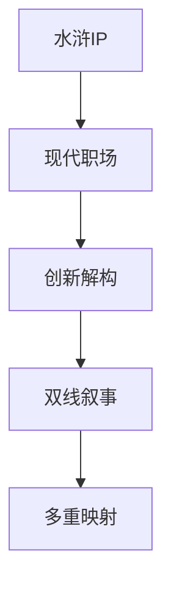
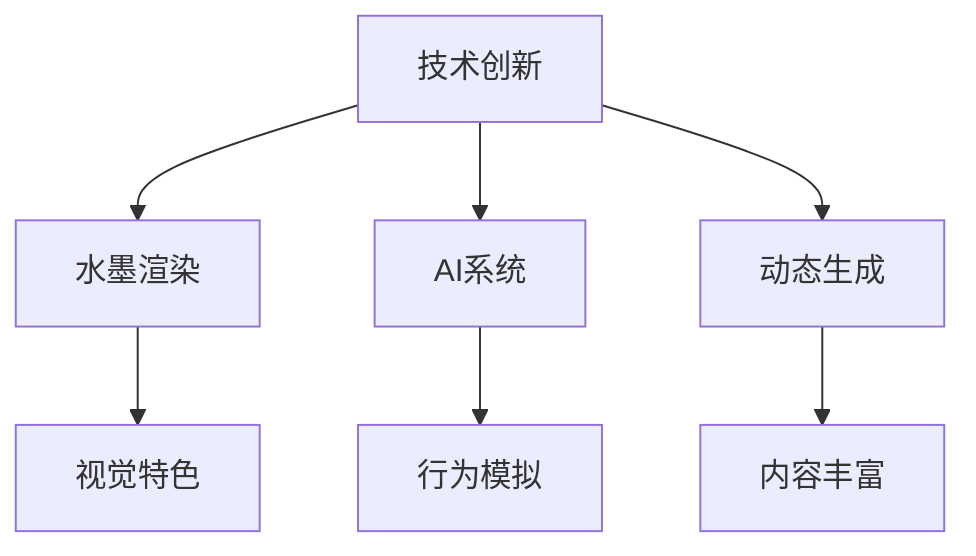
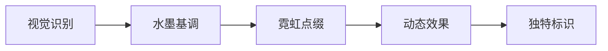
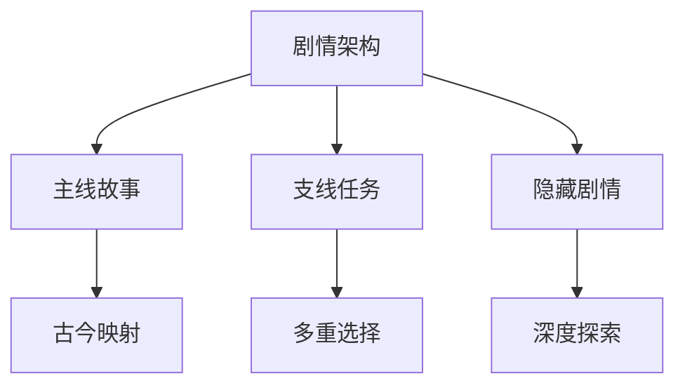
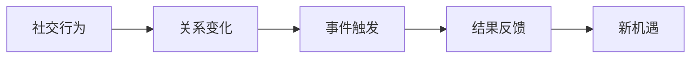
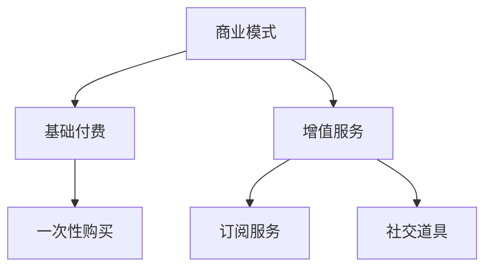
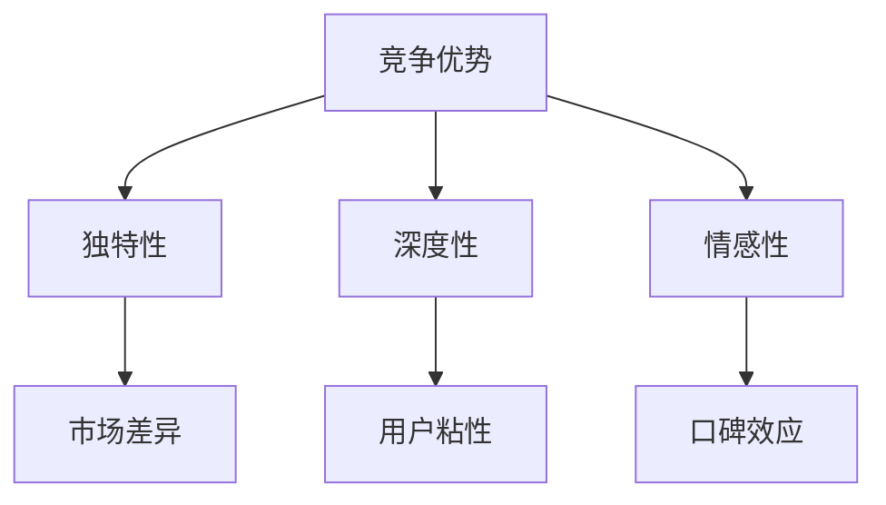

### 《水浒-fuk-u》核心卖点文档

---

#### 一、游戏特色亮点

**1.1 创新题材融合**


**1.2 核心吸引力**
| 卖点维度 | 创新特色 | 玩家价值 | 市场独特性 |
|----------|----------|----------|------------|
| 题材转化 | 古今对照 | 新鲜感 | 首创 |
| 玩法设计 | 双线成长 | 深度感 | 独特 |
| 美术风格 | 水墨赛博 | 视觉冲击 | 稀有 |
| 剧情内容 | 职场隐喻 | 共鸣感 | 差异化 |

#### 二、玩法创新特色

**2.1 战斗系统创新**
- **技能转化机制**：
  | 古代技能 | 现代映射 | 效果表现 | 独特性 |
  |----------|----------|----------|---------|
  | 打虎拳法 | 项目攻坚 | 伤害爆发 | 高 |
  | 太极心法 | 职场周旋 | 控制效果 | 高 |
  | 梁山绝技 | 团队配合 | 连携技能 | 中 |

- **战斗流程创新**：
  ```mermaid
  graph LR
  A[回合制基底] --> B[卡牌元素]
  B --> C[技能连携]
  C --> D[场景互动]
  D --> E[多结局]
  ```

**2.2 职场系统设计**
| 系统名称 | 创新点 | 实现方式 | 玩家反馈 |
|----------|--------|----------|----------|
| 压力系统 | 动态平衡 | 数值调节 | 真实感 |
| 社交关系 | 多维互动 | 复杂网络 | 策略性 |
| 成长路线 | 双线发展 | 技能树 | 自由度 |

#### 三、技术创新点

**3.1 核心技术特色**


**3.2 创新技术详解**
| 技术点 | 创新性 | 实现难度 | 效果预期 |
|--------|--------|----------|----------|
| 水墨引擎 | 自研 | 高 | 独特视觉 |
| AI行为树 | 改进 | 中 | 智能NPC |
| 动态剧情 | 创新 | 高 | 高自由度 |

#### 四、美术风格特色

**4.1 视觉风格创新**
- **古今结合**：
  | 元素类型 | 古代特征 | 现代转化 | 视觉效果 |
  |----------|----------|----------|----------|
  | 人物造型 | 水浒英雄 | 职场装扮 | 反差感 |
  | 场景设计 | 水墨意境 | 赛博朋克 | 冲突美 |
  | 特效表现 | 武侠格调 | 科技感 | 融合感 |

**4.2 美术标识性**


#### 五、剧情创新

**5.1 叙事结构**
| 叙事层面 | 创新点 | 实现方式 | 情感诉求 |
|----------|--------|----------|----------|
| 主线剧情 | 双线并行 | 古今映射 | 深度思考 |
| 支线故事 | 多重分支 | 选择影响 | 个人代入 |
| 隐藏剧情 | 条件触发 | 探索发现 | 惊喜感 |

**5.2 剧情特色**


#### 六、社交系统创新

**6.1 关系网络**
| 系统特色 | 创新点 | 实现方式 | 社交价值 |
|----------|--------|----------|----------|
| 派系关系 | 动态变化 | 行为影响 | 策略性强 |
| 好感度 | 多维度 | 综合计算 | 真实感强 |
| 社交影响 | 蝴蝶效应 | 连锁反应 | 深度强 |

**6.2 互动机制**


#### 七、商业模式创新

**7.1 创新付费点**
| 付费类型 | 创新特色 | 价值主张 | 接受度 |
|----------|----------|----------|---------|
| 职场技能包 | 实用性强 | 双线应用 | 高 |
| 社交道具 | 互动性强 | 关系建立 | 中 |
| 角色成长 | 差异化强 | 个性体验 | 高 |

**7.2 商业创新**


#### 八、竞争优势

**8.1 市场优势**
| 优势点 | 具体表现 | 竞争力 | 持续性 |
|--------|----------|---------|---------|
| 题材创新 | 独特融合 | 强 | 长期 |
| 玩法深度 | 系统联动 | 强 | 中期 |
| 画面特色 | 视觉冲击 | 中 | 长期 |
| 情感共鸣 | 现实映射 | 强 | 长期 |

**8.2 核心竞争力**


---

#### 九、后续发展

1. 持续深化双线叙事系统
2. 扩展职场玩法内容
3. 优化社交互动机制
4. 增加剧情分支选择
5. 强化美术风格特色
