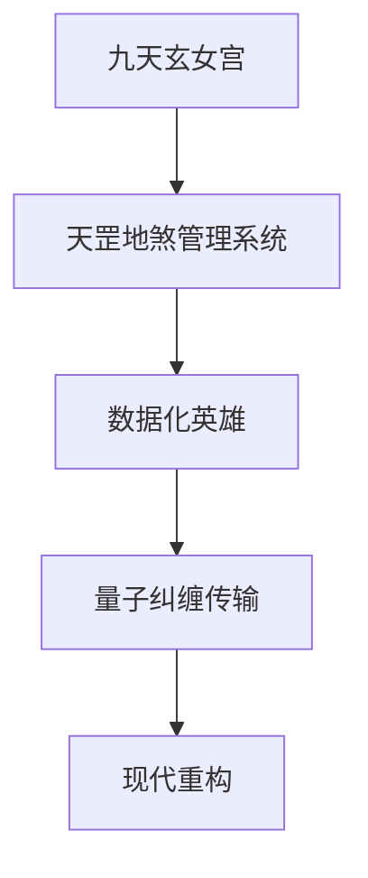
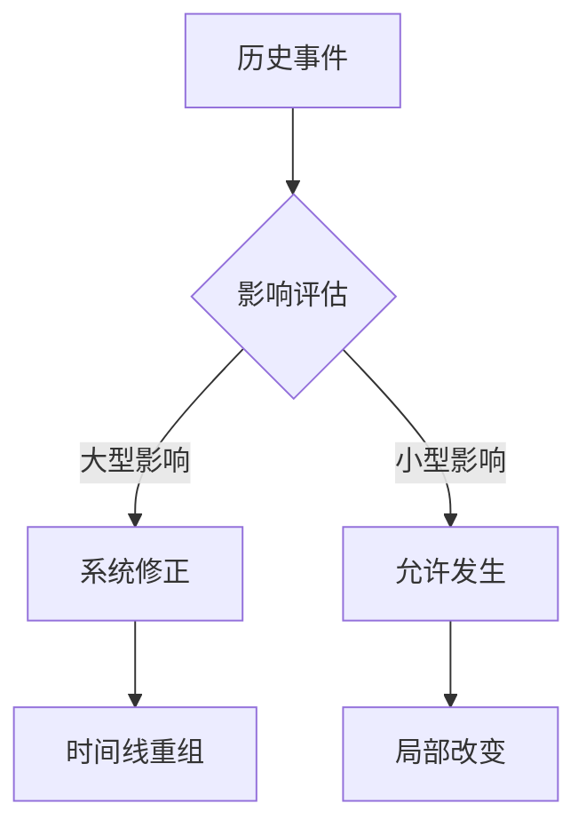
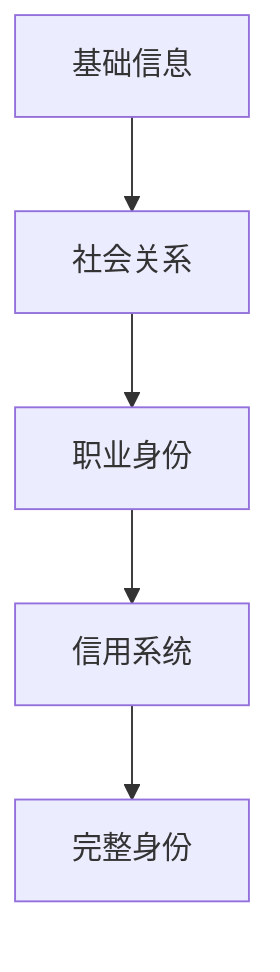
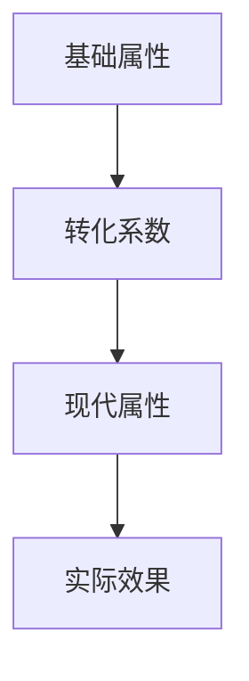
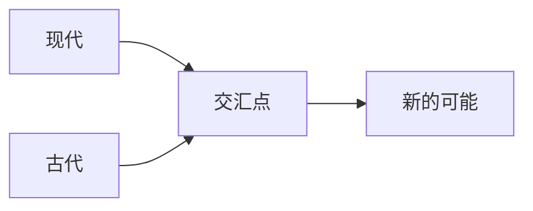

### 《水浒-fuk-u》时空穿越机制设计文档

---

#### 一、时空穿越核心原理

**1.1 天罡地煞服务器**


**1.2 技术架构**
| 系统层级 | 功能描述 | 技术原理 | 现代对应 |
|----------|----------|----------|----------|
| 天罡系统 | 英雄数据化 | 元神提取 | 数据采集 |
| 地煞系统 | 时空通道 | 浑天仪 | 量子传输 |
| 转化系统 | 能力适配 | 天机推演 | AI适配 |
| 重构系统 | 现代具现 | 阵法重组 | 3D建模 |

#### 二、穿越规则设定

**2.1 基础法则**
- **存在定律**：
  | 法则 | 说明 | 表现形式 | 限制条件 |
  |------|------|----------|----------|
  | 能量守恒 | 古代能量等价转换 | 香火值 | 持续消耗 |
  | 信息不灭 | 历史记录残留 | 记忆碎片 | 需要收集 |
  | 身份重构 | 现代身份构建 | 社会关系 | 需要维护 |

- **穿越限制**：
  ```mermaid
  graph LR
  A[穿越条件] --> B[香火值]
  B --> C[身份认证]
  C --> D[能力适配]
  D --> E[现代生存]
  ```

**2.2 能力转化机制**
| 古代能力 | 现代形态 | 转化条件 | 特殊效果 |
|----------|----------|----------|----------|
| 武艺 | 职场技能 | 适应训练 | 战斗加成 |
| 内功 | 精神力 | 压力适应 | 续航能力 |
| 绝技 | 特殊技能 | 觉醒触发 | 爆发效果 |

#### 三、时空影响系统

**3.1 蝴蝶效应控制**


**3.2 历史修正机制**
| 影响等级 | 判定标准 | 修正方式 | 后果 |
|----------|----------|----------|------|
| 轻微 | 个人层面 | 自动修正 | 可忽略 |
| 中等 | 组织层面 | 系统干预 | 支线变化 |
| 重大 | 历史走向 | 强制纠正 | 任务失败 |

#### 四、存在维持系统

**4.1 香火值机制**
- **获取方式**：
  | 来源 | 效率 | 持续性 | 风险 |
  |------|------|--------|------|
  | 社交认同 | 中 | 稳定 | 低 |
  | 功德积累 | 高 | 波动 | 中 |
  | 信仰凝聚 | 极高 | 困难 | 高 |

- **消耗规则**：
  ```mermaid
  graph LR
  A[基础存在] --> B[能力使用]
  B --> C[特殊技能]
  C --> D[穿越行为]
  ```

**4.2 存在稳定性**
| 状态 | 特征 | 影响 | 解决方案 |
|------|------|------|----------|
| 稳定 | 正常行动 | 无 | 维持现状 |
| 波动 | 能力不稳 | 效果衰减 | 补充香火 |
| 危险 | 存在模糊 | 可能消失 | 紧急救援 |
| 消散 | 即将消失 | 强制返回 | 重新穿越 |

#### 五、身份构建系统

**5.1 现代身份构建**


**5.2 身份维护要素**
| 要素 | 重要性 | 维护方式 | 失败风险 |
|------|--------|----------|----------|
| 社保记录 | 高 | 正常工作 | 身份审查 |
| 人际关系 | 中 | 社交活动 | 社会孤立 |
| 信用评级 | 高 | 金融行为 | 功能限制 |
| 网络足迹 | 中 | 日常活动 | 真实性质疑 |

#### 六、技术实现考虑

**6.1 游戏表现**
| 系统 | 表现形式 | 交互方式 | 视觉效果 |
|------|----------|----------|----------|
| 穿越过程 | 时空隧道 | 过场动画 | 水墨溶解 |
| 能力转化 | 技能特效 | 渐变过程 | 古今融合 |
| 存在状态 | UI指示器 | 实时反馈 | 半透明度 |

**6.2 数值设计**


#### 七、多元宇宙理论

**7.1 平行时空设定**
| 时空类型 | 特征 | 交互可能 | 影响范围 |
|----------|------|----------|----------|
| 主时间线 | 稳定 | 高 | 全局 |
| 平行支线 | 不稳定 | 中 | 局部 |
| 独立空间 | 封闭 | 低 | 个人 |

**7.2 时空节点**


---

#### 八、后续扩展规划

1. 增加更多的穿越触发条件
2. 完善时空影响评估系统
3. 丰富平行时空玩法
4. 深化身份构建机制
5. 优化香火值获取方式
