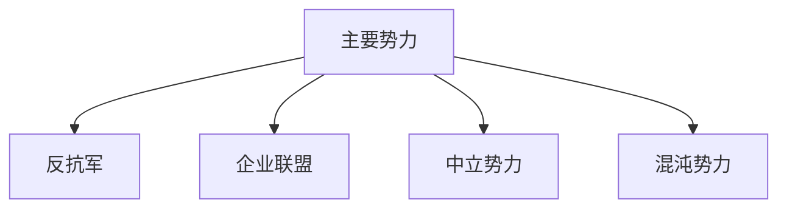
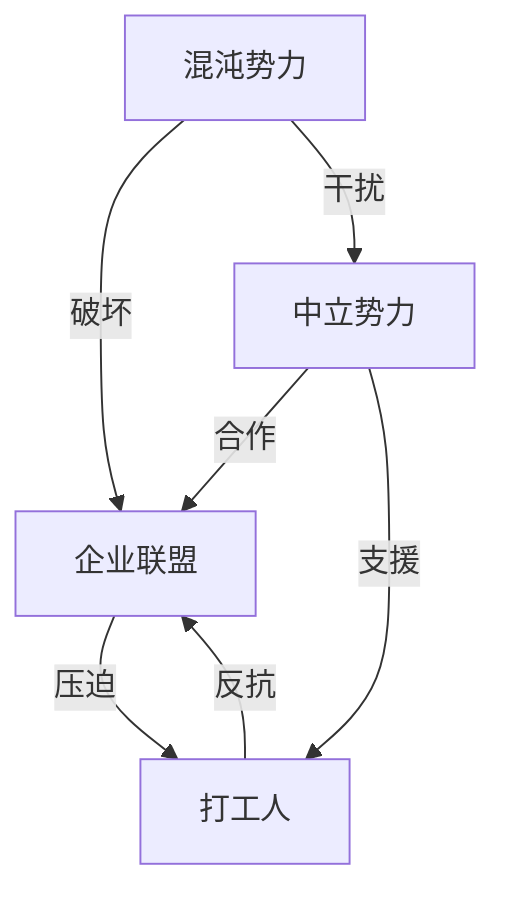
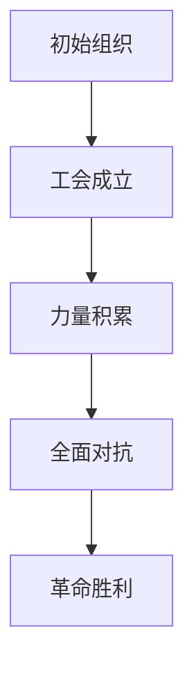
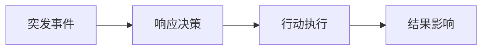
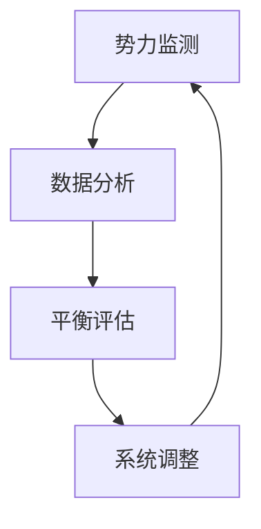
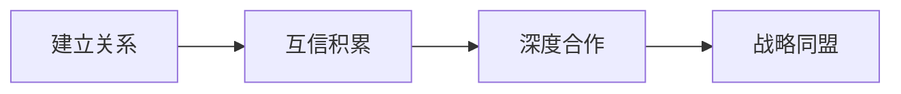

### 《水浒-fuk-u》势力关系设计文档

---

#### 一、势力概览

**1.1 主要势力分布**


**1.2 势力基础属性**
| 势力 | 核心理念 | 主要成员 | 势力规模 |
|------|----------|----------|----------|
| 反抗军 | 职场正义 | 108将转世 | 中等 |
| 企业联盟 | 资本统治 | 高俅集团 | 大型 |
| 中立势力 | 利益至上 | 社会各界 | 分散 |
| 混沌势力 | 系统破坏 | 地下黑客 | 小型 |

#### 二、势力详细说明

**2.1 反抗军（玩家阵营）**
- **组织结构**：
  ```mermaid
  graph TD
  A[工会总部] --> B[战斗部门]
  A --> C[情报部门]
  A --> D[后勤部门]
  B --> E[一线战斗]
  C --> F[信息收集]
  D --> G[资源管理]
  ```

- **核心成员**：
  | 角色 | 现代身份 | 特殊能力 | 职责 |
  |------|----------|----------|------|
  | 宋江 | 工会主席 | 领导力 | 总指挥 |
  | 武松 | 打工人 | 战斗力 | 主战力 |
  | 吴用 | 策略师 | 智谋 | 战略 |

**2.2 企业联盟**
- **组织架构**：
  | 部门 | 负责人 | 主要职能 | 特点 |
  |------|--------|----------|------|
  | 董事会 | 高俅 | 决策制定 | 强权 |
  | 人力部 | 蔡京 | 人员管理 | 压迫 |
  | 财务部 | 童贯 | 资金控制 | 贪婪 |

- **企业文化**：
  ```mermaid
  graph LR
  A[压迫文化] --> B[KPI至上]
  B --> C[内卷竞争]
  C --> D[资本剥削]
  ```

#### 三、势力关系网络

**3.1 主要势力互动**


**3.2 利益关系**
| 关系类型 | 影响程度 | 互动方式 | 变化可能 |
|----------|----------|----------|----------|
| 敌对 | 高 | 对抗 | 固定 |
| 合作 | 中 | 交易 | 可变 |
| 中立 | 低 | 观望 | 不定 |

#### 四、势力特殊能力

**4.1 反抗军能力**
| 能力名称 | 效果 | 触发条件 | 冷却时间 |
|----------|------|----------|----------|
| 工会集结 | 团队增益 | 集体行动 | 7天 |
| 舆论压力 | 声望打击 | 证据收集 | 3天 |
| 群体维权 | 范围控制 | 权益受损 | 5天 |

**4.2 企业联盟能力**
| 能力名称 | 效果 | 触发条件 | 冷却时间 |
|----------|------|----------|----------|
| 资本压制 | 经济制裁 | 资金充足 | 即时 |
| 制度镇压 | 行动限制 | 权限审批 | 1天 |
| 舆论管控 | 信息封锁 | 危机发生 | 2天 |

#### 五、势力发展路线

**5.1 反抗军发展**


**5.2 势力升级路线**
| 阶段 | 目标 | 所需资源 | 解锁内容 |
|------|------|----------|----------|
| 萌芽 | 建立基地 | 基础资金 | 基础设施 |
| 发展 | 扩大影响 | 人员招募 | 组织架构 |
| 成熟 | 力量壮大 | 技术革新 | 高级能力 |
| 巅峰 | 最终决战 | 全面动员 | 终极技能 |

#### 六、势力任务系统

**6.1 日常任务**
| 任务类型 | 难度 | 奖励 | 影响 |
|----------|------|------|------|
| 情报收集 | 低 | 资源 | 微小 |
| 成员救援 | 中 | 声望 | 中等 |
| 资源争夺 | 高 | 装备 | 显著 |

**6.2 特殊事件**


#### 七、势力平衡设计

**7.1 制衡机制**
| 机制 | 目的 | 实现方式 | 效果 |
|------|------|----------|------|
| 资源分配 | 平衡发展 | 动态调整 | 均衡 |
| 势力反制 | 避免独大 | 系统干预 | 制衡 |
| 联盟机制 | 促进合作 | 利益共享 | 互补 |

**7.2 动态调整**


#### 八、跨势力互动

**8.1 社交系统**
| 互动类型 | 风险 | 收益 | 限制 |
|----------|------|------|------|
| 商业合作 | 中 | 资源共享 | 信任度 |
| 情报交换 | 高 | 信息获取 | 保密级 |
| 人员流动 | 低 | 能力互补 | 忠诚度 |

**8.2 外交机制**


---

#### 九、后续规划

1. 增加更多次级势力
2. 完善势力间互动
3. 优化平衡性机制
4. 丰富任务系统
5. 深化势力成长路线
