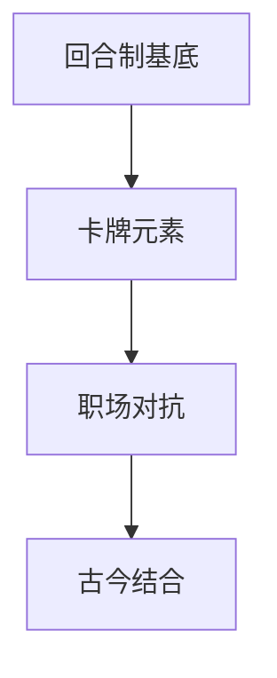
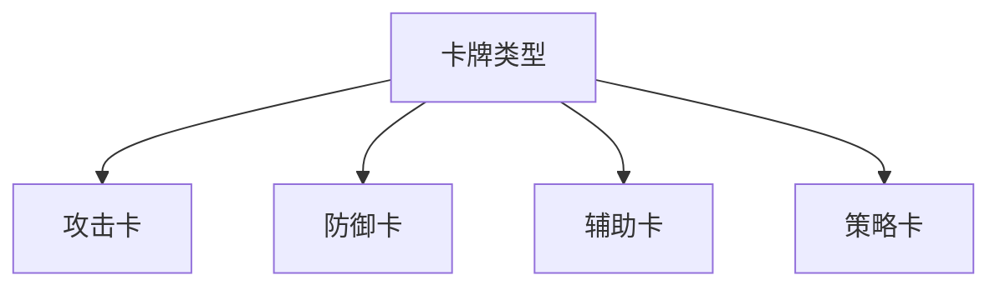
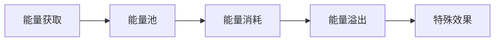
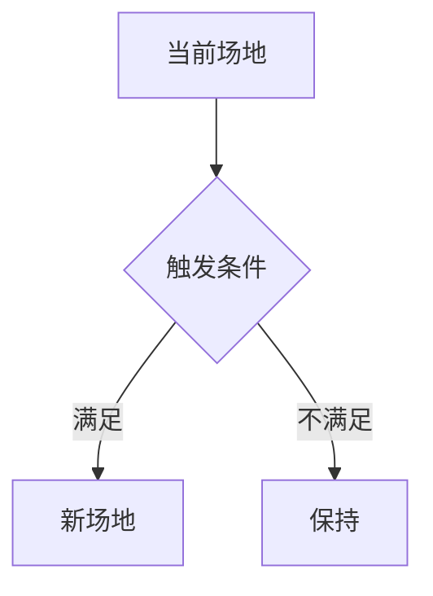
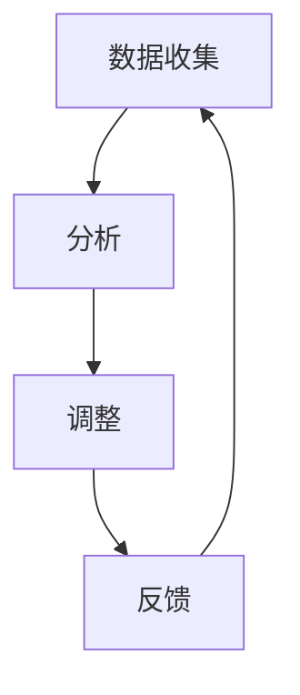

### 《水浒-fuk-u》卡牌战斗机制设计文档

---

#### 一、战斗系统概述

**1.1 核心玩法定位**


**1.2 战斗流程概览**
| 阶段 | 主要行为 | 时间限制 | 特殊规则 |
|------|----------|----------|----------|
| 准备阶段 | 抽取手牌 | 无限制 | 首抽5张 |
| 行动阶段 | 出牌操作 | 60秒/回合 | 能量限制 |
| 结算阶段 | 效果处理 | 自动结算 | 连锁判定 |
| 回合结束 | 状态更新 | 自动执行 | 回合效果 |

#### 二、CTB战斗系统

**2.1 时序机制**
- **行动条设计**：
  ```mermaid
  graph LR
  A[准备位置] --> B[行动位置]
  B --> C[执行动作]
  C --> D[重置位置]
  ```

- **速度计算**：
  | 影响因素 | 权重 | 计算公式 | 效果范围 |
  |----------|------|----------|----------|
  | 基础速度 | 40% | 角色属性 | 固定值 |
  | 技能加成 | 30% | 卡牌效果 | 可变动 |
  | 状态影响 | 20% | 即时计算 | 临时性 |
  | 装备效果 | 10% | 固定加成 | 持续性 |

**2.2 行动优先级**
| 优先级 | 行动类型 | 特殊效果 | 触发条件 |
|--------|----------|----------|----------|
| 最高 | 打断技能 | 中止当前行动 | 特定卡牌 |
| 高 | 即时技能 | 插入行动序列 | 触发条件 |
| 中 | 普通行动 | 标准结算 | 行动条满 |
| 低 | 被动效果 | 自动触发 | 特定时机 |

#### 三、卡牌系统设计

**3.1 卡牌基础属性**
| 属性 | 说明 | 取值范围 | 影响效果 |
|------|------|----------|----------|
| 能量消耗 | 使用成本 | 0-5 | 出牌限制 |
| 稀有度 | 卡牌等级 | 普通-传说 | 效果强度 |
| 使用次数 | 回合限制 | 0-无限 | 战术选择 |
| 目标选择 | 作用范围 | 单体/群体 | 战术定位 |

**3.2 卡牌类型**


**3.3 卡牌效果设计**
| 类型 | 效果示例 | 触发条件 | 战术价值 |
|------|----------|----------|----------|
| 即时效果 | 直接伤害 | 打出即生效 | 战术节奏 |
| 持续效果 | 状态增益 | 回合开始 | 长期规划 |
| 触发效果 | 条件反击 | 特定条件 | 战术应对 |
| 组合效果 | 连携加成 | 特定序列 | 连招设计 |

#### 四、能量系统

**4.1 能量获取**
| 来源 | 获取量 | 触发条件 | 限制 |
|------|--------|----------|------|
| 回合开始 | 2点 | 自动 | 无 |
| 被动技能 | 1点 | 特定条件 | 每回合1次 |
| 特殊卡牌 | 1-3点 | 使用卡牌 | 卡牌限制 |
| 连击奖励 | 1点 | 达成连击 | 战斗中累计 |

**4.2 能量管理**


#### 五、场地机制

**5.1 场地效果**
| 场地类型 | 效果描述 | 触发时机 | 影响范围 |
|----------|----------|----------|----------|
| 会议室 | 压力值+1 | 回合开始 | 全体 |
| 茶水间 | 恢复1能量 | 特定行动 | 使用者 |
| 总裁办公室 | 伤害+20% | 持续 | 全体 |
| 电梯间 | 速度+1 | 进入时 | 个人 |

**5.2 场地切换**


#### 六、战斗平衡设计

**6.1 数值平衡**
| 参数 | 基准值 | 浮动范围 | 调节方式 |
|------|--------|----------|----------|
| 基础伤害 | 100 | ±20% | 动态 |
| 能量获取 | 2/回合 | ±1 | 固定 |
| 手牌上限 | 7 | ±2 | 可变 |
| 技能倍率 | 1.0 | ±0.3 | 线性 |

**6.2 平衡性机制**


#### 七、战斗反馈系统

**7.1 视觉反馈**
| 效果类型 | 表现形式 | 持续时间 | 优先级 |
|----------|----------|----------|--------|
| 伤害数字 | 跳动数值 | 1秒 | 高 |
| 状态图标 | 角色特效 | 持续 | 中 |
| 技能动画 | 全屏特效 | 2-3秒 | 最高 |
| 连击提示 | UI动画 | 0.5秒 | 中 |

**7.2 操作反馈**
| 操作 | 反馈方式 | 延迟 | 说明 |
|------|----------|------|------|
| 选择卡牌 | 高亮效果 | 即时 | 可用判定 |
| 确认使用 | 音效+特效 | 0.1秒 | 打出动画 |
| 目标选择 | 准星提示 | 即时 | 范围显示 |
| 效果结算 | 连锁动画 | 按序播放 | 结果展示 |

---

#### 八、后续优化方向

1. 增加更多卡牌类型和效果
2. 优化战斗节奏和流畅度
3. 完善反馈系统的表现
4. 增强战术策略的深度
5. 平衡各职业的战斗体验
