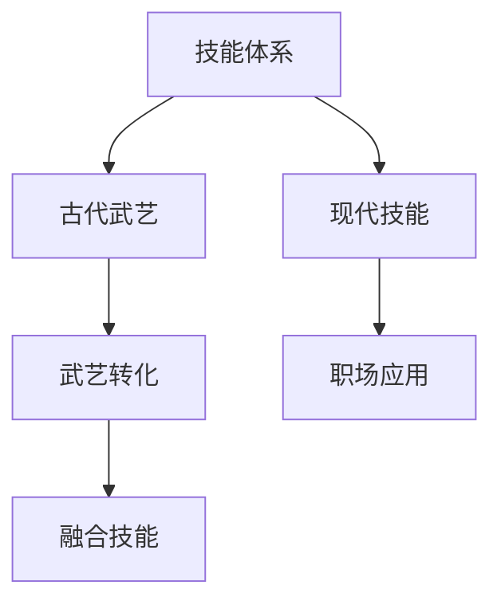
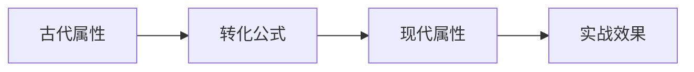
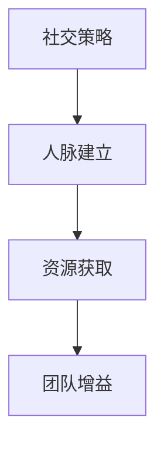
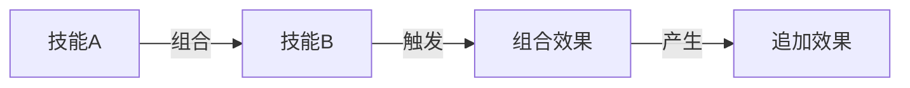
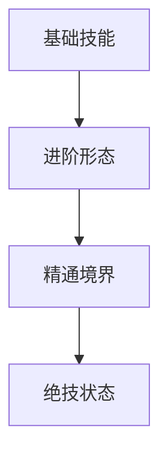
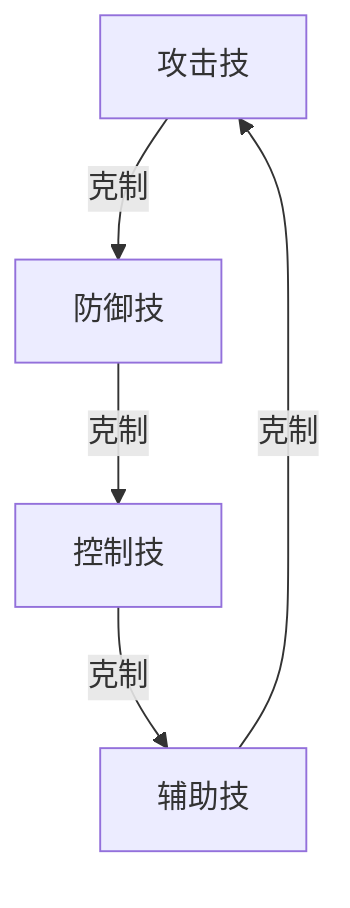

### 《水浒-fuk-u》技能系统设计文档

---

#### 一、技能体系概述

**1.1 技能分类**

**1.2 技能等级**
| 等级 | 解锁条件 | 效果强度 | 能量消耗 |
|------|----------|----------|----------|
| 基础 | 默认解锁 | 100% | 1-2 |
| 进阶 | 角色等级10 | 150% | 2-3 |
| 精通 | 特定成就 | 200% | 3-4 |
| 绝技 | 剧情解锁 | 300% | 4-5 |

#### 二、古今技能转化

**2.1 武艺转化规则**
| 古代武艺 | 现代形态 | 效果转化 | 特色表现 |
|----------|----------|----------|----------|
| 打虎拳法 | 项目攻坚 | 单体爆发 | 气力凝聚 |
| 醉拳 | 应酬技巧 | 混乱控制 | 场面混乱 |
| 梁山枪法 | 商务谈判 | 多重打击 | 气势压迫 |
| 太极心法 | 职场周旋 | 防御反击 | 以柔克刚 |

**2.2 转化机制**

#### 三、技能设计标准

**3.1 基础参数**
| 参数 | 取值范围 | 影响因素 | 平衡考虑 |
|------|----------|----------|----------|
| 伤害系数 | 80%-300% | 技能等级 | 能量消耗 |
| 冷却时间 | 1-5回合 | 效果强度 | 使用频率 |
| 触发概率 | 30%-100% | 技能类型 | 效果强度 |
| 持续时间 | 1-3回合 | 影响范围 | 总体收益 |

**3.2 技能类型详解**
- **攻击技能**：
  | 类型 | 效果 | 特点 | 适用场景 |
  |------|------|------|----------|
  | 单体打击 | 高伤害 | 目标精确 | BOSS战 |
  | 群体压制 | 中等伤害 | 范围效果 | 多目标 |
  | 持续伤害 | 叠加效果 | 长期收益 | 持久战 |

- **防御技能**：
  | 类型 | 效果 | 特点 | 适用场景 |
  |------|------|------|----------|
  | 直接防护 | 减伤30% | 立即生效 | 危险时刻 |
  | 持续防御 | 减伤15%/回合 | 持续效果 | 稳定输出 |
  | 反击防御 | 反弹伤害 | 特殊效果 | 策略应对 |

#### 四、职场技能特色

**4.1 办公室技能**
| 技能名称 | 原型 | 效果 | 特殊效果 |
|----------|------|------|----------|
| PPT必杀 | 暗器手法 | 范围伤害 | 注意力降低 |
| 会议发言 | 狮子吼 | 群体控制 | 沉默效果 |
| 加班熬夜 | 铁布衫 | 防御增强 | 疲劳积累 |
| 项目汇报 | 剑法 | 精准打击 | 破防效果 |

**4.2 社交技能**

#### 五、技能组合系统

**5.1 连携规则**
| 触发条件 | 组合效果 | 能量消耗 | 限制条件 |
|----------|----------|----------|----------|
| 相同属性 | 伤害+30% | +1 | 回合限制 |
| 互补属性 | 特殊效果 | +2 | 顺序要求 |
| 完美配合 | 追加效果 | +3 | 角色限定 |

**5.2 典型组合**

#### 六、技能成长系统

**6.1 升级路线**
| 阶段 | 要求 | 提升效果 | 解锁内容 |
|------|------|----------|----------|
| 入门 | 基础使用 | 效果+20% | 基础连携 |
| 熟练 | 使用50次 | 效果+50% | 进阶技能 |
| 精通 | 特殊成就 | 效果+100% | 绝技解锁 |
| 登峰 | 剧情完成 | 效果+200% | 终极奥义 |

**6.2 技能进化**

#### 七、技能平衡性

**7.1 数值平衡**
| 平衡因素 | 基准值 | 调整范围 | 制约因素 |
|----------|--------|----------|----------|
| 伤害值 | 100 | ±20% | 能量消耗 |
| 持续时间 | 2回合 | ±1回合 | 效果强度 |
| 冷却时间 | 3回合 | ±1回合 | 使用频率 |
| 触发概率 | 50% | ±20% | 效果影响 |

**7.2 技能克制**

#### 八、视觉表现

**8.1 技能特效**
| 效果类型 | 表现形式 | 持续时间 | 优先级 |
|----------|----------|----------|--------|
| 瞬间效果 | 粒子爆发 | 0.5秒 | 高 |
| 持续效果 | 光环环绕 | 全程 | 中 |
| 蓄力效果 | 能量聚集 | 1-2秒 | 最高 |
| 结算效果 | 数值飘动 | 1秒 | 低 |

**8.2 动画设计**
| 阶段 | 时长 | 重点 | 过渡处理 |
|------|------|------|----------|
| 前摇 | 0.3秒 | 蓄力感 | 自然流畅 |
| 施放 | 0.5秒 | 打击感 | 速度变化 |
| 后摇 | 0.2秒 | 余韵 | 平滑收尾 |

---

#### 九、后续扩展方向

1. 增加更多特色技能组合
2. 深化技能成长系统
3. 完善技能反馈表现
4. 优化技能平衡性
5. 增加特殊场景技能
