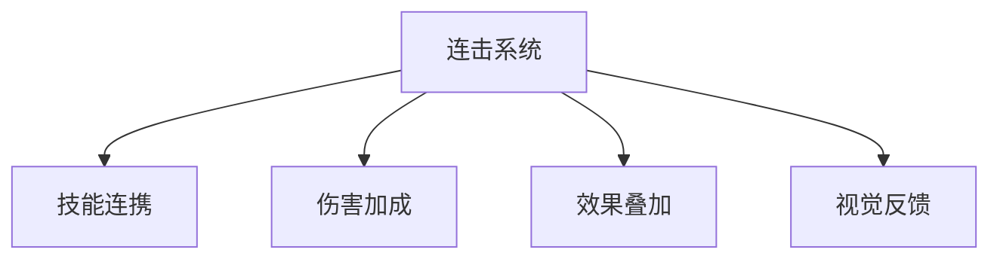
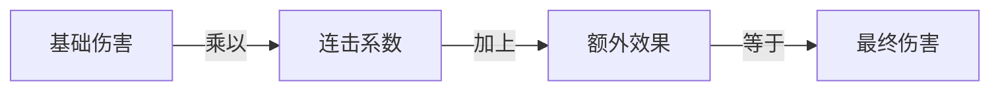
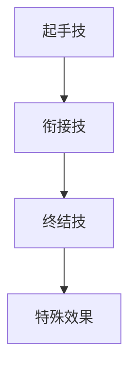
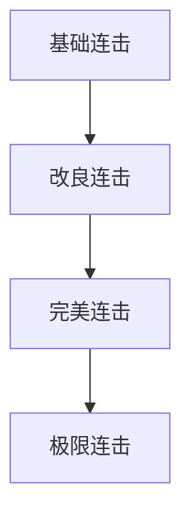
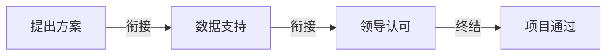
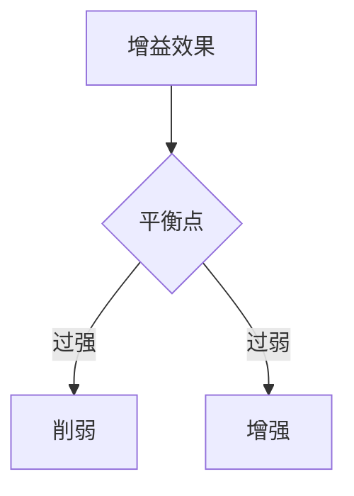

### 《水浒-fuk-u》连击系统设计文档

---

#### 一、连击系统概述

**1.1 系统定位**

**1.2 基础机制**
| 机制 | 说明 | 触发条件 | 效果范围 |
|------|------|----------|----------|
| 连击计数 | 连续出牌统计 | 符合连携规则 | 1-10次 |
| 伤害提升 | 基础伤害加成 | 根据连击数 | 10%-100% |
| 能量返还 | 能量值返还 | 达到阈值 | 1-3点 |
| 特效强化 | 视觉效果提升 | 连击进行中 | 渐进式 |

#### 二、连击规则设计

**2.1 连击触发条件**
| 条件类型 | 判定标准 | 成功率 | 限制条件 |
|----------|----------|---------|----------|
| 同属性连击 | 相同属性卡牌 | 100% | 能量充足 |
| 异属性连击 | 互补属性卡牌 | 80% | 特定顺序 |
| 特殊连击 | 特定卡牌组合 | 100% | 严格顺序 |

**2.2 连击公式**

#### 三、连击效果设计

**3.1 基础连击效果**
| 连击数 | 伤害加成 | 能量返还 | 特殊效果 |
|--------|----------|----------|----------|
| 2连击 | +20% | 0 | 无 |
| 3连击 | +40% | 1 | 破防+10% |
| 5连击 | +80% | 2 | 暴击率+15% |
| 7连击 | +120% | 3 | 额外行动 |
| 10连击 | +200% | 5 | 终结技解锁 |

**3.2 特殊连击组合**

#### 四、连击培养系统

**4.1 连击技能树**
| 等级 | 解锁条件 | 效果提升 | 新增特性 |
|------|----------|----------|----------|
| 入门 | 基础训练 | 连击+1 | 基础连携 |
| 进阶 | 10次完美连击 | 伤害+20% | 能量优化 |
| 精通 | 50次高级连击 | 效果+50% | 特殊连携 |
| 大师 | 100次完美连击 | 全面强化 | 终极连携 |

**4.2 成长路线**

#### 五、连击反馈系统

**5.1 视觉反馈**
| 效果类型 | 表现形式 | 触发条件 | 优先级 |
|----------|----------|----------|--------|
| 打击特效 | 粒子系统 | 连击命中 | 高 |
| 连击计数 | UI动画 | 连击累积 | 中 |
| 伤害数字 | 跳动数值 | 结算时 | 低 |
| 终结特效 | 全屏特效 | 连击结束 | 最高 |

**5.2 音效设计**
| 音效类型 | 时机 | 音量变化 | 特点 |
|----------|------|----------|------|
| 打击音 | 每次连击 | 递增 | 节奏感 |
| 衔接音 | 连击过渡 | 平稳 | 流畅感 |
| 终结音 | 连击结束 | 最高 | 爆发感 |

#### 六、职场特色连击

**6.1 办公室连击**
| 连击名称 | 组成技能 | 特殊效果 | 条件 |
|----------|----------|----------|------|
| 会议风暴 | 发言+PPT+总结 | 群体眩晕 | 3连击 |
| 项目压榨 | 加班+督促+绩效 | 持续伤害 | 3连击 |
| 部门合作 | 会议+提案+执行 | 团队增益 | 3连击 |

**6.2 典型连携**

#### 七、连击平衡设计

**7.1 连击限制**
| 限制类型 | 具体规则 | 影响 | 解除条件 |
|----------|----------|------|----------|
| 能量消耗 | 递增消耗 | 持续性 | 能量恢复 |
| 冷却时间 | 技能CD | 时间性 | 时间流逝 |
| 连击上限 | 最多10连 | 数量性 | 无法解除 |
| 疲劳累积 | 效果衰减 | 周期性 | 回合结束 |

**7.2 平衡机制**

#### 八、连击养成策略

**8.1 培养方向**
| 路线 | 特点 | 优势 | 劣势 |
|------|------|------|------|
| 爆发路线 | 高伤害 | 速战速决 | 持续性差 |
| 持续路线 | 稳定输出 | 消耗较低 | 爆发不足 |
| 控制路线 | 效果叠加 | 战术性强 | 伤害较低 |
| 综合路线 | 平衡发展 | 适应性强 | 特点不突出 |

**8.2 技能配置**
| 位置 | 作用 | 选择建议 | 重要性 |
|------|------|----------|--------|
| 起手技 | 开启连击 | 低耗能技能 | 高 |
| 衔接技 | 维持连击 | 快速技能 | 中 |
| 终结技 | 伤害爆发 | 重型技能 | 高 |

---

#### 九、后续优化方向

1. 增加更多特色连击组合
2. 优化连击判定机制
3. 强化视觉反馈效果
4. 平衡连击收益
5. 设计新的连击玩法
