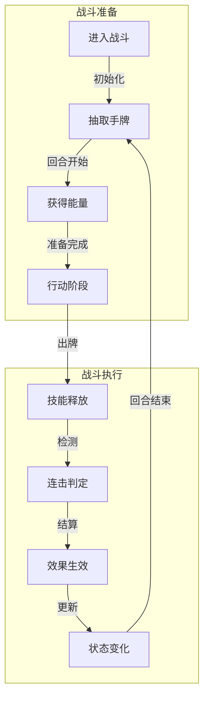
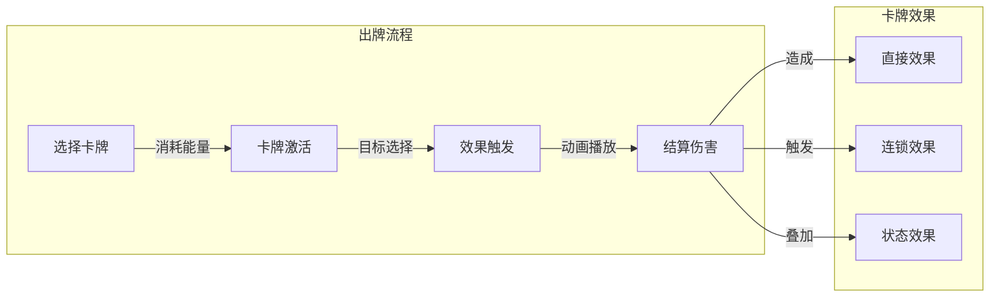
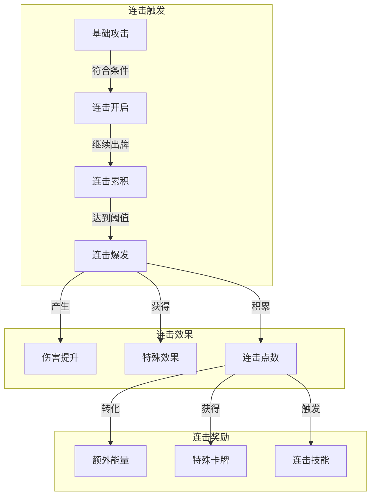
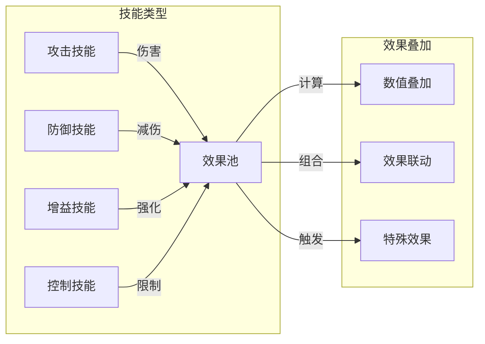
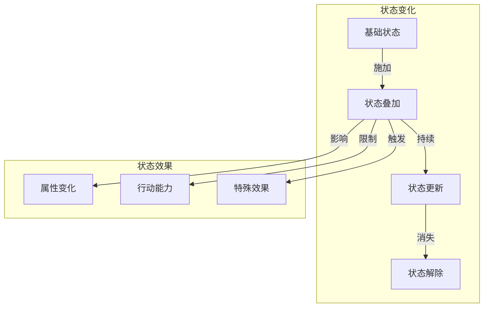
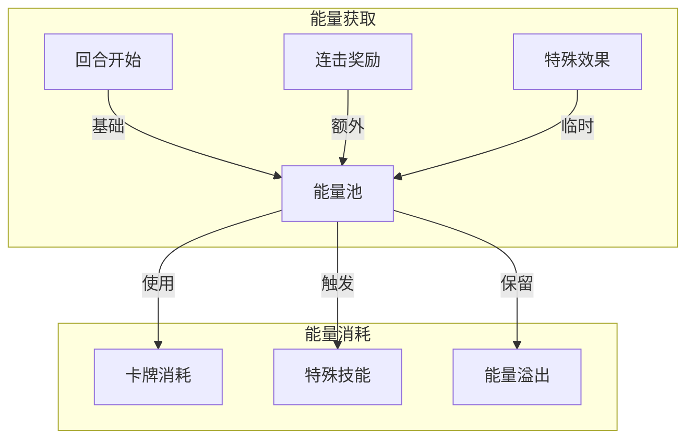
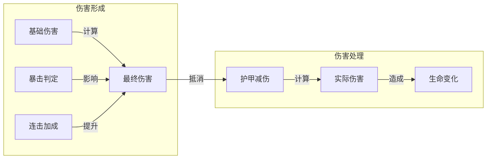

### 《水浒-fuk-u》战斗系统流转图

---

#### 一、战斗流程总览

#### 二、卡牌出牌系统

#### 三、连击系统流转

#### 四、技能效果系统

#### 五、战斗状态流转

#### 六、能量系统流转

#### 七、伤害计算流程

---

#### 八、系统要点说明

1. **战斗节奏**
   - 回合制基础节奏
   - 连击加速机制
   - 能量管理策略

2. **战斗深度**
   - 卡牌组合
   - 连击技巧
   - 状态管理

3. **平衡设计**
   - 能量消耗
   - 连击收益
   - 状态持续

4. **反馈体验**
   - 打击感
   - 连击提示
   - 效果展示
