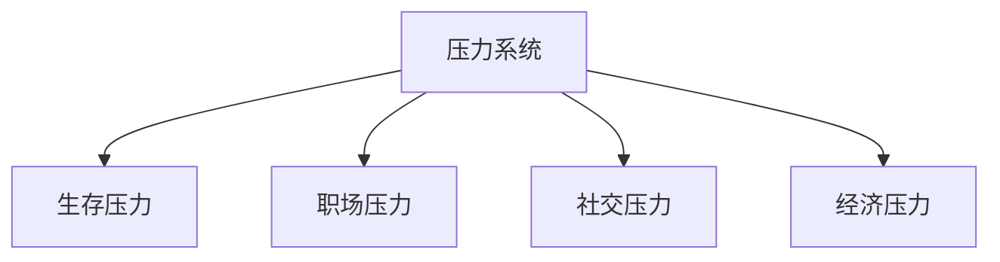
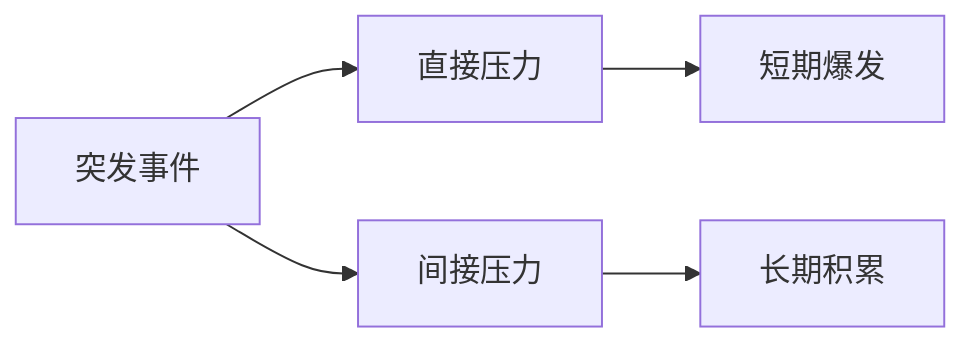
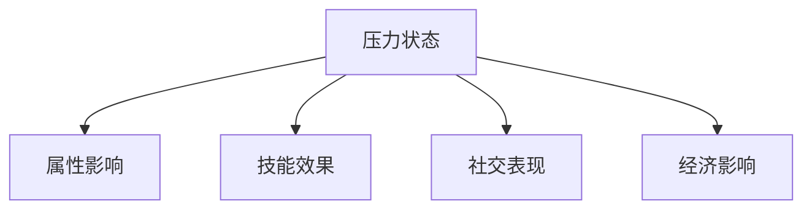
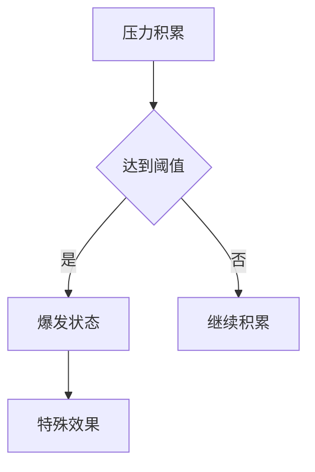
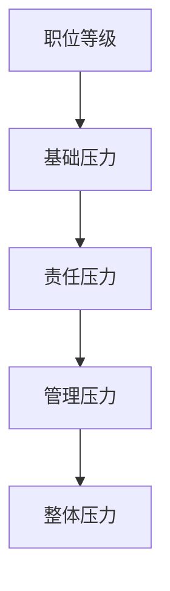
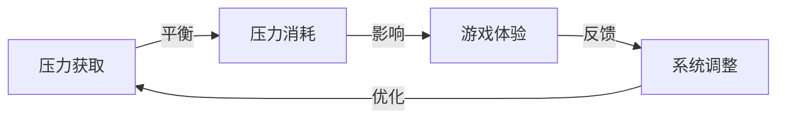

### 《水浒-fuk-u》压力值机制设计文档

---

#### 一、压力系统概述

**1.1 系统定位**

**1.2 压力值属性**
| 属性 | 数值范围 | 影响因素 | 变化特征 |
|------|----------|----------|----------|
| 基础压力 | 0-100 | 日常工作 | 缓慢累积 |
| 暴发压力 | 0-200 | 突发事件 | 急速上升 |
| 临界压力 | 200+ | 极限状态 | 爆发效果 |
| 压力抗性 | 0-100 | 角色属性 | 被动减免 |

#### 二、压力获取机制

**2.1 日常压力来源**
| 来源 | 压力值 | 触发频率 | 持续时间 |
|------|--------|----------|----------|
| 工作任务 | 5-10 | 每小时 | 持续性 |
| 会议 | 15-20 | 每次 | 临时性 |
| 加班 | 20-30 | 每天 | 累积性 |
| 项目ddl | 30-50 | 周期性 | 爆发性 |

**2.2 特殊压力事件**

#### 三、压力效果系统

**3.1 压力状态等级**
| 状态 | 压力值范围 | 角色状态 | 游戏效果 |
|------|------------|----------|----------|
| 轻松 | 0-50 | 正常状态 | 能力正常 |
| 紧张 | 51-100 | 亢奋状态 | 攻击+10% |
| 焦虑 | 101-150 | 不稳定 | 闪避-20% |
| 崩溃 | 151-200 | 临界状态 | 防御-30% |
| 爆发 | 200+ | 狂暴状态 | 特殊效果 |

**3.2 状态影响**

#### 四、压力管理机制

**4.1 压力缓解方式**
| 方式 | 效果 | 消耗 | 限制 |
|------|------|------|------|
| 休息 | -5/小时 | 时间 | 工作时间 |
| 娱乐 | -20/次 | 金钱 | 每日3次 |
| 运动 | -30/次 | 体力 | 每日2次 |
| 放假 | -50/天 | 年假 | 额度限制 |

**4.2 压力抗性培养**
| 培养方式 | 效果提升 | 持续时间 | 条件 |
|----------|----------|----------|------|
| 心理咨询 | 抗性+10% | 7天 | 费用高 |
| 技能学习 | 抗性+5% | 永久 | 时间长 |
| 装备强化 | 抗性+15% | 装备期间 | 资源消耗 |
| 团队协作 | 抗性+20% | 合作期间 | 需要配合 |

#### 五、压力爆发系统

**5.1 爆发触发**

**5.2 爆发效果**
| 效果类型 | 触发条件 | 持续时间 | 冷却时间 |
|----------|----------|----------|----------|
| 战斗力提升 | 压力>200 | 30秒 | 5分钟 |
| 免疫控制 | 压力>250 | 20秒 | 10分钟 |
| 技能增强 | 压力>300 | 15秒 | 15分钟 |
| 终极爆发 | 压力MAX | 10秒 | 30分钟 |

#### 六、职场环境影响

**6.1 环境压力**
| 场景 | 基础压力 | 特殊效果 | 持续时间 |
|------|----------|----------|----------|
| 办公室 | +5/小时 | 工作效率+10% | 工作日 |
| 会议室 | +10/小时 | 压力抗性-20% | 会议中 |
| 老板办公室 | +15/小时 | 压力获取+50% | 对话中 |
| 茶水间 | -5/小时 | 压力恢复+30% | 休息时 |

**6.2 职位压力**

#### 七、压力系统平衡

**7.1 数值平衡**
| 参数 | 基准值 | 浮动范围 | 调节方式 |
|------|--------|----------|----------|
| 获取速率 | 10/小时 | ±5 | 动态 |
| 缓解效率 | 5/小时 | ±2 | 固定 |
| 爆发阈值 | 200 | ±20 | 角色相关 |
| 恢复系数 | 1.0 | ±0.2 | 场景相关 |

**7.2 平衡策略**

#### 八、UI表现

**8.1 压力值显示**
| 显示元素 | 表现形式 | 更新频率 | 特效触发 |
|----------|----------|----------|----------|
| 压力条 | 进度条 | 实时 | 超限闪烁 |
| 状态图标 | 角色头顶 | 状态变化时 | 特效切换 |
| 数值显示 | 具体数字 | 每秒 | 数值跳动 |
| 预警提示 | 界面提示 | 达到阈值时 | 声光效果 |

**8.2 视觉反馈**
| 状态 | 角色表现 | 环境效果 | 音效 |
|------|----------|----------|------|
| 正常 | 标准动作 | 正常 | 无 |
| 紧张 | 动作加快 | 轻微扭曲 | 心跳声 |
| 爆发 | 狂暴动画 | 画面扭曲 | 咆哮声 |

---

#### 九、后续优化方向

1. 增加更多压力来源和缓解方式
2. 优化压力值平衡性
3. 增加团队协同减压机制
4. 完善压力爆发效果
5. 强化视觉和音效表现
