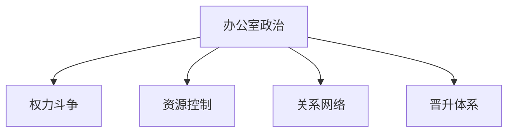
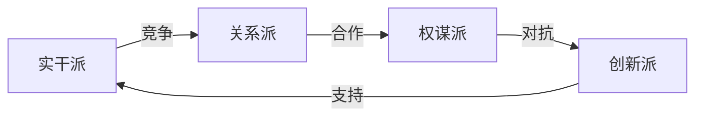
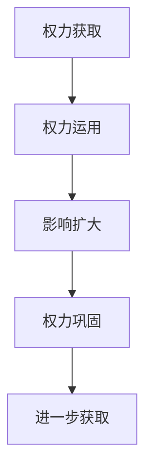
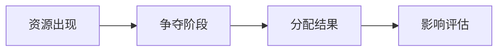
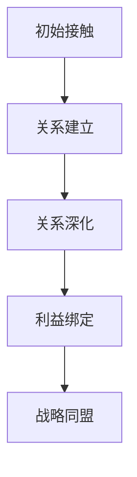
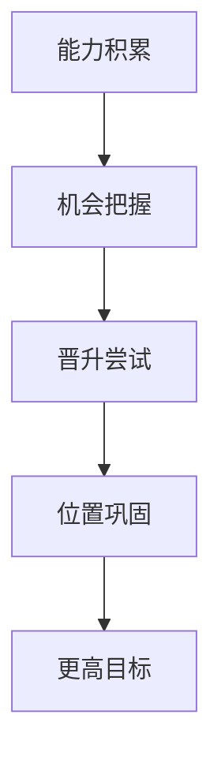
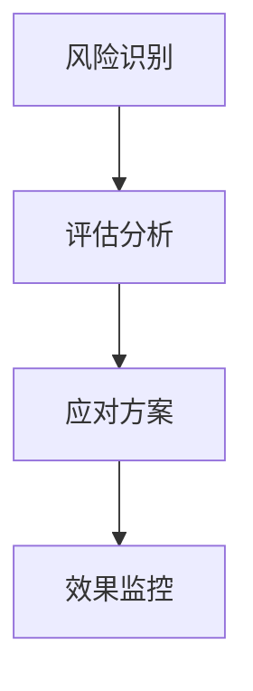

### 《水浒-fuk-u》办公室政治系统设计文档

---

#### 一、系统概述

**1.1 系统定位**

**1.2 核心玩法**
| 玩法要素 | 主要内容 | 目标 | 挑战性 |
|----------|----------|------|---------|
| 派系斗争 | 势力对抗 | 权力获取 | 高 |
| 资源争夺 | 利益分配 | 资源积累 | 中 |
| 人际关系 | 关系经营 | 支持网络 | 高 |
| 职位晋升 | 阶层跃迁 | 地位提升 | 中 |

#### 二、派系系统设计

**2.1 派系架构**
| 派系 | 特点 | 核心理念 | 专属资源 |
|------|------|----------|----------|
| 实干派 | 业绩导向 | 数据说话 | 项目资源 |
| 关系派 | 人脉为主 | 圈子文化 | 隐藏信息 |
| 权谋派 | 战略谋划 | 利益最大 | 决策权限 |
| 创新派 | 变革思维 | 破旧立新 | 技术优势 |

**2.2 派系互动**

#### 三、权力系统

**3.1 权力来源**
| 类型 | 获取方式 | 影响范围 | 持续性 |
|------|----------|----------|---------|
| 职位权力 | 晋升获得 | 部门内 | 稳定 |
| 专业权力 | 技能积累 | 项目中 | 渐进 |
| 关系权力 | 人脉经营 | 跨部门 | 波动 |
| 资源权力 | 控制资源 | 全公司 | 临时 |

**3.2 权力运作**

#### 四、资源分配系统

**4.1 资源类型**
| 资源 | 用途 | 获取难度 | 价值评估 |
|------|------|----------|----------|
| 项目资源 | 业绩提升 | 中等 | 直接价值 |
| 培训机会 | 能力提升 | 较难 | 长期价值 |
| 人事权限 | 影响力 | 极难 | 战略价值 |
| 预算控制 | 资金支配 | 高 | 核心价值 |

**4.2 资源争夺**

#### 五、关系网络系统

**5.1 关系层级**
| 层级 | 特征 | 维护成本 | 影响力 |
|------|------|----------|---------|
| 核心圈 | 深度信任 | 极高 | 决定性 |
| 关键人 | 互利共生 | 高 | 重要 |
| 普通圈 | 一般交往 | 中 | 普通 |
| 泛关系 | 基础联系 | 低 | 微弱 |

**5.2 关系经营**

#### 六、晋升体系

**6.1 职业阶梯**
| 职级 | 要求 | 权限 | 挑战 |
|------|------|------|------|
| P1实习生 | 基础技能 | 最低 | 适应环境 |
| P2正式员工 | 2年经验 | 一般 | 业绩达标 |
| P3主管 | 团队管理 | 中等 | 团队建设 |
| P4经理 | 部门运营 | 较高 | 资源整合 |
| P5总监 | 战略眼光 | 高级 | 方向把控 |

**6.2 晋升路径**

#### 七、政治事件系统

**7.1 日常事件**
| 事件类型 | 触发条件 | 影响范围 | 处理策略 |
|----------|----------|----------|----------|
| 工作冲突 | 资源竞争 | 部门内 | 协调解决 |
| 权力较量 | 利益冲突 | 跨部门 | 策略应对 |
| 人事变动 | 定期/突发 | 全公司 | 提前布局 |
| 政策调整 | 高层决策 | 系统性 | 快速适应 |

**7.2 特殊事件**

#### 八、平衡设计

**8.1 制衡机制**
| 机制 | 作用 | 实现方式 | 效果评估 |
|------|------|----------|----------|
| 派系制衡 | 避免独大 | 利益分配 | 动态平衡 |
| 权力制约 | 限制滥用 | 规则设定 | 有效控制 |
| 资源平衡 | 公平竞争 | 分配机制 | 基本公平 |

**8.2 风险控制**

#### 九、UI呈现

**9.1 界面设计**
| 功能模块 | 主要内容 | 交互方式 | 视觉重点 |
|----------|----------|----------|----------|
| 关系网络 | 人际图谱 | 可视化 | 关系强度 |
| 权力分布 | 影响力图 | 热力图 | 势力范围 |
| 资源面板 | 资源状态 | 数据列表 | 直观展示 |
| 事件系统 | 动态信息 | 实时推送 | 重要性 |

**9.2 反馈系统**
| 事件类型 | 反馈方式 | 表现形式 | 优先级 |
|----------|----------|----------|--------|
| 重要事件 | 弹窗提醒 | 醒目提示 | 最高 |
| 关系变化 | 图标提示 | 动态效果 | 高 |
| 资源获得 | 飘窗显示 | 渐显渐隐 | 中 |

---

#### 十、后续扩展方向

1. 增加更多政治事件类型
2. 深化派系互动机制
3. 完善晋升挑战系统
4. 优化权力运作方式
5. 强化关系网络效果
