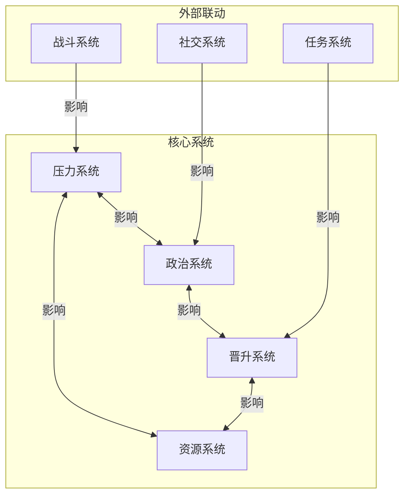
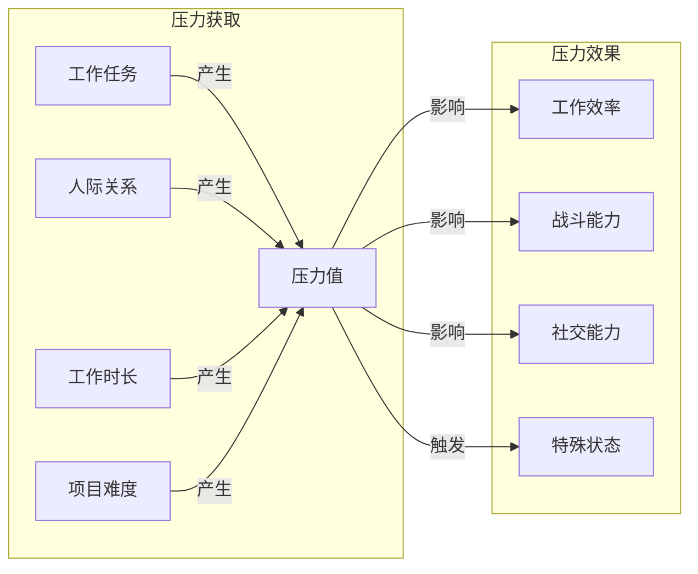
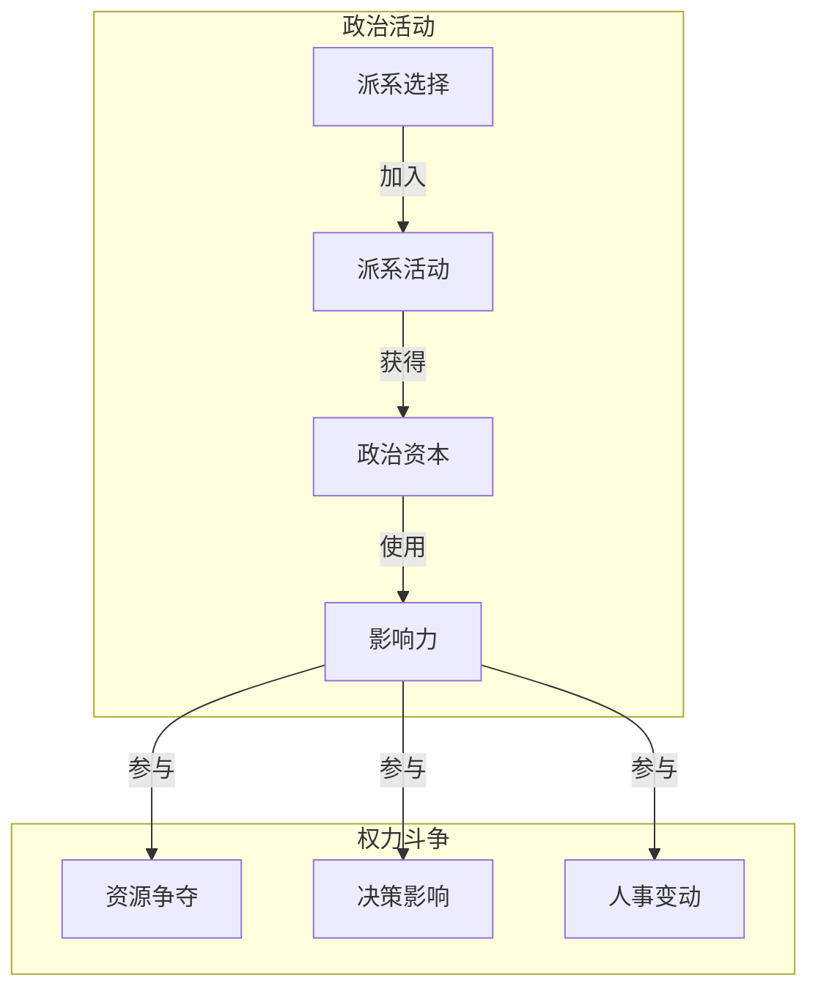
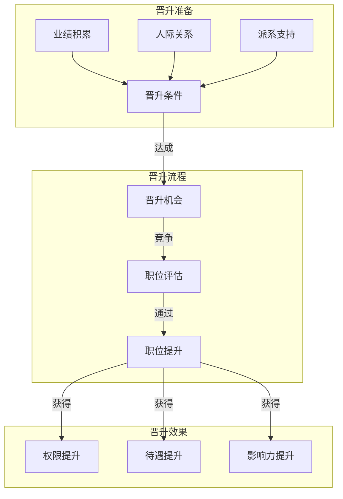
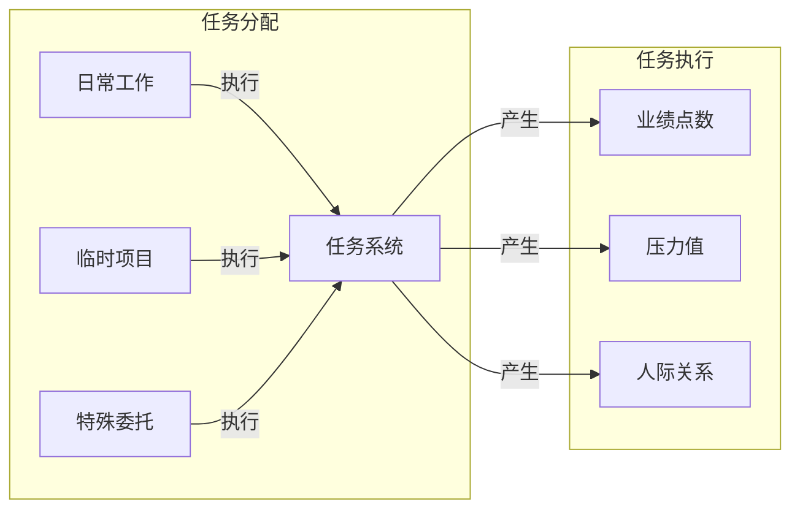
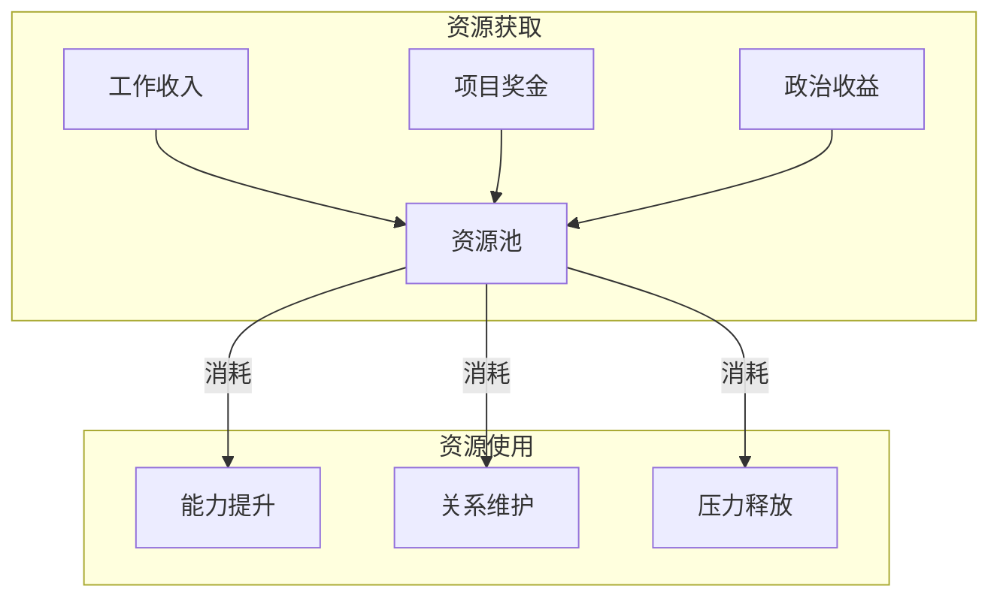
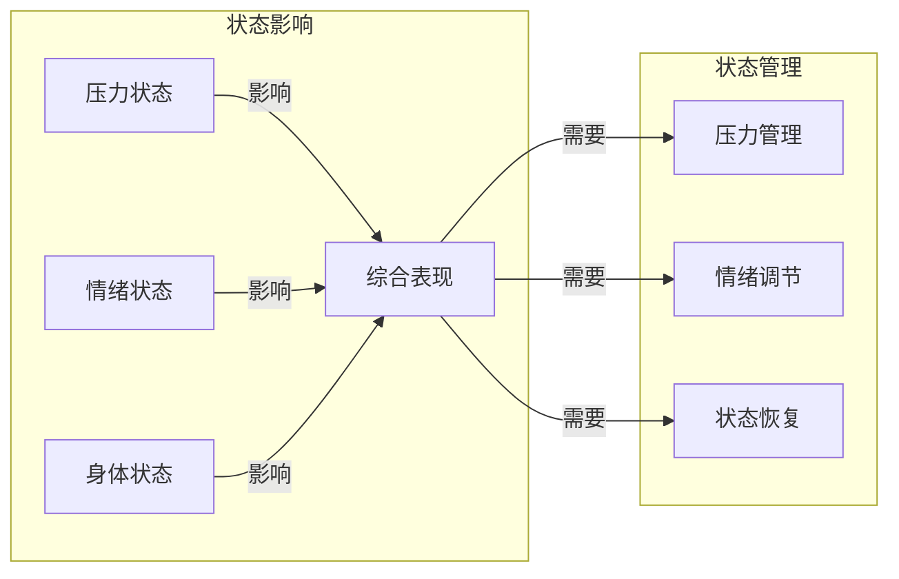

### 《水浒-fuk-u》职场系统流转图

---

#### 一、职场系统总览

#### 二、压力值流转

#### 三、办公室政治流转

#### 四、晋升系统流转

#### 五、工作任务流转

#### 六、资源系统流转

#### 七、状态系统流转

---

#### 八、系统要点说明

1. **压力管理**
   - 压力值积累机制
   - 压力影响范围
   - 压力释放方式

2. **政治运作**
   - 派系关系维护
   - 权力争夺策略
   - 影响力运用

3. **晋升路线**
   - 条件达成
   - 竞争机制
   - 收益体现

4. **资源平衡**
   - 获取途径
   - 分配策略
   - 使用优先级

---

#### 九、互动要点

1. **系统联动**
   - 压力-战斗联动
   - 政治-社交联动
   - 晋升-任务联动

2. **平衡机制**
   - 压力与收益
   - 政治与风险
   - 投入与产出

3. **策略选择**
   - 发展路线
   - 资源分配
   - 风险管理
