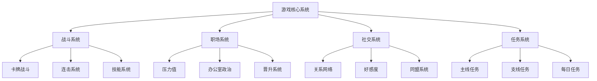
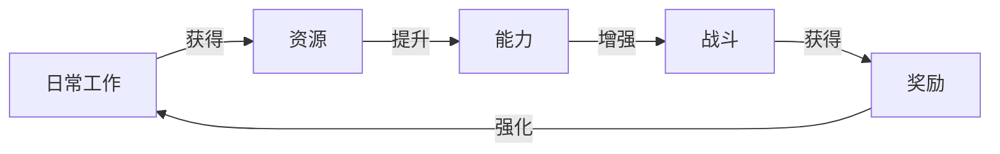
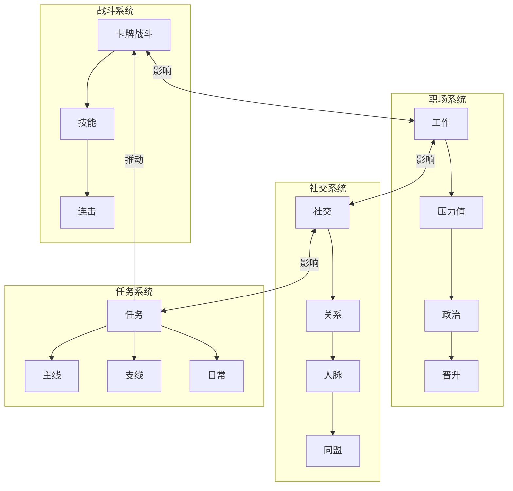
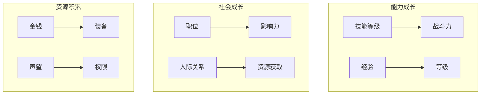
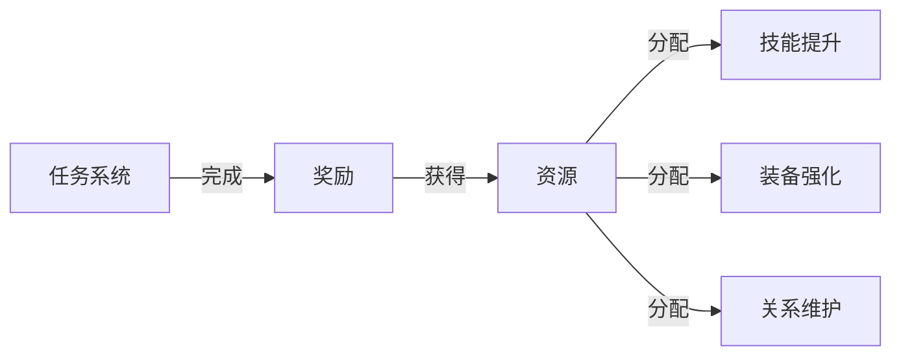
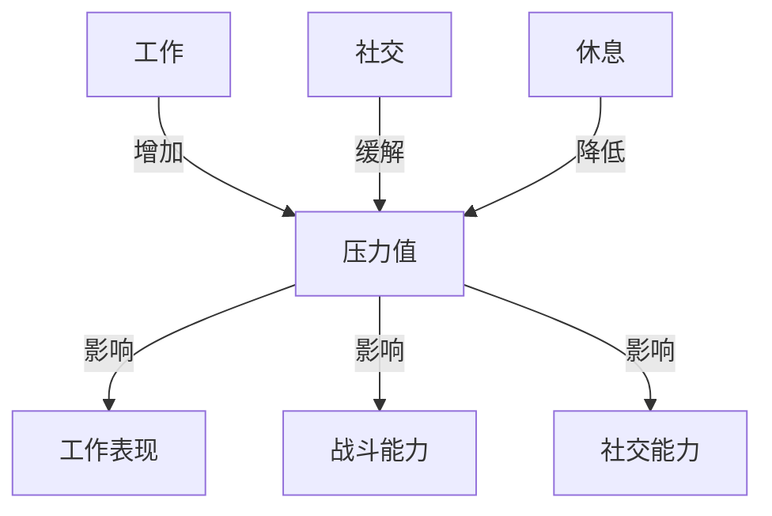
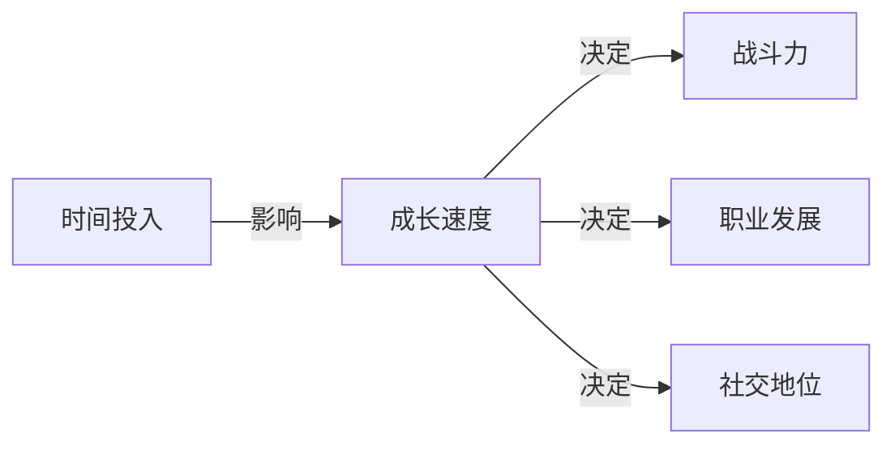

### 《水浒-fuk-u》游戏玩法结构图

---

#### 一、核心玩法系统

#### 二、核心游戏循环

#### 三、系统联动关系

#### 四、玩家成长体系

#### 五、任务奖励流向

#### 六、压力值影响系统

#### 七、数值成长曲线

---

#### 八、系统要点说明

1. **战斗系统**
- 卡牌战斗为核心玩法
- 连击系统提供战斗乐趣
- 技能系统体现角色特色

2. **职场系统**
- 压力值管理是关键
- 办公室政治需要策略
- 晋升系统提供目标

3. **社交系统**
- 关系网络影响资源获取
- 好感度决定互动效果
- 同盟系统提供支援

4. **任务系统**
- 主线推动剧情发展
- 支线丰富游戏内容
- 日常提供稳定收益

---

#### 九、后续优化方向

1. 增加系统间的互动深度
2. 优化奖励反馈机制
3. 平衡各系统发展速度
4. 丰富玩法多样性
5. 完善成长路线设计
