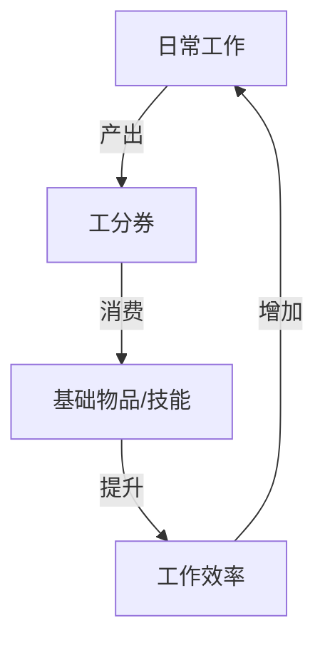
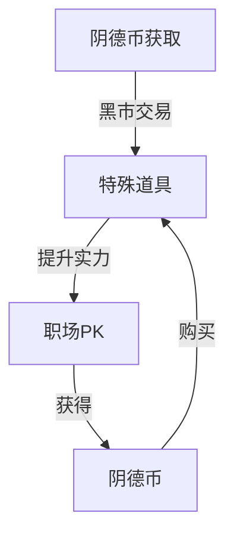
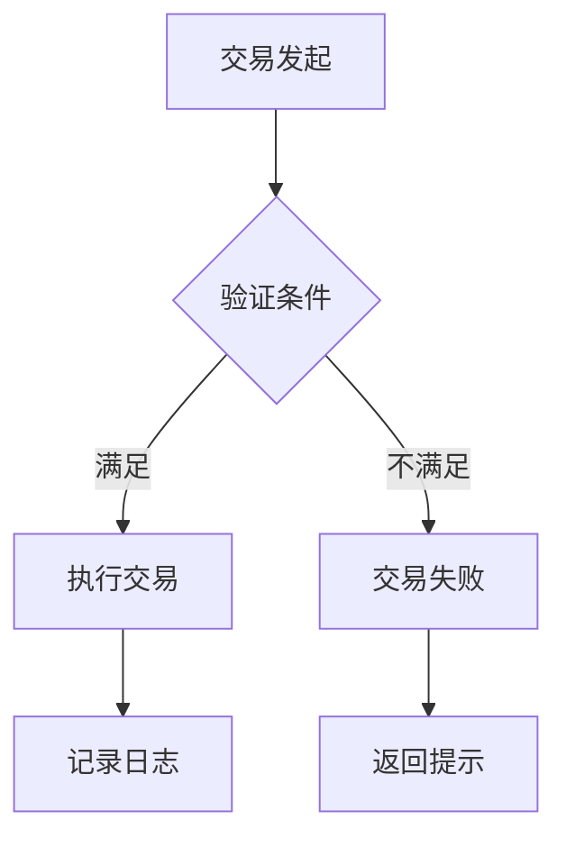

### 《水浒-fuk-u》货币体系设计文档

---

#### 一、货币类型与获取途径

**1.1 阳间货币**
| 货币类型 | 主要用途 | 获取途径 | 消耗场景 |
|----------|---------|----------|----------|
| 工分券   | • 基础消费<br>• 技能升级<br>• 装备购买 | • 日常工作结算<br>• 完成任务<br>• 副本掉落 | • 商城购物<br>• 技能学习<br>• 装备强化 |
| 阴德币   | • 黑市交易<br>• 特殊道具<br>• 情报购买 | • 职场PK获胜<br>• 特殊任务<br>• 黑市交易 | • 贿赂NPC<br>• 购买黑市物品<br>• 解锁特殊剧情 |

**1.2 阴间货币**
| 货币类型 | 主要用途 | 获取途径 | 消耗场景 |
|----------|---------|----------|----------|
| 香火值   | • 维持存在<br>• 穿越时空<br>• 解锁古代能力 | • 获得粉丝关注<br>• 直播打赏<br>• 社交互动 | • 每日存在消耗<br>• 技能转化<br>• 时空穿越 |
| 功德点   | • 技能升级<br>• 解锁觉醒<br>• 特殊道具购买 | • 完成主线任务<br>• 帮助NPC<br>• 特殊成就 | • 技能觉醒<br>• 解锁形态<br>• 购买限定道具 |

#### 二、经济循环系统

**2.1 基础循环模型**


**2.2 高级循环模型**


#### 三、经济平衡机制

**3.1 通货膨胀控制**
- **货币产出上限**：
  - 日常工作收入上限：1000工分券/天
  - 副本掉落限制：每周最多获取5000工分券
  - 黑市交易限额：每日最多获取200阴德币

- **货币消耗机制**：
  - 装备维护费用：每日固定消耗
  - 技能使用消耗：按次数收费
  - 存在维持费用：香火值自动衰减

**3.2 经济调节手段**
- **动态价格系统**：
  ```mermaid
  graph LR
  A[市场需求] -->|影响| B[物品价格]
  C[流通数量] -->|影响| B
  D[系统限制] -->|调节| B
  ```

- **特殊经济事件**：
  | 事件名称 | 触发条件 | 经济影响 |
  |----------|---------|----------|
  | 发薪日暴动 | 每月15日 | 工分券获取翻倍 |
  | 股市波动 | 随机触发 | 物品价格波动 |
  | 比特币挖矿 | 特定角色解锁 | 新货币获取途径 |

#### 四、交易系统

**4.1 交易场所**
- **正规市场**：
  - 商业街：基础物品交易
  - 技能培训中心：技能购买
  - 装备商店：装备交易

- **黑市交易**：
  - 地下钱庄：货币兑换
  - 情报贩子：特殊道具
  - 职场掮客：特殊服务

**4.2 交易规则**


#### 五、风险控制

**5.1 反作弊机制**
- 异常交易监控
- 货币流向追踪
- 账户行为分析

**5.2 经济预警系统**
| 监控指标 | 预警阈值 | 干预措施 |
|----------|---------|----------|
| 通货膨胀率 | >5%/周 | 投放消耗道具 |
| 货币流通速度 | >200%基准值 | 限制交易频率 |
| 市场价格波动 | >30%/天 | 系统强制调价 |

#### 六、数值平衡

**6.1 基础收入参考表**
| 收入来源 | 基准值（工分券） | 时间成本 | 风险系数 |
|----------|----------------|----------|----------|
| 日常工作 | 100/小时 | 固定 | 低 |
| 副本挑战 | 500-1000/次 | 20-30分钟 | 中 |
| 职场PK | 200-2000/次 | 不固定 | 高 |

**6.2 消耗参考表**
| 消耗项目 | 成本（工分券） | 效果持续 | 获得价值 |
|----------|----------------|----------|----------|
| 基础技能学习 | 1000-3000 | 永久 | 能力提升10% |
| 装备强化 | 500/次 | 永久 | 属性提升5% |
| 道具使用 | 100-500 | 一次性 | 即时效果 |

---

#### 七、后续优化方向

1. 设计更多元化的货币获取途径
2. 完善经济系统与其他系统的联动
3. 增加更多趣味性的经济事件
4. 优化通货膨胀控制机制
5. 设计更多的货币消耗点
