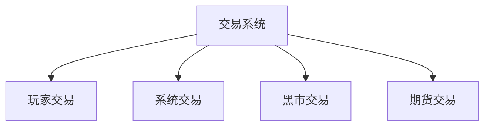
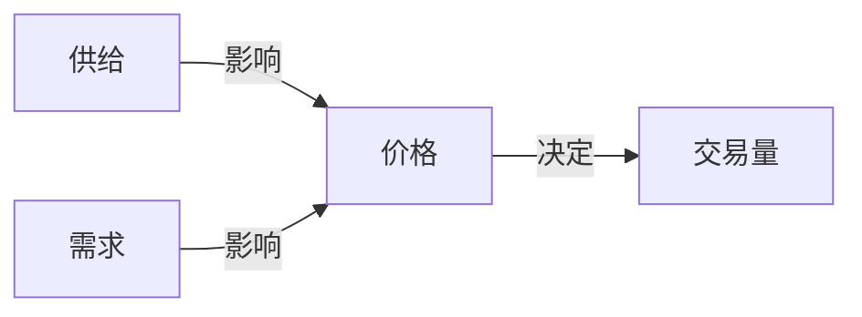
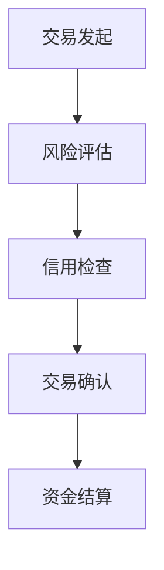
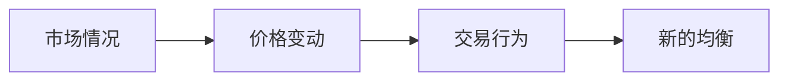
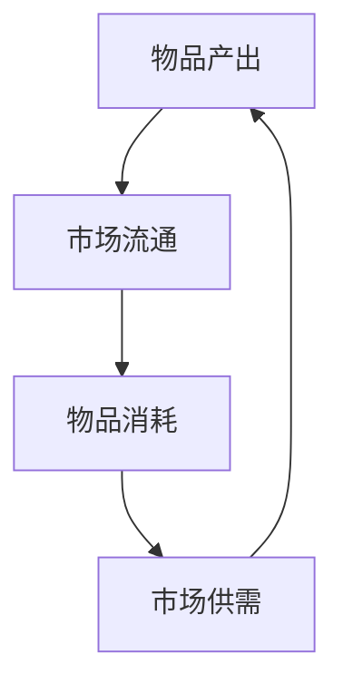
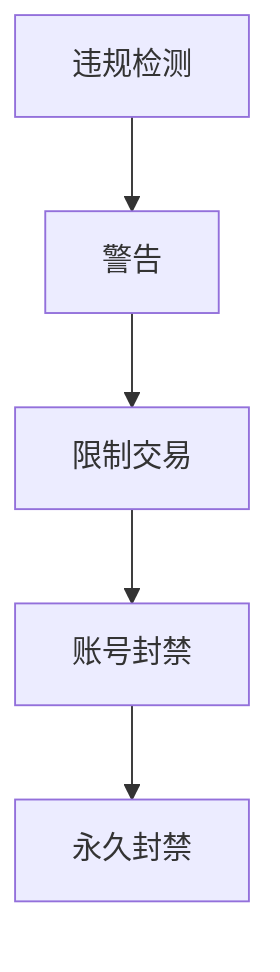
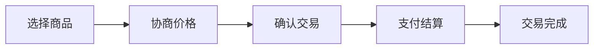

### 《水浒-fuk-u》交易系统设计文档

---

#### 一、交易系统概述

**1.1 系统定位**

**1.2 交易类型**
| 类型 | 主要特点 | 风险等级 | 收益潜力 |
|------|----------|----------|----------|
| 直接交易 | 玩家间点对点 | 低 | 中等 |
| 系统交易 | 固定价格 | 无 | 低 |
| 黑市交易 | 高风险高收益 | 极高 | 极高 |
| 期货交易 | 价格波动 | 高 | 高 |

#### 二、交易市场设计

**2.1 市场分类**
| 市场类型 | 交易品类 | 特色机制 | 准入条件 |
|----------|----------|----------|----------|
| 正规市场 | 基础物资 | 价格稳定 | 无 |
| 高级市场 | 稀有道具 | 限时上架 | 信用等级 |
| 黑市 | 特殊商品 | 隐藏交易 | 黑市声望 |
| 期货市场 | 期货合约 | 价格预测 | 资金门槛 |

**2.2 市场机制**

#### 三、交易规则设计

**3.1 基础规则**
| 规则类型 | 具体内容 | 目的 | 限制 |
|----------|----------|------|------|
| 交易税 | 2%-5% | 经济调节 | 全局 |
| 信用评级 | A-D级 | 风险控制 | 差异化 |
| 交易额度 | 每日上限 | 通货膨胀 | 等级相关 |
| 交易时限 | 24小时确认 | 安全保障 | 固定 |

**3.2 安全机制**

#### 四、价格系统

**4.1 定价机制**
| 因素 | 影响权重 | 波动范围 | 更新周期 |
|------|----------|----------|----------|
| 基础价值 | 40% | ±10% | 固定 |
| 市场供需 | 30% | ±20% | 实时 |
| 稀有度 | 20% | ±30% | 每周 |
| 时令影响 | 10% | ±15% | 每月 |

**4.2 价格波动**

#### 五、物品流通系统

**5.1 物品分类**
| 类别 | 示例 | 流通限制 | 价值稳定性 |
|------|------|----------|------------|
| 消耗品 | 办公用品 | 无 | 稳定 |
| 装备 | 数码产品 | 绑定期 | 波动 |
| 特殊道具 | 稀有配件 | 严格限制 | 高波动 |
| 虚拟商品 | 数字资产 | 平台限制 | 极不稳定 |

**5.2 流通机制**

#### 六、职场交易特色

**6.1 职场特供商品**
| 商品类型 | 作用 | 获取难度 | 交易限制 |
|----------|------|----------|----------|
| 内部消息 | 情报收集 | 高 | 严格限制 |
| 关系网络 | 人脉拓展 | 中 | 半开放 |
| 技能证书 | 能力提升 | 低 | 开放 |
| 办公资源 | 效率提升 | 中 | 部门限制 |

**6.2 办公室交易**
| 交易类型 | 风险 | 收益 | 发现惩罚 |
|----------|------|------|----------|
| 资源互换 | 低 | 低 | 警告 |
| 信息买卖 | 中 | 中 | 记过 |
| 关系交易 | 高 | 高 | 降职 |
| 灰色交易 | 极高 | 极高 | 开除 |

#### 七、监管系统

**7.1 交易监控**
| 监控项 | 监控方式 | 触发条件 | 处理方式 |
|--------|----------|----------|----------|
| 大额交易 | 自动标记 | 超过阈值 | 人工审核 |
| 频繁交易 | 行为分析 | 异常频率 | 自动冻结 |
| 可疑交易 | AI识别 | 模式匹配 | 系统预警 |
| 违规交易 | 实时检测 | 规则违反 | 直接制裁 |

**7.2 惩罚机制**

#### 八、UI/UX设计

**8.1 界面布局**
| 功能区 | 主要内容 | 交互方式 | 特色设计 |
|--------|----------|----------|----------|
| 交易大厅 | 商品列表 | 分类浏览 | 实时更新 |
| 个人交易 | 交易记录 | 详细信息 | 状态追踪 |
| 市场行情 | 价格走势 | 图表展示 | 趋势预测 |
| 交易通知 | 消息提醒 | 即时推送 | 重要提示 |

**8.2 操作流程**

#### 九、数据统计分析

**9.1 交易数据**
| 数据类型 | 统计周期 | 用途 | 展示方式 |
|----------|----------|------|----------|
| 交易量 | 实时/日/周 | 市场活跃度 | 趋势图 |
| 价格走势 | 小时/日/周 | 市场预测 | 折线图 |
| 热门商品 | 日/周/月 | 市场导向 | 排行榜 |
| 交易分布 | 实时 | 异常监控 | 热力图 |

---

#### 十、后续优化方向

1. 增加更多交易玩法
2. 优化价格机制
3. 完善监管系统
4. 增强用户体验
5. 丰富交易种类
