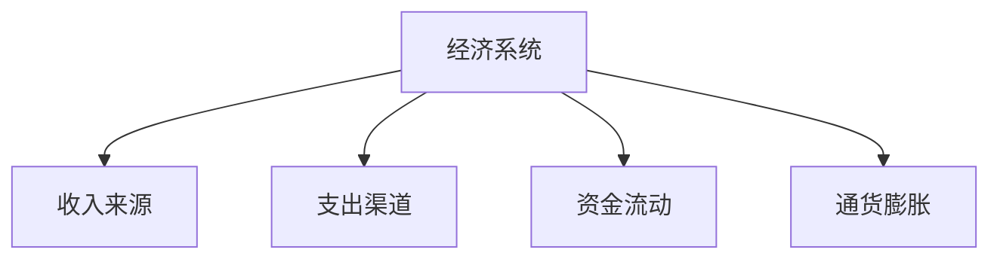
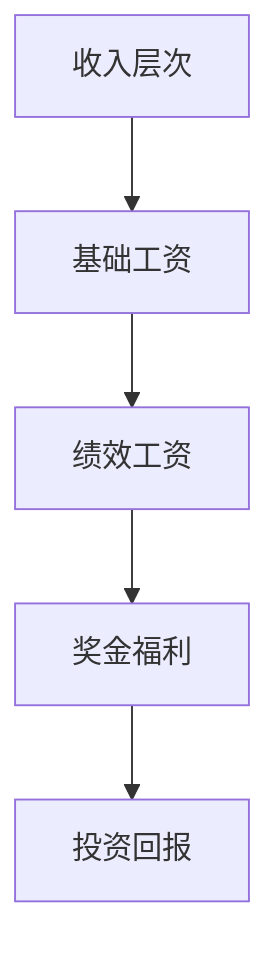
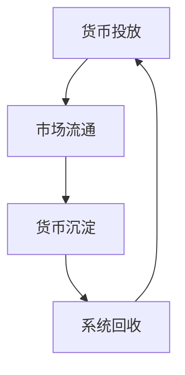
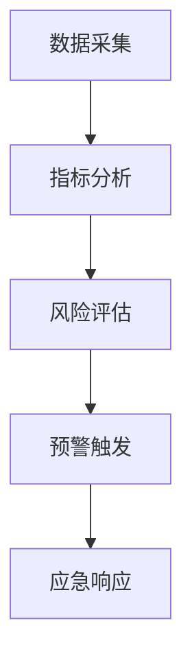

### 《水浒-fuk-u》经济平衡设计文档

---

#### 一、经济系统概览

**1.1 经济模型**

**1.2 经济指标**
| 指标 | 目标值 | 浮动范围 | 调节手段 |
|------|--------|----------|----------|
| 通货膨胀率 | 3% | ±2% | 货币回收 |
| 财富差距 | 5倍 | ±2倍 | 福利补贴 |
| 市场活跃度 | 60% | ±10% | 活动激励 |
| 消费意愿 | 70% | ±15% | 促销活动 |

#### 二、收入系统平衡

**2.1 收入来源分布**
| 来源 | 占比 | 获取难度 | 稳定性 |
|------|------|----------|--------|
| 工资收入 | 50% | 低 | 稳定 |
| 奖金收入 | 20% | 中 | 波动 |
| 投资收入 | 15% | 高 | 不稳定 |
| 副业收入 | 15% | 中 | 较稳定 |

**2.2 收入等级**

#### 三、支出系统平衡

**3.1 必要支出**
| 支出项 | 占比 | 弹性 | 调节空间 |
|--------|------|------|----------|
| 技能提升 | 30% | 低 | 小 |
| 装备更新 | 25% | 中 | 中 |
| 社交支出 | 20% | 高 | 大 |
| 日常消耗 | 25% | 中 | 中 |

**3.2 消费引导**

#### 四、货币系统平衡

**4.1 货币供给**
| 渠道 | 产出量 | 产出频率 | 限制条件 |
|------|--------|----------|----------|
| 主线任务 | 高 | 一次性 | 进度限制 |
| 日常任务 | 中 | 每日 | 次数限制 |
| 活动奖励 | 高 | 不定期 | 参与门槛 |
| 成就系统 | 中 | 一次性 | 难度限制 |

**4.2 货币回收**

#### 五、市场价格平衡

**5.1 价格体系**
| 商品类型 | 基准价格 | 波动范围 | 调节机制 |
|----------|----------|----------|----------|
| 基础物资 | 100 | ±10% | 自动调节 |
| 技能道具 | 500 | ±20% | 人工干预 |
| 稀有装备 | 2000 | ±30% | 市场调节 |
| 限定物品 | 5000+ | ±50% | 供需关系 |

**5.2 价格调控**
| 调控手段 | 影响范围 | 生效时间 | 副作用 |
|----------|----------|----------|--------|
| 价格上限 | 全局 | 立即 | 货物短缺 |
| 折扣活动 | 局部 | 临时 | 市场波动 |
| 限量发售 | 特定商品 | 持续 | 价格上涨 |
| 捆绑销售 | 特定组合 | 活动期 | 库存积压 |

#### 六、经济调控机制

**6.1 宏观调控**

**6.2 调控措施**
| 问题 | 措施 | 预期效果 | 实施周期 |
|------|------|----------|----------|
| 通货膨胀 | 提高消耗 | 货币回收 | 短期 |
| 贫富差距 | 福利补贴 | 收入平衡 | 中期 |
| 市场萧条 | 刺激消费 | 活跃市场 | 短期 |
| 物价失控 | 价格管制 | 稳定物价 | 长期 |

#### 七、经济监测系统

**7.1 监测指标**
| 指标 | 监测频率 | 警戒值 | 干预措施 |
|------|----------|--------|----------|
| 货币总量 | 实时 | ±20% | 调节供给 |
| 物价指数 | 每日 | ±15% | 价格管制 |
| 交易活跃 | 每时 | <40% | 激励措施 |
| 财富分布 | 每周 | >8倍 | 福利调节 |

**7.2 预警机制**

#### 八、平衡性验证

**8.1 验证方法**
| 方法 | 周期 | 样本量 | 评估维度 |
|------|------|--------|----------|
| 数据分析 | 每日 | 全体 | 宏观趋势 |
| 玩家反馈 | 实时 | 抽样 | 体验感受 |
| 压力测试 | 每周 | 特定群体 | 极限情况 |
| 模拟预测 | 每月 | 全服务器 | 未来趋势 |

**8.2 调整流程**

#### 九、应急预案

**9.1 经济危机处理**
| 危机类型 | 触发条件 | 应对措施 | 恢复时间 |
|----------|----------|----------|----------|
| 通货膨胀 | 物价+50% | 紧急回收 | 1周 |
| 市场崩溃 | 交易-70% | 强制托市 | 3天 |
| 财富暴雷 | 差距>10倍 | 财富重分配 | 1月 |
| 系统漏洞 | 异常数据 | 紧急维护 | 即时 |

**9.2 补偿机制**
| 情况 | 补偿内容 | 发放方式 | 限制条件 |
|------|----------|----------|----------|
| 系统故障 | 直接损失 | 立即补偿 | 无 |
| 政策调整 | 过渡补贴 | 分期发放 | 活跃度 |
| 平衡性调整 | 补偿礼包 | 一次性 | 等级要求 |

---

#### 十、后续优化方向

1. 完善经济模型的动态调节能力
2. 增强市场预警机制的准确性
3. 优化价格体系的自动调节
4. 改进财富分配的平衡性
5. 强化经济监测的实时性
