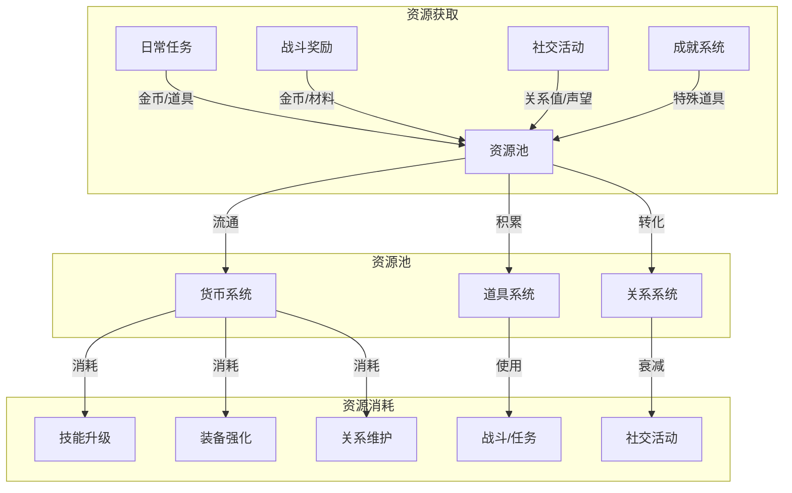
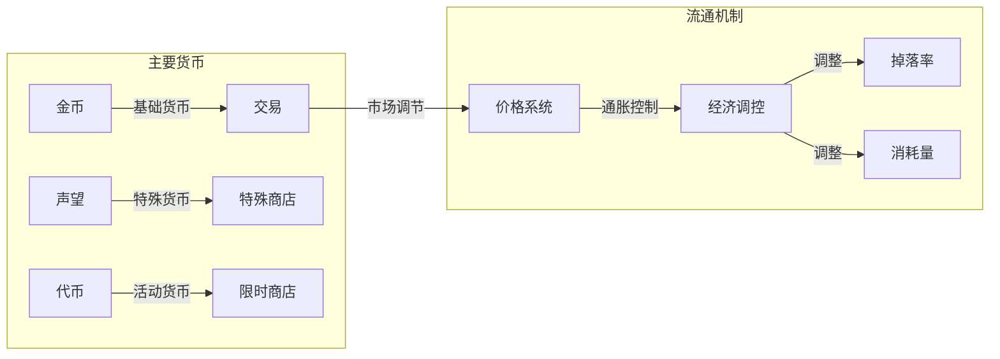
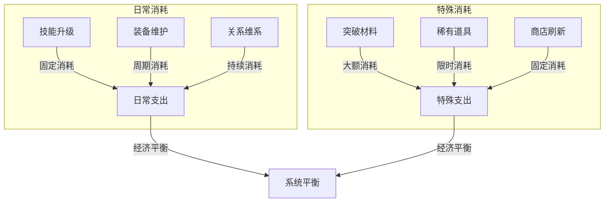
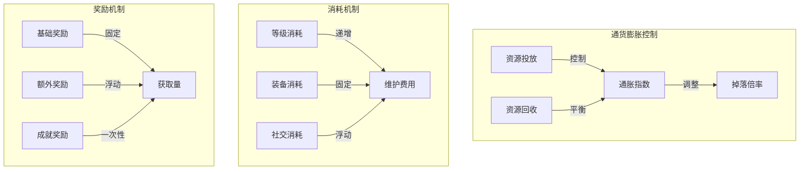
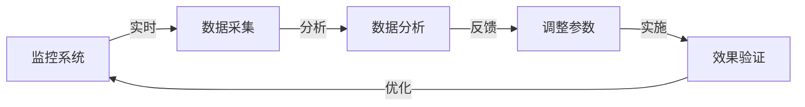

### 《水浒-fuk-u》经济流转图

---

#### 一、整体经济流转

#### 二、货币系统流转

#### 三、消耗链条

#### 四、经济平衡机制

#### 五、资源流向监控

---

#### 六、经济系统说明

1. **资源获取**
   - 任务奖励：主要固定收入
   - 战斗掉落：随机收入
   - 社交回报：关系收益
   - 成就奖励：里程碑收入

2. **资源消耗**
   - 技能升级：主要消耗
   - 装备强化：定向消耗
   - 关系维护：持续消耗
   - 商店购买：自由消耗

3. **平衡机制**
   - 通货膨胀控制
   - 消耗阈值调整
   - 掉落率动态调整
   - 价格浮动系统

4. **监控指标**
   - 货币存量
   - 流通速度
   - 消耗比率
   - 获取效率
