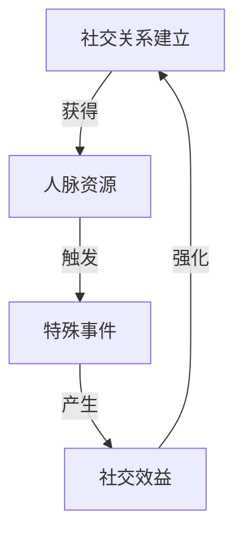
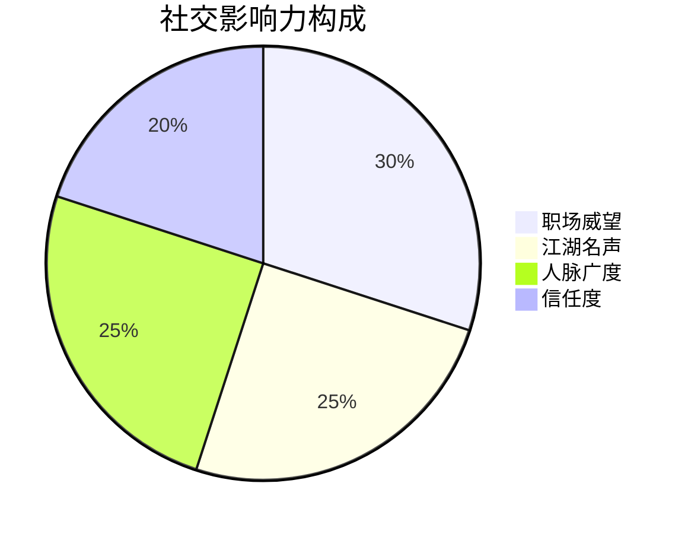
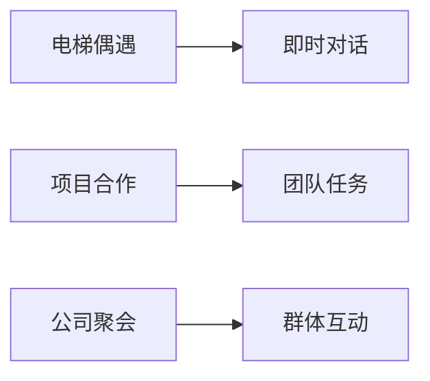
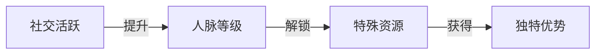
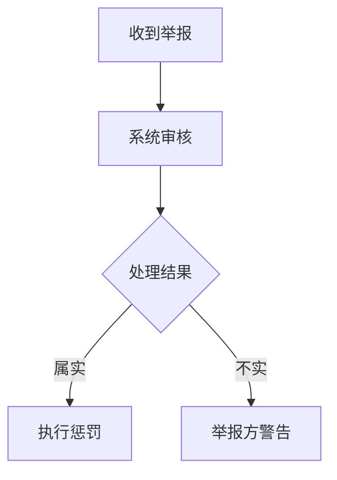

### 《水浒-fuk-u》社交系统设计文档

---

#### 一、社交系统核心理念

**1.1 设计目标**
- 重现现代职场社交网络的复杂性
- 结合水浒传统义气与现代职场关系
- 通过社交互动影响游戏进程
- 构建有趣且深度的社交玩法

**1.2 核心玩法闭环**


#### 二、社交关系系统

**2.1 关系类型分级**
| 关系等级 | 形成条件 | 特殊效果 | 每日互动次数 |
|----------|---------|----------|--------------|
| 点头之交 | 初次见面 | 基础信息共享 | 1次 |
| 工作伙伴 | 共事30天 | 工作效率+5% | 3次 |
| 革命友谊 | 互助达成50次 | 战斗加成+10% | 5次 |
| 生死之交 | 完成隐藏任务 | 技能共享 | 无限制 |

**2.2 社交属性**


#### 三、互动系统设计

**3.1 基础互动**
| 互动类型 | 消耗 | 收益 | 冷却时间 |
|----------|------|------|----------|
| 闲聊 | 体力5 | 好感度+1 | 5分钟 |
| 送礼 | 工分券 | 好感度+5 | 24小时 |
| 请吃饭 | 工分券 | 好感度+10 | 72小时 |
| 帮忙 | 体力20 | 好感度+15 | 24小时 |

**3.2 高级互动**
- **办公室政治**：
  ```mermaid
  graph TB
  A[站队选择] --> B{派系关系}
  B -->|友好| C[资源共享]
  B -->|敌对| D[利益冲突]
  ```

- **特殊事件**：
  | 事件类型 | 触发条件 | 影响 |
  |----------|----------|------|
  | 背后议论 | 好感度<-20 | 信任度-10 |
  | 举荐升职 | 好感度>80 | 晋升机会+1 |
  | 联手打压 | 共同敌人 | 目标压力值+30 |

#### 四、社交场景设计

**4.1 固定场景**
| 场景 | 主要功能 | 特色玩法 | 开放时间 |
|------|----------|----------|----------|
| 茶水间 | 日常交际 | 隐藏情报获取 | 工作时间 |
| 健身房 | 属性提升 | 切磋技能 | 全天 |
| 网吧 | 信息获取 | 黑客入侵 | 晚间 |
| 天台 | 秘密会谈 | 结盟策划 | 特定时段 |

**4.2 随机场景**


#### 五、社交系统玩法

**5.1 派系玩法**
- **主要派系**：
  | 派系名称 | 特色 | 加入条件 | 专属特权 |
  |----------|------|----------|----------|
  | 实干派 | 能力至上 | 完成率>90% | 效率提升 |
  | 关系派 | 人脉优先 | 好感度>500 | 资源共享 |
  | 摸鱼派 | 快乐至上 | 压力值<30 | 减压技能 |

- **派系任务**：
  ```mermaid
  graph TD
  A[接取任务] --> B[完成目标]
  B --> C[获得声望]
  C --> D[提升地位]
  ```

**5.2 工会系统**
| 功能 | 描述 | 要求 | 效果 |
|------|------|------|------|
| 创建工会 | 组建工人联盟 | 声望>1000 | 开启工会任务 |
| 工会战 | 跨工会对抗 | 成员>20 | 获得资源 |
| 集体行动 | 组织群体活动 | 活跃度>50 | 增加凝聚力 |

#### 六、社交奖励机制

**6.1 直接奖励**
| 行为 | 奖励类型 | 数值 | 上限 |
|------|----------|------|------|
| 日常互动 | 经验值 | 10/次 | 100/天 |
| 任务协助 | 工分券 | 50/次 | 500/天 |
| 情报分享 | 阴德币 | 5/条 | 50/天 |

**6.2 间接收益**


#### 七、社交任务系统

**7.1 每日社交任务**
| 任务类型 | 要求 | 奖励 | 难度 |
|----------|------|------|------|
| 建立联系 | 结识3人 | 社交点*30 | 简单 |
| 信息收集 | 获取5条情报 | 阴德币*50 | 中等 |
| 派系互动 | 完成3次派系任务 | 声望*100 | 困难 |

**7.2 特殊社交任务**
- **关系链任务**：
  - 建立特定NPC关系网
  - 解锁隐藏剧情
  - 获得独特奖励

#### 八、防护机制

**8.1 负面社交防护**
| 问题类型 | 防护措施 | 惩罚机制 |
|----------|----------|----------|
| 谣言传播 | 信息溯源 | 声望降低 |
| 恶意举报 | 仲裁系统 | 功能限制 |
| 攻击行为 | 行为监控 | 账号警告 |

**8.2 举报处理**


#### 九、数据分析

**9.1 核心监控指标**
| 指标 | 目标值 | 预警值 | 干预措施 |
|------|--------|--------|----------|
| 日活跃度 | >60% | <30% | 活动激励 |
| 互动频率 | >10次/日 | <5次/日 | 奖励提升 |
| 社交链接 | >20人 | <10人 | 匹配推荐 |

**9.2 平衡性调整**
- 社交收益与时间投入比例
- 派系势力动态平衡
- 社交资源合理分配

---

#### 十、后续优化方向

1. 增加更多样化的社交场景
2. 深化派系间的互动机制
3. 完善工会系统功能
4. 优化社交任务的趣味性
5. 加强社交系统与主线剧情的联动
