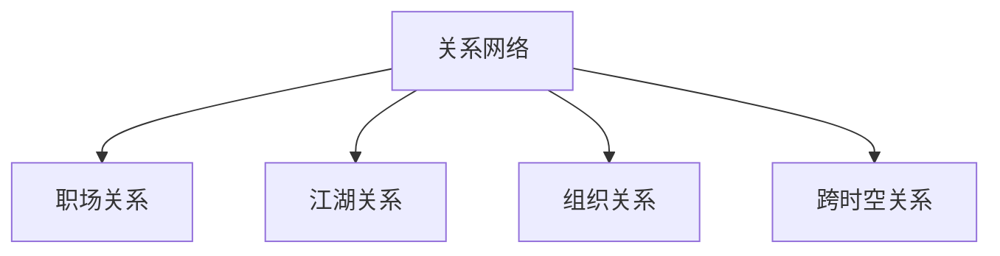
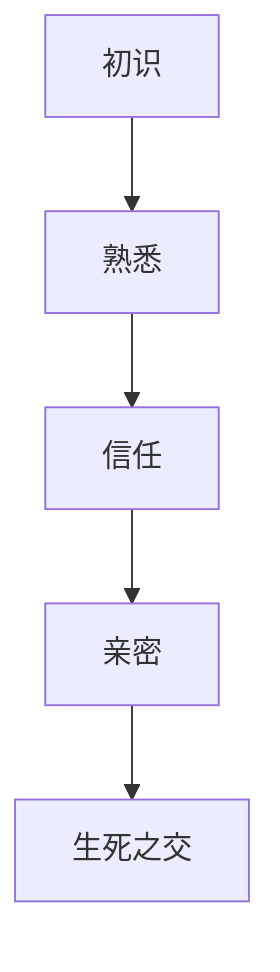
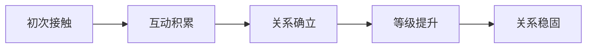
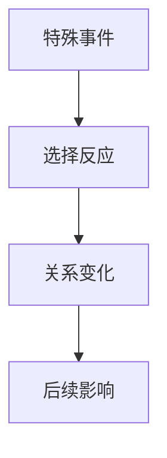
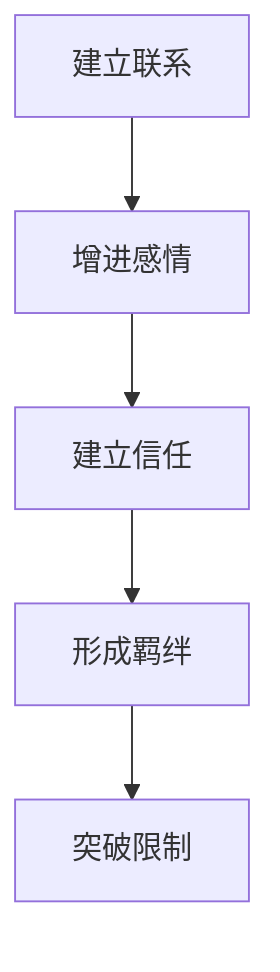
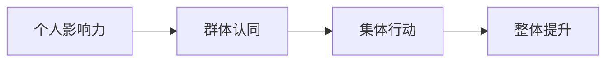
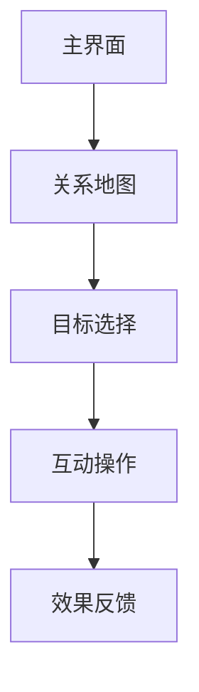

### 《水浒-fuk-u》关系网络系统设计文档

---

#### 一、系统概述

**1.1 系统定位**

**1.2 关系类型**
| 类型 | 特点 | 建立方式 | 维护成本 |
|------|------|----------|----------|
| 同事关系 | 职场基础 | 自动形成 | 低 |
| 部门关系 | 组织性质 | 系统分配 | 中 |
| 结义关系 | 玩家互动 | 双方确认 | 高 |
| 师徒关系 | 传承性质 | 邀请制 | 中高 |

#### 二、关系属性系统

**2.1 基础属性**
| 属性 | 影响范围 | 提升方式 | 衰减规则 |
|------|----------|----------|----------|
| 好感度 | 互动权限 | 日常互动 | 缓慢降低 |
| 信任度 | 合作效率 | 任务协作 | 事件触发 |
| 默契度 | 配合加成 | 长期搭档 | 无 |
| 羁绊值 | 特殊能力 | 剧情选择 | 背叛清零 |

**2.2 关系等级**

#### 三、关系网络构建

**3.1 网络结构**
| 层级 | 规模限制 | 互动频率 | 关系强度 |
|------|----------|----------|----------|
| 核心圈 | 5人 | 每日 | 最强 |
| 关键圈 | 15人 | 每周 | 较强 |
| 普通圈 | 50人 | 不定期 | 一般 |
| 泛关系 | 不限 | 偶尔 | 最弱 |

**3.2 关系建立**

#### 四、互动系统

**4.1 日常互动**
| 互动类型 | 效果 | 次数限制 | 冷却时间 |
|----------|------|----------|----------|
| 一起吃饭 | 好感+5 | 3次/日 | 4小时 |
| 送礼物 | 好感+10 | 1次/日 | 24小时 |
| 帮忙 | 信任+8 | 5次/日 | 2小时 |
| 聊天 | 好感+2 | 无限 | 无 |

**4.2 特殊互动**

#### 五、关系效果系统

**5.1 基础效果**
| 关系等级 | 互动加成 | 特殊权限 | 额外奖励 |
|----------|----------|----------|----------|
| 初识 | 无 | 基础互动 | 无 |
| 熟悉 | 10% | 组队优先 | 小额福利 |
| 信任 | 25% | 资源共享 | 特殊道具 |
| 亲密 | 50% | 专属任务 | 稀有奖励 |
| 生死之交 | 100% | 全部开放 | 传说装备 |

**5.2 组合效果**
| 组合类型 | 触发条件 | 特殊效果 | 持续时间 |
|----------|----------|----------|----------|
| 双人组合 | 关系>信任 | 属性+15% | 组队期间 |
| 三人组合 | 平均>熟悉 | 经验+20% | 任务期间 |
| 团队羁绊 | 全员>亲密 | 战力+30% | 固定时间 |

#### 六、关系养成系统

**6.1 养成路径**

**6.2 养成方式**
| 方式 | 效率 | 资源消耗 | 成功率 |
|------|------|----------|--------|
| 日常互动 | 低 | 低 | 100% |
| 送礼物 | 中 | 中 | 90% |
| 任务协作 | 高 | 高 | 80% |
| 剧情选择 | 极高 | 一次性 | 50% |

#### 七、影响力系统

**7.1 个人影响力**
| 维度 | 计算方式 | 影响范围 | 提升方法 |
|------|----------|----------|----------|
| 社交活跃度 | 互动频率 | 好感获取 | 频繁互动 |
| 信誉评级 | 承诺完成度 | 信任建立 | 遵守承诺 |
| 人脉广度 | 关系网络大小 | 资源获取 | 扩展人脉 |
| 关系深度 | 高等级关系数 | 特殊权限 | 重点经营 |

**7.2 群体影响**

#### 八、关系管理系统

**8.1 维护机制**
| 维护项 | 消耗 | 效果 | 周期 |
|--------|------|------|------|
| 日常问候 | 时间 | 防止衰减 | 每日 |
| 定期互动 | 资源 | 关系提升 | 每周 |
| 礼物馈赠 | 道具 | 快速提升 | 不定期 |
| 危机处理 | 大量资源 | 挽回关系 | 临时 |

**8.2 衰减机制**
| 触发条件 | 衰减速度 | 影响范围 | 补救方式 |
|----------|----------|----------|----------|
| 长期未互动 | -1/天 | 好感度 | 日常互动 |
| 承诺失败 | -10/次 | 信任度 | 任务补偿 |
| 利益冲突 | -20/次 | 全属性 | 危机处理 |
| 背叛行为 | -50/次 | 关系断绝 | 特殊剧情 |

#### 九、界面设计

**9.1 关系界面**
| 功能区 | 显示内容 | 操作方式 | 更新频率 |
|--------|----------|----------|----------|
| 关系地图 | 人际网络 | 可视化交互 | 实时 |
| 属性面板 | 关系状态 | 数值展示 | 变化时 |
| 互动按钮 | 可用操作 | 点击触发 | 实时 |
| 历史记录 | 互动日志 | 翻页查看 | 即时记录 |

**9.2 交互设计**

---

#### 十、后续优化方向

1. 增加更多特色互动方式
2. 完善关系衰减机制
3. 优化群体影响系统
4. 增强关系养成趣味性
5. 细化关系网络可视化
