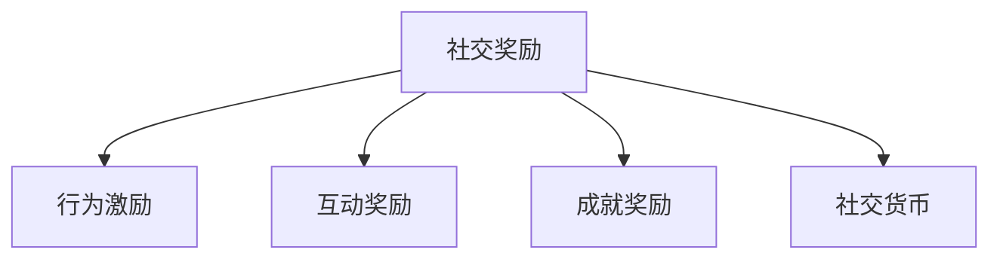
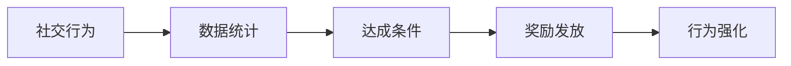
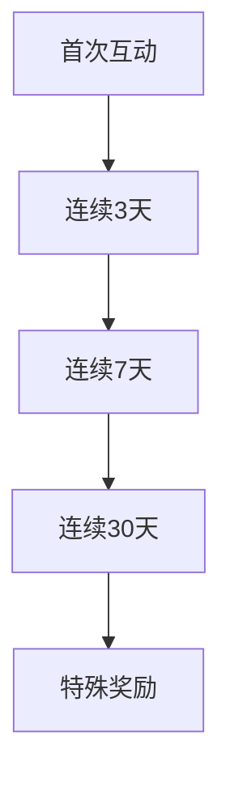
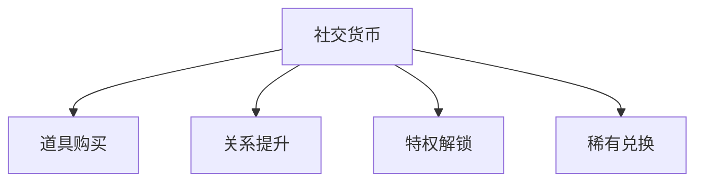
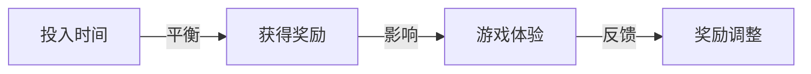
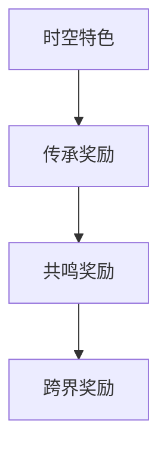
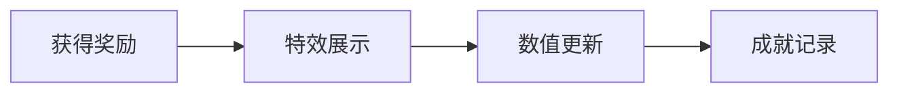

### 《水浒-fuk-u》社交奖励系统设计文档

---

#### 一、系统概述

**1.1 系统定位**

**1.2 奖励层级**
| 层级 | 获取难度 | 奖励价值 | 刷新周期 |
|------|----------|----------|----------|
| 日常奖励 | 低 | 基础资源 | 每日 |
| 周常奖励 | 中 | 进阶道具 | 每周 |
| 月度奖励 | 高 | 稀有物品 | 每月 |
| 特殊奖励 | 极高 | 限定装备 | 不定期 |

#### 二、行为激励系统

**2.1 激励类型**
| 行为类型 | 激励方式 | 奖励内容 | 限制条件 |
|----------|----------|----------|----------|
| 主动社交 | 即时奖励 | 友情点 | 每日上限 |
| 协作任务 | 完成奖励 | 双倍经验 | 组队条件 |
| 社群活动 | 参与奖励 | 活动道具 | 活动期间 |
| 关系建设 | 阶段奖励 | 特殊称号 | 等级要求 |

**2.2 激励机制**

#### 三、互动奖励设计

**3.1 基础互动奖励**
| 互动类型 | 奖励内容 | 获取频率 | 额外效果 |
|----------|----------|----------|----------|
| 日常问候 | 友情点×10 | 每日1次 | 亲密度+1 |
| 送礼 | 好感度+20 | 每日3次 | 概率双倍 |
| 帮助他人 | 声望+15 | 不限 | 信任度+2 |
| 组队活动 | 效率+30% | 持续性 | 默契度+5 |

**3.2 连续互动奖励**

#### 四、成就奖励系统

**4.1 社交成就**
| 成就类型 | 达成条件 | 奖励内容 | 稀有度 |
|----------|----------|----------|--------|
| 人脉达人 | 100个好友 | 称号+道具 | 普通 |
| 交际花 | 1000次互动 | 限定装扮 | 稀有 |
| 群众领袖 | 公会等级10 | 专属技能 | 史诗 |
| 江湖传说 | 全关系满级 | 传说装备 | 传说 |

**4.2 成就等级**
| 等级 | 要求 | 奖励提升 | 特殊效果 |
|------|------|----------|----------|
| 铜牌 | 基础完成 | 100% | 无 |
| 银牌 | 优质完成 | 150% | 小概率额外 |
| 金牌 | 完美完成 | 200% | 必得额外 |
| 钻石 | 极限完成 | 300% | 额外特殊 |

#### 五、社交货币系统

**5.1 货币类型**
| 货币名称 | 获取方式 | 使用范围 | 保值性 |
|----------|----------|----------|--------|
| 友情点 | 日常互动 | 基础商店 | 低 |
| 声望值 | 社交成就 | 高级商店 | 中 |
| 公会币 | 公会贡献 | 公会商店 | 高 |
| 社交券 | 限定活动 | 特殊兑换 | 极高 |

**5.2 货币用途**

#### 六、奖励平衡设计

**6.1 价值体系**
| 奖励类型 | 基准价值 | 获取难度 | 稀有程度 |
|----------|----------|----------|----------|
| 基础道具 | 100 | 低 | 普通 |
| 进阶装备 | 500 | 中 | 稀有 |
| 限定物品 | 2000 | 高 | 史诗 |
| 传说装备 | 10000 | 极高 | 传说 |

**6.2 平衡机制**

#### 七、特殊奖励活动

**7.1 活动类型**
| 活动名称 | 周期 | 奖励特点 | 参与门槛 |
|----------|------|----------|----------|
| 社交节日 | 月度 | 主题装扮 | 无 |
| 公会战 | 赛季 | 团队奖励 | 公会等级 |
| 好友狂欢 | 限时 | 双倍收益 | 好友数量 |
| 跨服联谊 | 特殊 | 独占奖励 | 等级要求 |

**7.2 活动奖励**
| 奖励类型 | 获取条件 | 价值量 | 稀有度 |
|----------|----------|--------|--------|
| 个人奖励 | 积分达标 | 中等 | 普通 |
| 排名奖励 | 排名靠前 | 高 | 稀有 |
| 团队奖励 | 集体达标 | 很高 | 史诗 |
| 特殊奖励 | 随机触发 | 极高 | 传说 |

#### 八、时空特色奖励

**8.1 跨时空社交**
| 特色 | 奖励机制 | 互动方式 | 特殊效果 |
|------|----------|----------|----------|
| 古今对话 | 双倍收益 | 剧情选择 | 解锁传承 |
| 武艺传授 | 技能点 | 切磋互动 | 技能进阶 |
| 情谊传承 | 羁绊值 | 任务协作 | 羁绊技能 |
| 跨世共鸣 | 共鸣点 | 特殊互动 | 隐藏剧情 |

**8.2 特殊奖励体系**

#### 九、界面展示

**9.1 奖励显示**
| 界面元素 | 显示内容 | 交互方式 | 更新频率 |
|----------|----------|----------|----------|
| 奖励预览 | 可获得物品 | 悬停查看 | 实时 |
| 进度条 | 完成进度 | 动态更新 | 实时 |
| 奖励特效 | 获得反馈 | 动画展示 | 触发时 |
| 成就墙 | 获得记录 | 查看详情 | 解锁时 |

**9.2 反馈设计**

---

#### 十、后续优化方向

1. 增加更多互动奖励类型
2. 优化奖励获取路径
3. 平衡奖励价值体系
4. 丰富时空特色奖励
5. 完善社交货币系统
