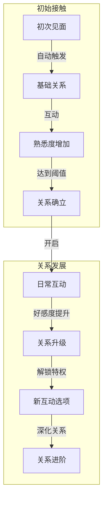
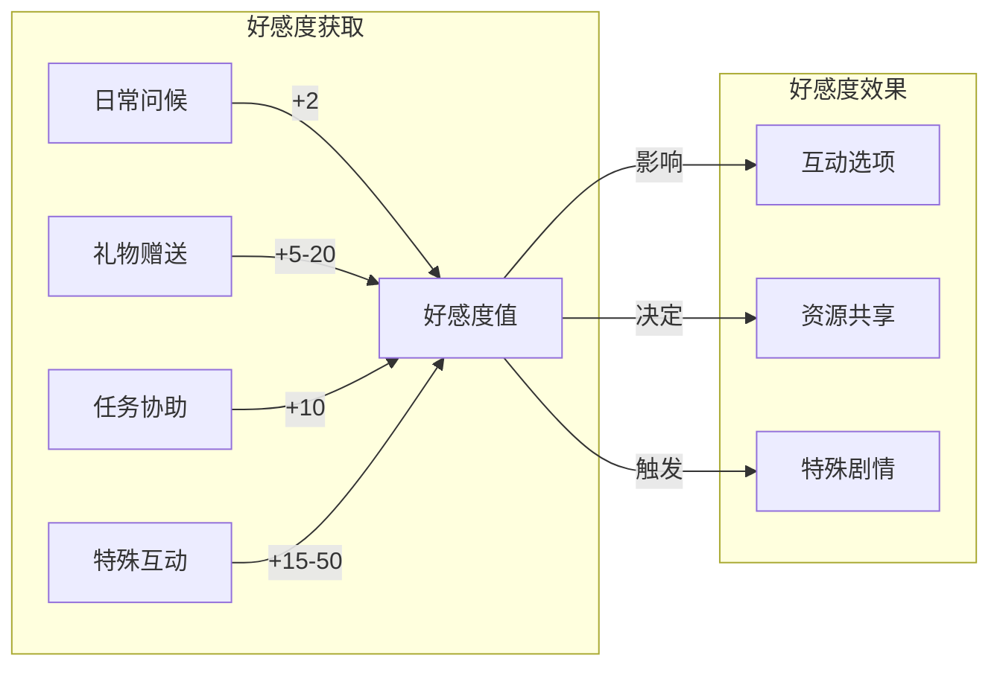
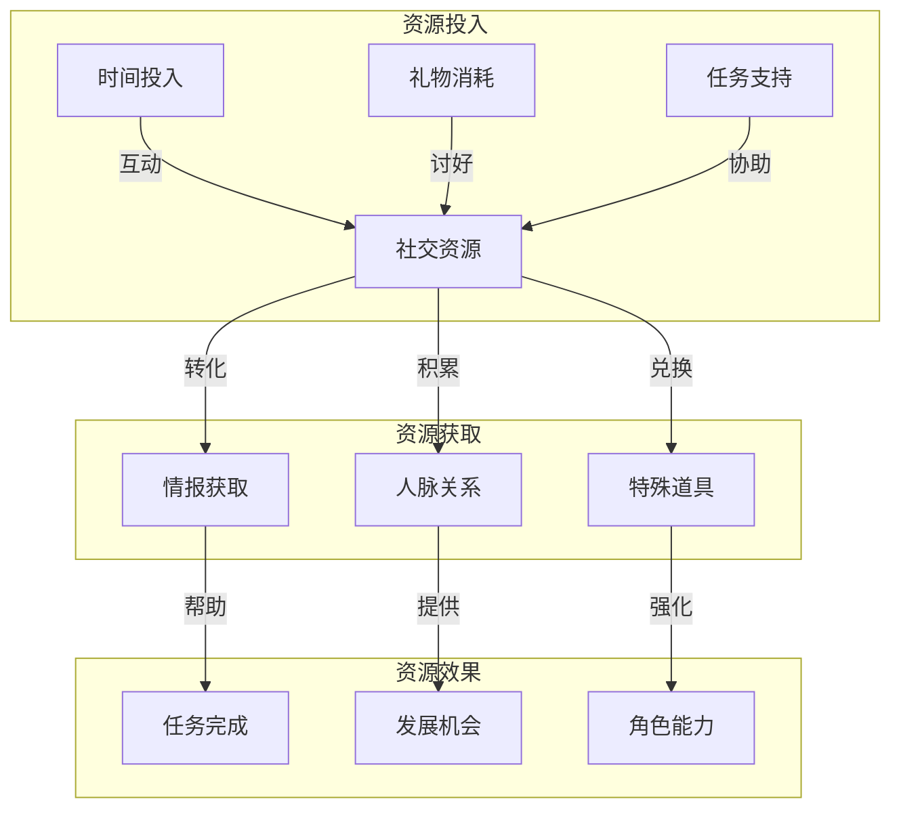
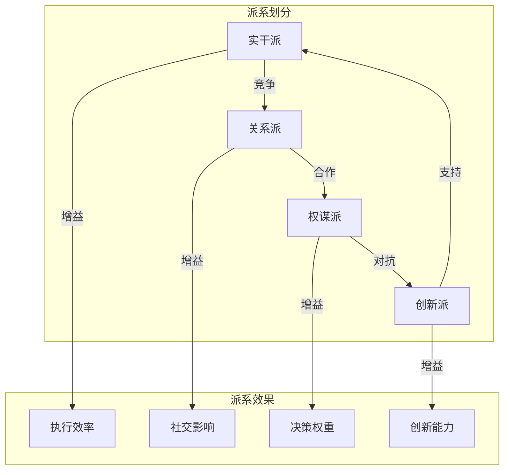
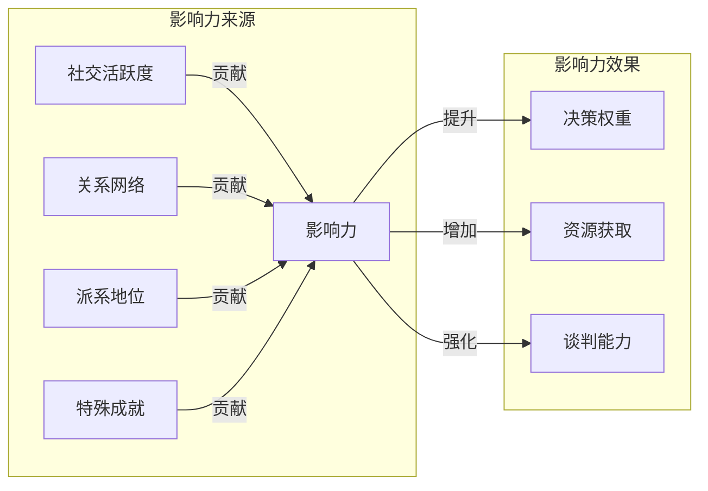
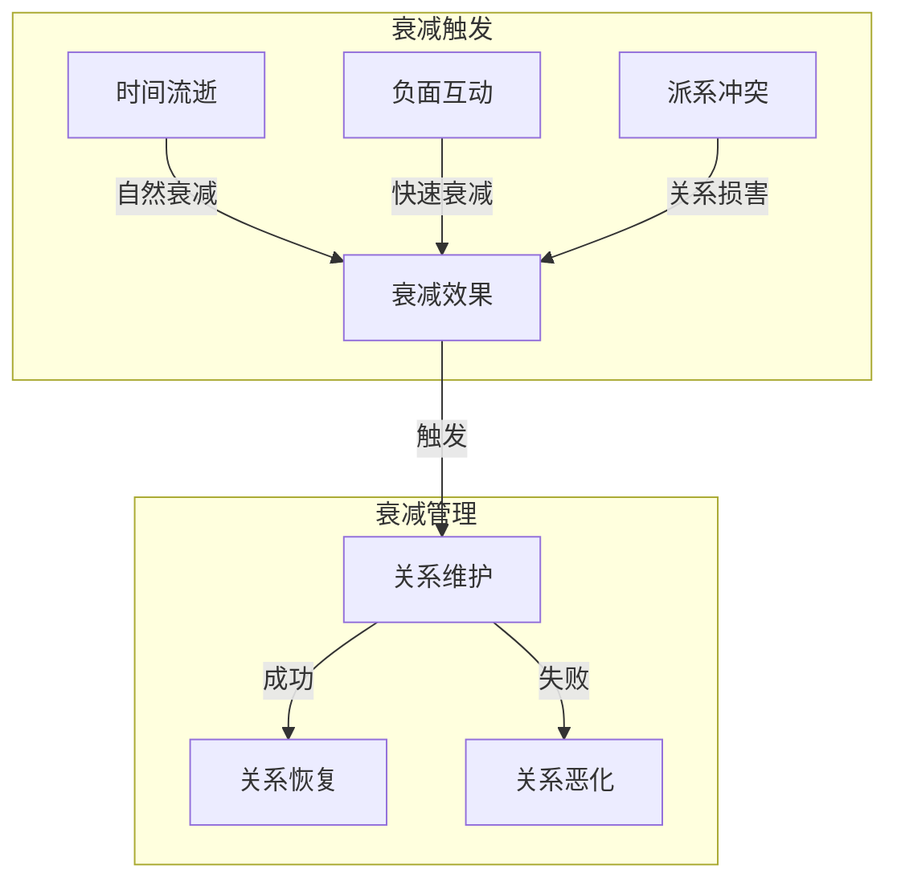
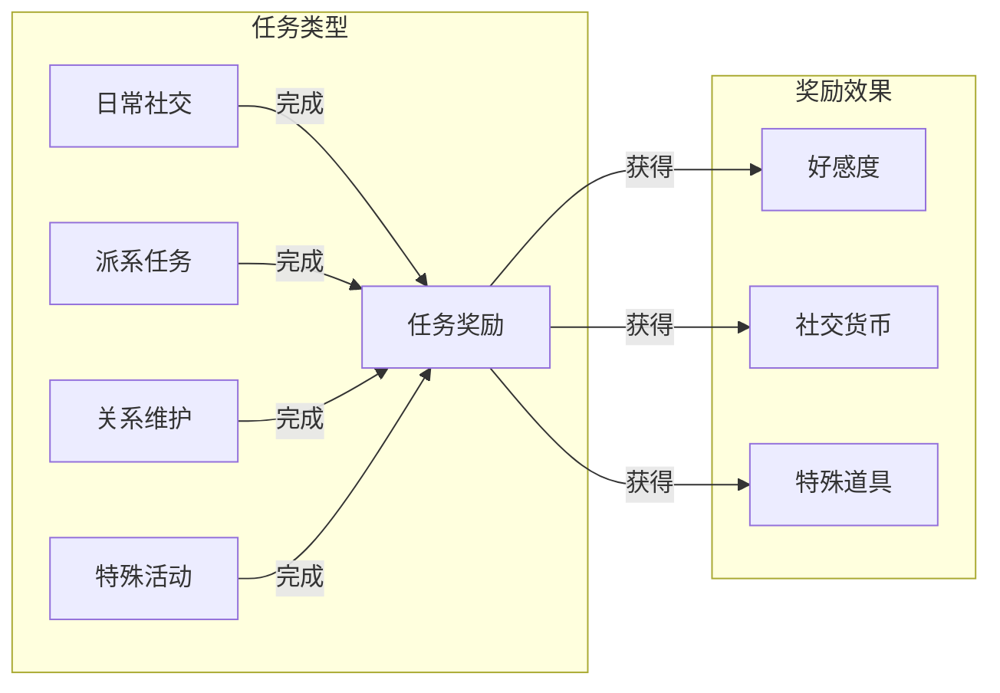

### 《水浒-fuk-u》社交关系网络流转图

---

#### 一、关系建立流程

#### 二、好感度系统

#### 三、社交资源流转

#### 四、派系关系网络

#### 五、社交影响力系统

#### 六、关系衰减系统

#### 七、社交任务系统

---

#### 八、系统要点说明

1. **关系建立**
   - 自然渐进的发展过程
   - 多样化的互动选择
   - 明确的进阶路径

2. **资源投入**
   - 时间成本
   - 物质投入
   - 精力消耗

3. **回报机制**
   - 直接利益
   - 长期收益
   - 特殊奖励

4. **平衡设计**
   - 投入产出比
   - 维护成本
   - 衰减机制
