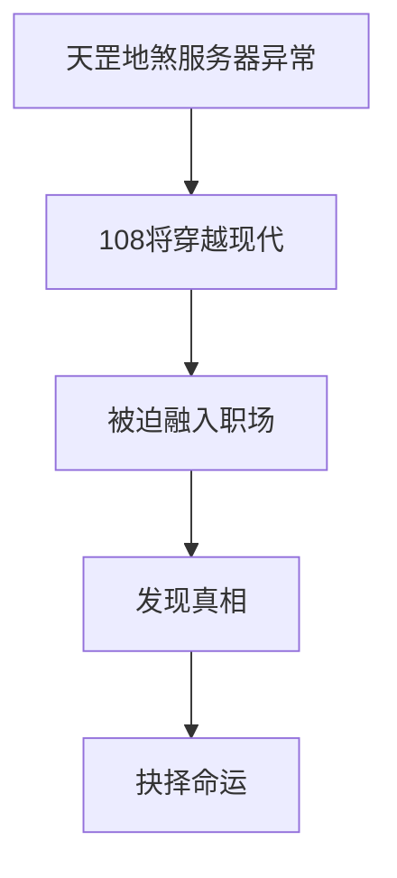
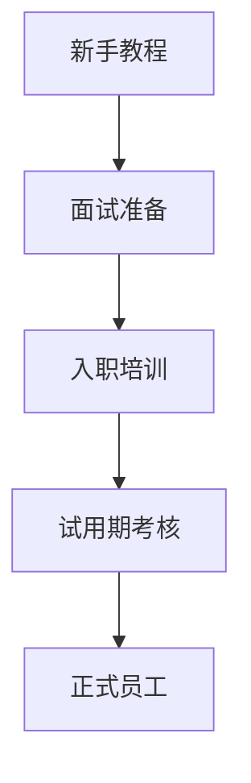
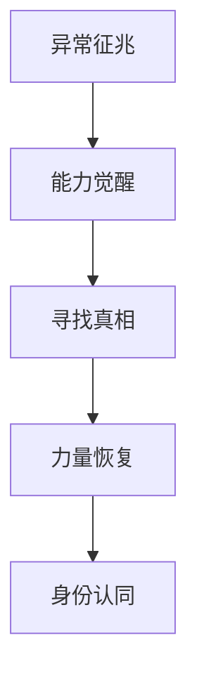
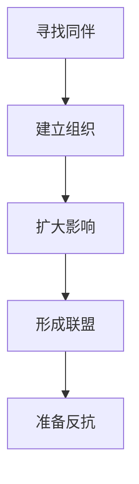
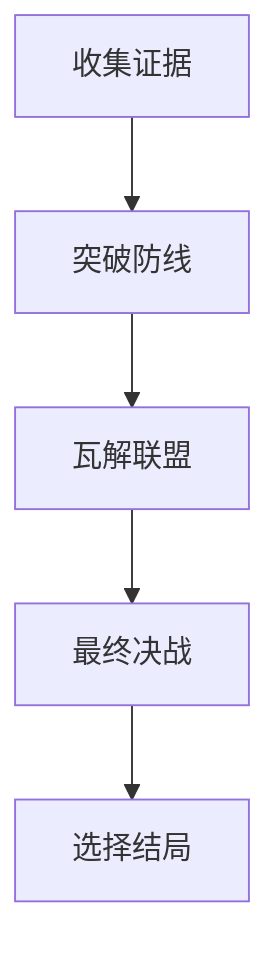
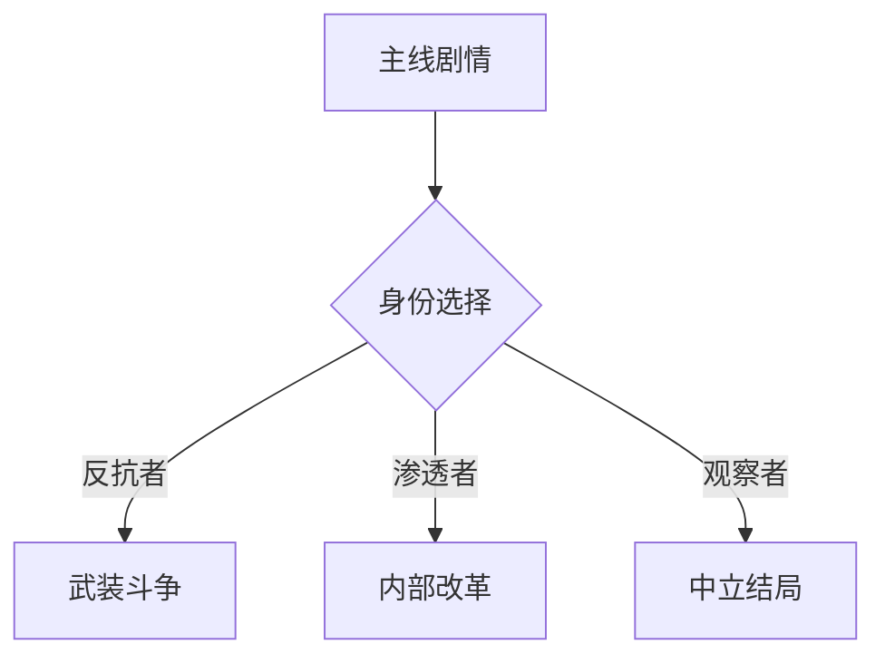
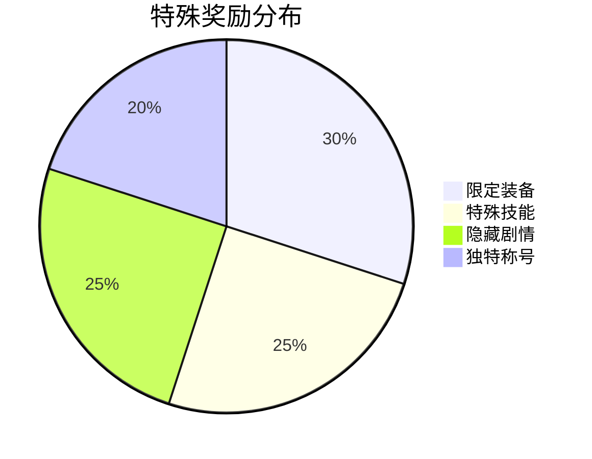

### 《水浒-fuk-u》主线任务系统设计文档

---

#### 一、主线剧情架构

**1.1 故事背景**

**1.2 主线分章结构**
| 章节 | 主题 | 核心剧情 | 时长预估 |
|------|------|----------|----------|
| 第一章：初入职场 | 适应现代生活 | 获得第一份工作 | 2-3小时 |
| 第二章：觉醒之路 | 能力觉醒 | 发现穿越真相 | 3-4小时 |
| 第三章：集结力量 | 寻找同伴 | 重聚108将 | 4-5小时 |
| 第四章：揭露阴谋 | 对抗资本 | 瓦解企业联盟 | 5-6小时 |

#### 二、第一章：初入职场

**2.1 主线任务链**

**2.2 关键任务节点**
| 任务名称 | 任务目标 | 奖励 | 解锁内容 |
|----------|----------|------|----------|
| 现代觉醒 | • 制作简历 • 学习现代技能 | • 基础工具 • 新手装备 | 求职系统 |
| 求职之路 | • 参加3次面试 • 通过背景审查 | • 工作机会 • 身份证明 | 公司地图 |
| 职场初体验 | • 完成入职流程 • 认识3名同事 | • 工资卡 • 基础技能 | 社交系统 |

#### 三、第二章：觉醒之路

**3.1 主线任务链**

**3.2 关键任务节点**
| 任务名称 | 任务目标 | 奖励 | 解锁内容 |
|----------|----------|------|----------|
| 记忆碎片 | • 收集古代记忆 • 触发能力觉醒 | • 传统武技 • 特殊道具 | 战斗系统 |
| 真相探索 | • 调查服务器 • 解密穿越原因 | • 核心情报 • 技能升级 | 调查系统 |
| 力量觉醒 | • 恢复战斗能力 • 适应现代形态 | • 觉醒形态 • 特殊技能 | 变身系统 |

#### 四、第三章：集结力量

**4.1 主线任务链**

**4.2 关键任务节点**
| 任务名称 | 任务目标 | 奖励 | 解锁内容 |
|----------|----------|------|----------|
| 英雄寻访 | • 找到5名好汉 • 建立联系网络 | • 团队技能 • 组织资源 | 工会系统 |
| 力量积累 | • 提升团队实力 • 获取关键资源 | • 团队装备 • 特殊道具 | 团队副本 |
| 组织扩张 | • 建立工会据点 • 发展外围势力 | • 地盘控制 • 经济来源 | 据点系统 |

#### 五、第四章：揭露阴谋

**5.1 主线任务链**

**5.2 关键任务节点**
| 任务名称 | 任务目标 | 奖励 | 解锁内容 |
|----------|----------|------|----------|
| 暗网调查 | • 入侵核心网络 • 获取关键证据 | • 绝密情报 • 黑客技能 | 黑客系统 |
| 内部渗透 | • 策反重要人物 • 破坏核心设施 | • 内部支援 • 特殊装备 | 策反系统 |
| 终极决战 | • 瓦解企业联盟 • 击败最终BOSS | • 结局选择 • 传说装备 | 结局分支 |

#### 六、分支剧情系统

**6.1 重要支线任务**
| 任务类型 | 触发条件 | 影响 | 可重复性 |
|----------|----------|------|----------|
| 角色剧情 | 好感度达标 | 解锁专属结局 | 否 |
| 派系任务 | 声望等级 | 影响势力分布 | 是 |
| 隐藏剧情 | 特殊条件 | 获得秘密结局 | 否 |

**6.2 剧情分支图**

#### 七、任务奖励系统

**7.1 基础奖励**
| 奖励类型 | 数值范围 | 获取难度 | 稀有度 |
|----------|----------|----------|---------|
| 经验值 | 1000-5000 | 低 | 普通 |
| 工分券 | 500-2000 | 中 | 普通 |
| 技能点 | 1-5 | 高 | 稀有 |
| 声望值 | 100-1000 | 中 | 普通 |

**7.2 特殊奖励**

#### 八、任务难度设计

**8.1 难度曲线**

**8.2 难度调节机制**
| 调节项 | 初始值 | 调整范围 | 影响因素 |
|--------|--------|----------|----------|
| 敌人等级 | 玩家等级-2 | ±5级 | 玩家战绩 |
| 时间限制 | 基准值*1.2 | ±30% | 装备等级 |
| 奖励倍率 | 1.0 | 0.8-1.5 | 难度选择 |

#### 九、数值平衡

**9.1 任务收益平衡**
| 任务难度 | 时间成本 | 基础收益 | 额外奖励概率 |
|----------|----------|----------|--------------|
| 简单 | 10-20分钟 | 100% | 10% |
| 普通 | 20-40分钟 | 150% | 25% |
| 困难 | 40-60分钟 | 200% | 50% |
| 极难 | 60分钟以上 | 300% | 100% |

**9.2 任务链收益**

#### 十、后续优化方向

1. 增加更多剧情分支选择
2. 优化任务难度曲线
3. 丰富任务奖励种类
4. 加强任务间的联动性
5. 完善主线剧情演出效果
