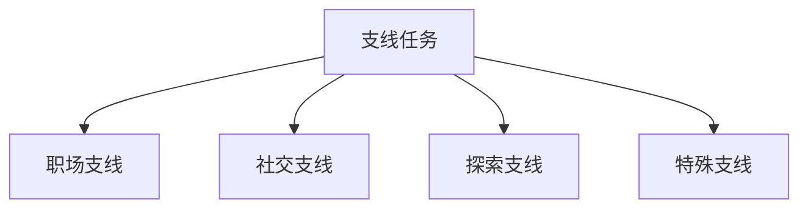
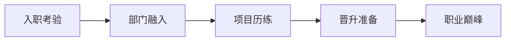
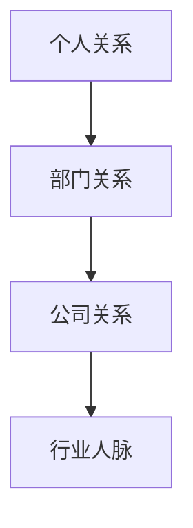
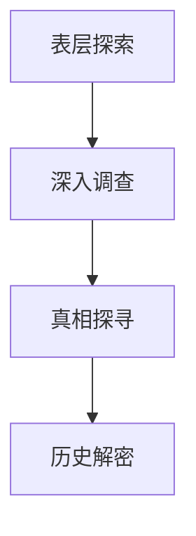
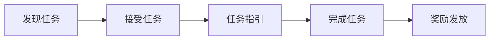
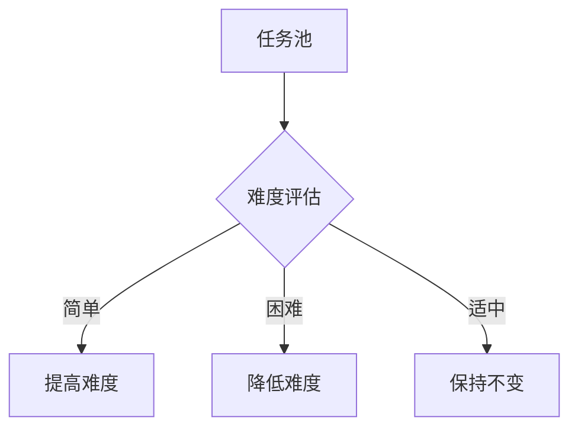
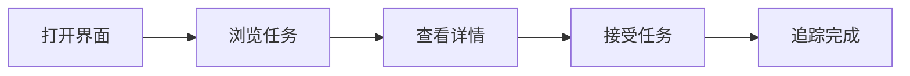

### 《水浒-fuk-u》支线任务系统设计文档

---

#### 一、系统概述

**1.1 系统定位**

**1.2 任务分类**
| 类型 | 特点 | 难度 | 重要性 |
|------|------|------|--------|
| 职场任务 | 职业发展 | 中等 | 重要 |
| 人际任务 | 关系维护 | 低 | 必要 |
| 隐藏任务 | 特殊奖励 | 高 | 可选 |
| 限时任务 | 时效性强 | 多变 | 推荐 |

#### 二、职场支线设计

**2.1 任务类型**
| 任务名称 | 触发条件 | 完成要求 | 奖励内容 |
|----------|----------|----------|----------|
| 部门历练 | 职级提升 | 完成指标 | 技能点+绩效 |
| 项目攻坚 | 主管委派 | 团队配合 | 声望+资源 |
| 办公室政治 | 人际矛盾 | 平衡处理 | 影响力+人脉 |
| 晋升挑战 | 达到条件 | 多重考验 | 职位+特权 |

**2.2 任务链设计**

#### 三、社交支线设计

**3.1 人际任务**
| 任务类型 | 目标 | 互动方式 | 成功条件 |
|----------|------|----------|----------|
| 关系建立 | 新人脉 | 日常交往 | 好感度>50 |
| 矛盾调解 | 化解冲突 | 谈判对话 | 双方满意 |
| 团队建设 | 凝聚力 | 集体活动 | 参与度>80% |
| 资源互换 | 利益交换 | 商业互助 | 双赢结果 |

**3.2 社交网络**

#### 四、探索支线设计

**4.1 探索任务**
| 区域 | 任务特点 | 发现内容 | 奖励类型 |
|------|----------|----------|----------|
| 办公区 | 日常探索 | 办公八卦 | 情报+道具 |
| 隐藏区域 | 秘密调查 | 公司黑幕 | 剧情+特殊物品 |
| 社交场所 | 人际观察 | 关系网络 | 人脉+信息 |
| 古代遗迹 | 时空探索 | 历史真相 | 技能+传承 |

**4.2 探索路线**

#### 五、特殊支线设计

**5.1 隐藏任务**
| 任务类型 | 触发条件 | 完成难度 | 特殊奖励 |
|----------|----------|----------|----------|
| 时空任务 | 特定时间点 | 极高 | 绝学传承 |
| 连环任务 | 特殊选择 | 高 | 限定装备 |
| 结局分支 | 关键决策 | 中等 | 特殊结局 |
| 彩蛋剧情 | 特殊操作 | 低 | 趣味内容 |

**5.2 限时任务**
| 类型 | 持续时间 | 失败惩罚 | 成功奖励 |
|------|----------|----------|----------|
| 紧急项目 | 24小时 | 绩效-10% | 双倍奖励 |
| 临时会议 | 1小时 | 信任-5 | 情报+人脉 |
| 危机处理 | 12小时 | 声望-20 | 晋升机会 |
| 特别活动 | 48小时 | 无 | 限定道具 |

#### 六、任务引导系统

**6.1 引导机制**
| 引导类型 | 表现形式 | 触发条件 | 辅助效果 |
|----------|----------|----------|----------|
| 新手引导 | 步骤提示 | 首次触发 | 详细说明 |
| 任务提醒 | 图标提示 | 可接任务 | 方向指引 |
| 进度追踪 | 实时更新 | 任务进行中 | 目标提示 |
| 完成回顾 | 总结展示 | 任务完成 | 经验总结 |

**6.2 引导流程**

#### 七、任务奖励设计

**7.1 奖励体系**
| 奖励类型 | 基础奖励 | 额外奖励 | 概率加成 |
|----------|----------|----------|----------|
| 经验值 | 100-1000 | 0-500 | 10% |
| 技能点 | 1-5 | 0-3 | 5% |
| 声望值 | 10-100 | 0-50 | 8% |
| 道具物品 | 普通道具 | 稀有道具 | 3% |

**7.2 任务难度与奖励**
| 难度 | 基础倍率 | 额外奖励 | 特殊道具 |
|------|----------|----------|----------|
| 简单 | 1.0 | 无 | 无 |
| 普通 | 1.5 | 小概率 | 普通 |
| 困难 | 2.0 | 中概率 | 稀有 |
| 专家 | 3.0 | 必得 | 传说 |

#### 八、任务动态系统

**8.1 触发机制**
| 触发类型 | 触发条件 | 刷新周期 | 优先级 |
|----------|----------|----------|--------|
| 定时触发 | 固定时间 | 每日/周 | 低 |
| 条件触发 | 达成条件 | 即时 | 中 |
| 事件触发 | 特殊事件 | 随机 | 高 |
| 剧情触发 | 剧情节点 | 一次性 | 最高 |

**8.2 动态调整**

#### 九、界面设计

**9.1 任务界面**
| 界面元素 | 功能 | 展示方式 | 交互设计 |
|----------|------|----------|----------|
| 任务列表 | 总览 | 分类展示 | 可筛选 |
| 任务详情 | 描述 | 弹窗展示 | 可查看 |
| 进度追踪 | 监控 | 进度条 | 可切换 |
| 奖励预览 | 激励 | 图标展示 | 可预览 |

**9.2 操作流程**

---

#### 十、后续优化方向

1. 增加更多支线任务类型
2. 优化任务触发机制
3. 完善奖励体系
4. 强化任务引导
5. 增加任务连携设计
