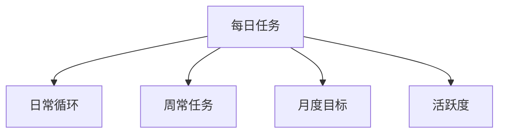
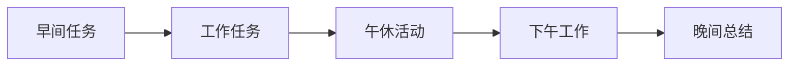
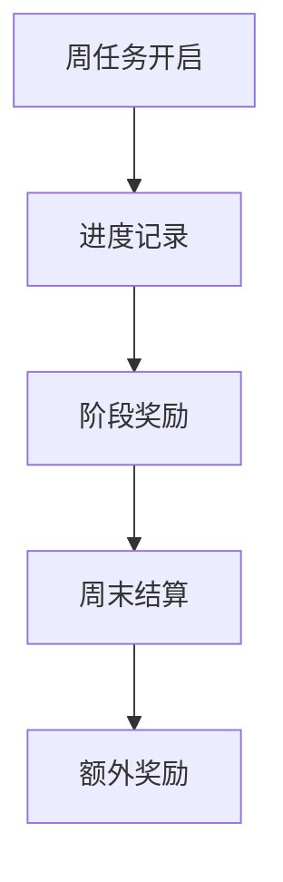
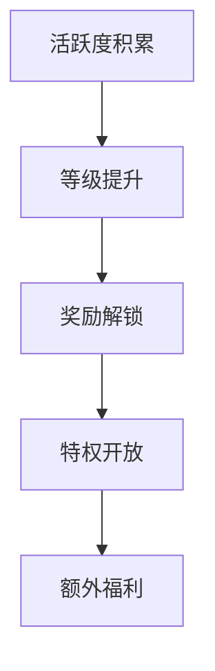
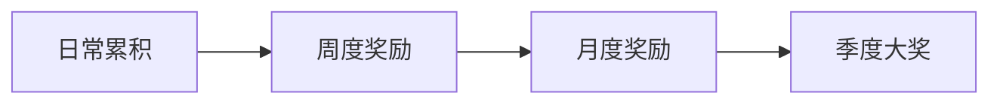
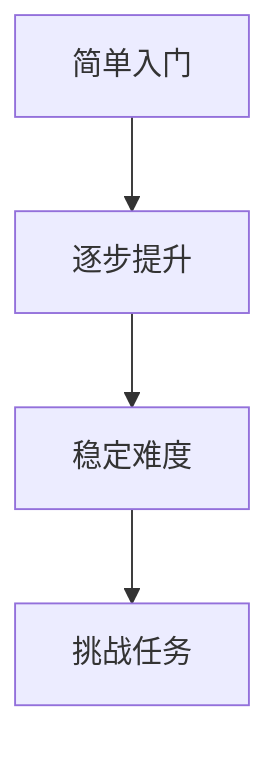
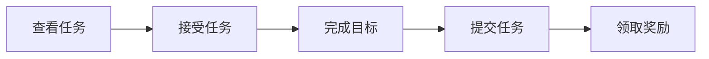

### 《水浒-fuk-u》每日任务系统设计文档

---

#### 一、系统概述

**1.1 系统定位**

**1.2 任务层级**
| 类型 | 刷新周期 | 奖励价值 | 完成难度 |
|------|----------|----------|----------|
| 日常任务 | 每日4点 | 基础 | 低 |
| 周常任务 | 每周一 | 中等 | 中 |
| 月度任务 | 每月1日 | 高级 | 高 |
| 特殊活动 | 不定期 | 极高 | 多样化 |

#### 二、日常循环设计

**2.1 基础任务**
| 任务类型 | 完成条件 | 奖励内容 | 时间投入 |
|----------|----------|----------|----------|
| 早会打卡 | 上班签到 | 精力值+20 | 5分钟 |
| 工作汇报 | 提交报告 | 绩效点+10 | 15分钟 |
| 部门协作 | 团队互动 | 团队贡献+5 | 30分钟 |
| 日常考核 | 完成指标 | 评分加成 | 持续性 |

**2.2 循环机制**

#### 三、周常任务设计

**3.1 任务类型**
| 分类 | 任务内容 | 完成次数 | 奖励等级 |
|------|----------|----------|----------|
| 职场任务 | 项目进度 | 3次/周 | A级 |
| 社交任务 | 人脉建设 | 5次/周 | B级 |
| 技能任务 | 能力提升 | 2次/周 | S级 |
| 团队任务 | 集体活动 | 1次/周 | SS级 |

**3.2 进度追踪**

#### 四、月度任务系统

**4.1 任务架构**
| 任务层级 | 要求 | 持续时间 | 奖励档位 |
|----------|------|----------|----------|
| 基础月任务 | 简单目标 | 30天 | 普通奖励 |
| 进阶月任务 | 中等目标 | 30天 | 稀有奖励 |
| 挑战月任务 | 困难目标 | 30天 | 史诗奖励 |
| 极限月任务 | 极限目标 | 30天 | 传说奖励 |

**4.2 完成机制**
| 目标类型 | 完成条件 | 失败惩罚 | 成功奖励 |
|----------|----------|----------|----------|
| 持续打卡 | 25天/月 | 无 | 基础奖励 |
| 业绩达标 | 指标达成 | 绩效-10% | 晋升机会 |
| 团队目标 | 集体达标 | 评级降低 | 团队奖金 |
| 个人成长 | 技能提升 | 无 | 特殊技能 |

#### 五、活跃度系统

**5.1 活跃度计算**
| 活动类型 | 活跃度 | 每日上限 | 额外奖励 |
|----------|--------|----------|----------|
| 基础任务 | 10点 | 100点 | 无 |
| 进阶任务 | 20点 | 200点 | 抽奖机会 |
| 团队任务 | 30点 | 300点 | 稀有道具 |
| 特殊任务 | 50点 | 500点 | 限定装扮 |

**5.2 奖励机制**

#### 六、奖励设计

**6.1 基础奖励**
| 任务等级 | 基础奖励 | 额外奖励 | 概率 |
|----------|----------|----------|------|
| D级任务 | 100金币 | 无 | - |
| C级任务 | 200金币 | 普通道具 | 10% |
| B级任务 | 500金币 | 稀有道具 | 5% |
| A级任务 | 1000金币 | 精英道具 | 3% |
| S级任务 | 2000金币 | 传说道具 | 1% |

**6.2 累积奖励**

#### 七、任务平衡

**7.1 时间投入**
| 任务类型 | 预计时间 | 最短完成 | 最长完成 |
|----------|----------|----------|----------|
| 快速任务 | 5分钟 | 3分钟 | 10分钟 |
| 日常任务 | 15分钟 | 10分钟 | 30分钟 |
| 周常任务 | 30分钟 | 20分钟 | 60分钟 |
| 月度任务 | 累计制 | 分段完成 | 弹性安排 |

**7.2 难度曲线**

#### 八、任务变体系统

**8.1 随机要素**
| 变体类型 | 触发概率 | 额外要求 | 特殊奖励 |
|----------|----------|----------|----------|
| 任务升级 | 10% | 难度+30% | 奖励×2 |
| 连环任务 | 5% | 追加目标 | 稀有道具 |
| 限时加急 | 15% | 时间压力 | 额外点数 |
| 特殊委托 | 3% | 特殊条件 | 独占奖励 |

**8.2 任务链**
| 环节 | 要求 | 完成奖励 | 失败影响 |
|------|------|----------|----------|
| 初始任务 | 基础目标 | 普通奖励 | 无 |
| 进阶任务 | 延伸目标 | 进阶奖励 | 终止链 |
| 终极任务 | 终极目标 | 稀有奖励 | 全部取消 |

#### 九、界面设计

**9.1 任务追踪**
| 界面元素 | 功能 | 显示位置 | 交互方式 |
|----------|------|----------|----------|
| 任务列表 | 总览 | 主界面 | 可展开 |
| 进度条 | 追踪 | 右侧栏 | 实时更新 |
| 奖励预览 | 激励 | 弹窗 | 可查看 |
| 完成提示 | 反馈 | 屏幕顶部 | 自动消失 |

**9.2 操作流程**

---

#### 十、后续优化方向

1. 增加任务类型多样性
2. 优化奖励发放机制
3. 完善任务链设计
4. 加强随机变体系统
5. 改进界面交互体验
