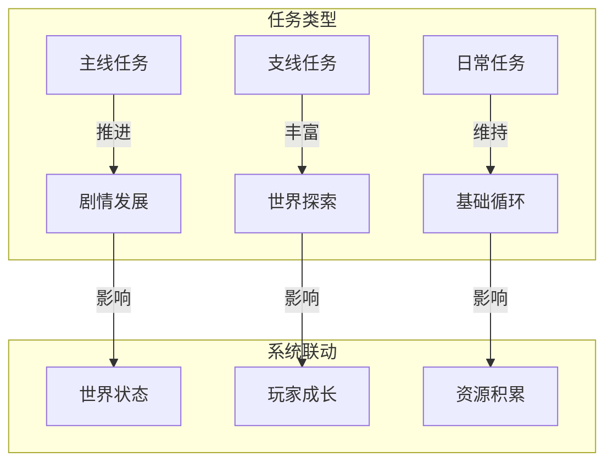
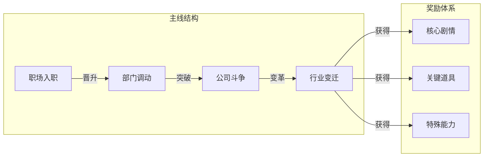
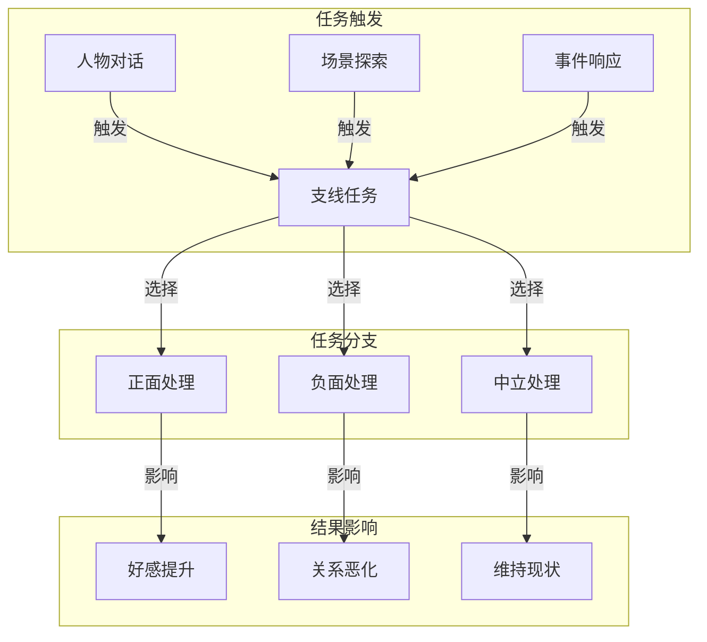
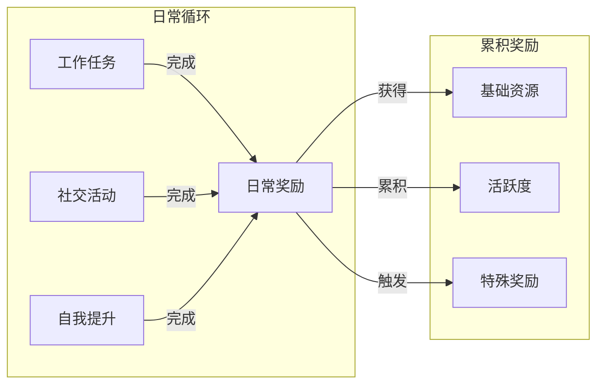
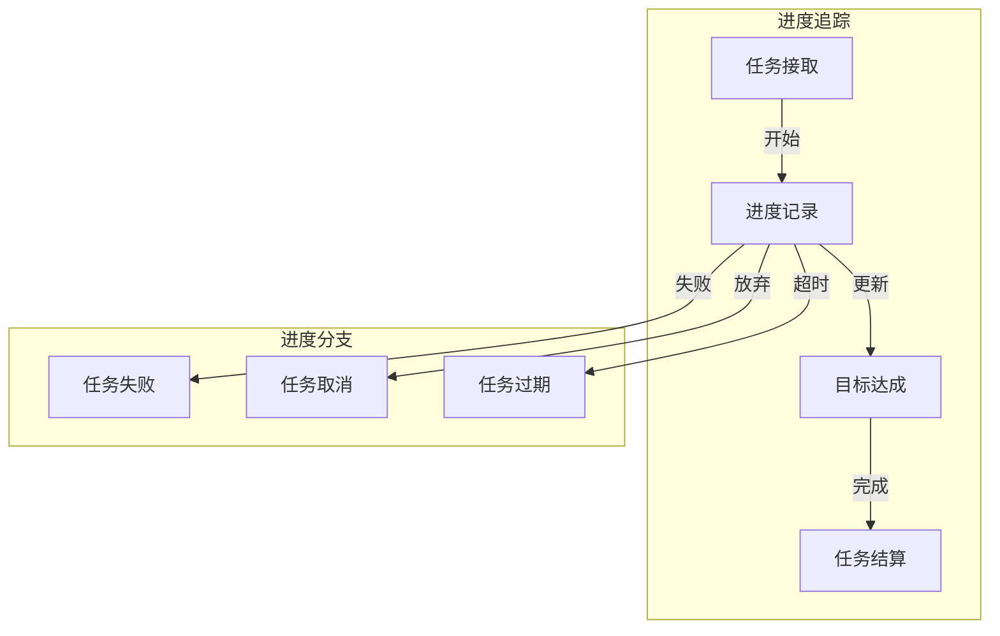
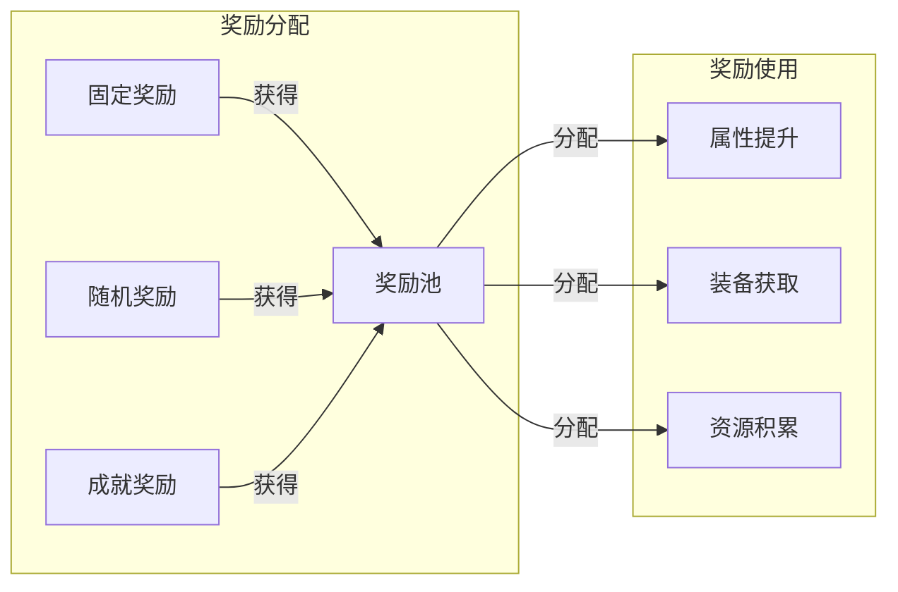
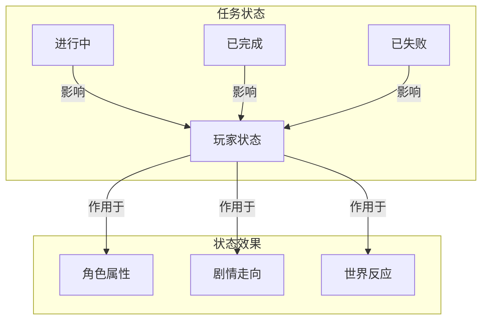

### 《水浒-fuk-u》任务系统流转图

---

#### 一、任务系统总览

#### 二、主线任务流转

#### 三、支线任务流转

#### 四、日常任务流转

#### 五、任务进度系统

#### 六、奖励系统流转

#### 七、状态影响系统

---

#### 八、系统要点说明

1. **任务分层**
   - 主线引导剧情发展
   - 支线丰富游戏内容
   - 日常维持基础循环

2. **奖励设计**
   - 层级分明
   - 循序渐进
   - 多样化

3. **难度曲线**
   - 平滑过渡
   - 适度挑战
   - 成就感

4. **任务联动**
   - 战斗系统联动
   - 社交系统联动
   - 职场系统联动

---

#### 九、平衡性考虑

1. **时间投入**
   - 主线：重要节点集中
   - 支线：自由探索
   - 日常：固定时长

2. **收益平衡**
   - 短期：日常任务
   - 中期：支线任务
   - 长期：主线任务

3. **难度设置**
   - 新手引导
   - 进阶挑战
   - 极限任务
