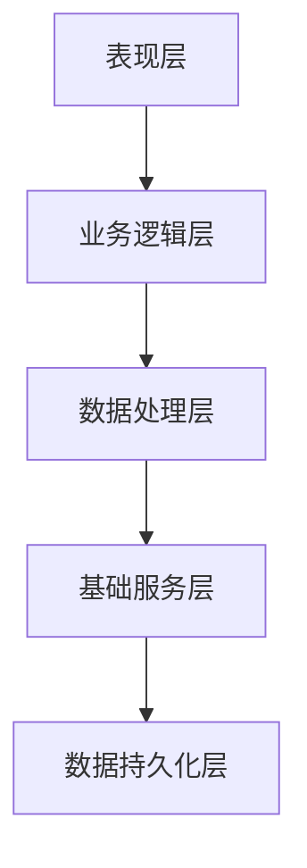
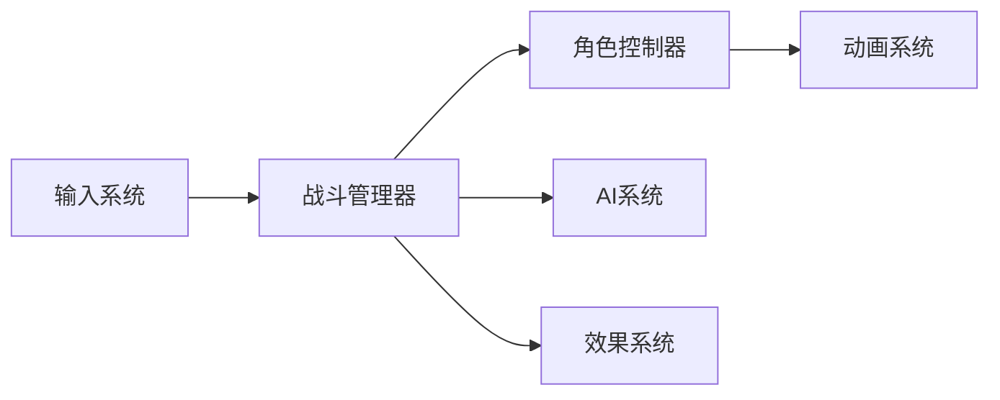
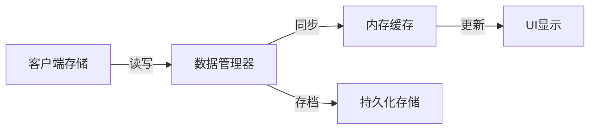
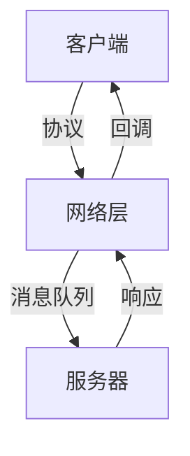
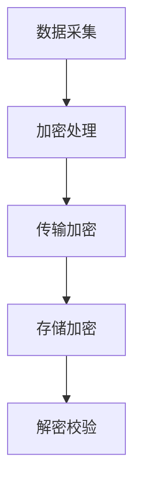

### 《水浒-fuk-u》技术架构设计文档

---

#### 一、整体架构设计

**1.1 架构层次图**


**1.2 核心模块组织**
| 模块名称 | 主要职责 | 关键组件 | 依赖关系 |
|----------|----------|----------|----------|
| UI框架 | 界面管理与交互 | • UI管理器<br>• 动画系统 | 业务逻辑层 |
| 战斗系统 | 战斗逻辑处理 | • 战斗管理器<br>• AI系统 | 数据处理层 |
| 任务系统 | 任务流程控制 | • 任务管理器<br>• 事件系统 | 数据处理层 |
| 社交系统 | 玩家互动管理 | • 社交管理器<br>• 关系系统 | 业务逻辑层 |

#### 二、核心系统实现

**2.1 战斗系统架构**


**2.2 关键系统说明**
| 系统名称 | 设计重点 | 实现方案 | 优化策略 |
|----------|----------|----------|----------|
| 战斗逻辑 | 回合制设计 | ECS架构 | 对象池 |
| AI行为树 | 企业BOSS AI | 行为树+机器学习 | 决策缓存 |
| 动画系统 | 动作融合 | 状态机 | 动画复用 |
| 效果系统 | 技能表现 | 时间轴控制 | 资源复用 |

#### 三、数据架构设计

**3.1 数据流转图**


**3.2 数据表设计**
| 数据类型 | 存储方式 | 更新机制 | 安全策略 |
|----------|----------|----------|----------|
| 角色数据 | 本地JSON | 实时存档 | 加密存储 |
| 任务进度 | 本地二进制 | 关键点存档 | 校验和 |
| 战斗数据 | 内存 | 实时同步 | - |
| 社交数据 | 本地JSON | 定期存档 | 加密存储 |

#### 四、性能优化方案

**4.1 资源管理优化**
- **对象池系统**：
  ```mermaid
  graph TD
  A[对象创建] --> B[对象池]
  B --> C[对象复用]
  C --> D[对象回收]
  D --> B
  ```

- **资源加载策略**：
  | 资源类型 | 加载方式 | 缓存策略 | 释放时机 |
  |----------|----------|----------|----------|
  | UI资源 | 异步加载 | LRU缓存 | 内存压力 |
  | 场景资源 | 分块加载 | 常驻内存 | 场景切换 |
  | 特效资源 | 动态加载 | 对象池 | 及时释放 |

**4.2 渲染优化**
| 优化项 | 实现方式 | 预期效果 | 成本评估 |
|--------|----------|----------|----------|
| Draw Call | 动态批处理 | 减少50% | 中 |
| 纹理内存 | 图集合并 | 节省30% | 低 |
| 粒子系统 | 粒子复用 | 提升40% | 中 |

#### 五、网络架构设计

**5.1 通信架构**


**5.2 协议设计**
| 协议类型 | 用途 | 加密方式 | 压缩策略 |
|----------|------|----------|----------|
| 战斗同步 | 实时数据 | 对称加密 | 增量同步 |
| 社交消息 | 玩家互动 | 非对称加密 | 完整同步 |
| 任务数据 | 进度同步 | 对称加密 | 定期同步 |

#### 六、安全性设计

**6.1 反作弊系统**
| 防护目标 | 实现方案 | 检测方式 | 处理策略 |
|----------|----------|----------|----------|
| 内存修改 | 数据校验 | 实时检测 | 强制退出 |
| 加速器 | 行为分析 | 统计检测 | 警告处理 |
| 脚本外挂 | 特征检测 | 定期扫描 | 账号封禁 |

**6.2 数据安全**


#### 七、跨平台适配

**7.1 平台支持**
| 平台 | 特殊处理 | 性能目标 | 适配重点 |
|------|----------|----------|----------|
| PC | DirectX11 | 60FPS | UI自适应 |
| Android | OpenGL ES | 30FPS | 性能优化 |
| iOS | Metal | 30FPS | 内存控制 |

**7.2 适配策略**


#### 八、开发工具链

**8.1 工具清单**
| 工具名称 | 用途 | 开发语言 | 使用阶段 |
|----------|------|----------|----------|
| 配置工具 | 数据配置 | Python | 开发期 |
| 调试工具 | 问题定位 | C# | 全阶段 |
| 测试工具 | 自动化测试 | Python | 测试期 |
| 构建工具 | 自动化构建 | Shell | 发布期 |

**8.2 开发流程**


#### 九、后续优化方向

1. 实现更高效的资源加载系统
2. 优化战斗系统的网络同步
3. 完善反作弊系统
4. 提升跨平台兼容性
5. 增强开发工具链
