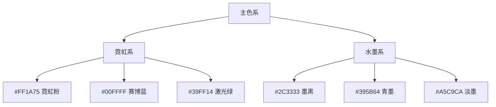
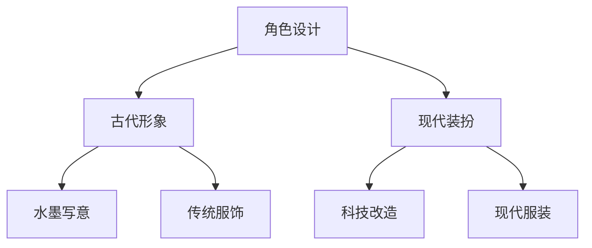
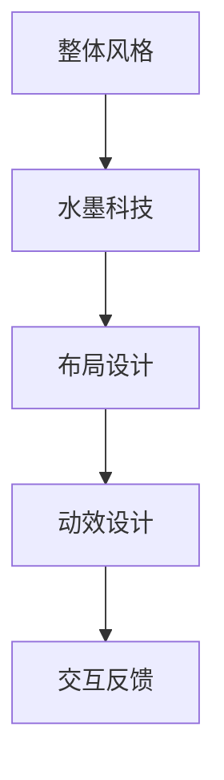

### 《水浒-fuk-u》美术风格规范文档

---

#### 一、整体艺术风格

**1.1 视觉风格定位**
- **核心理念**：古典水墨与现代科技的碰撞
- **艺术风格**：赛博朋克×中国传统水墨
- **色彩基调**：高饱和霓虹×水墨晕染

**1.2 参考案例分析**
| 参考作品 | 借鉴元素 | 创新方向 | 应用场景 |
|----------|----------|----------|----------|
| 赛博朋克2077 | 霓虹光效 | 加入国风元素 | 现代场景 |
| 水墨风手游 | 水墨肌理 | 融入科技感 | 古风场景 |
| 国风动画 | 传统纹样 | 现代重构 | 过场动画 |

#### 二、视觉元素规范

**2.1 配色方案**


**2.2 材质风格**
| 材质类型 | 视觉特征 | 适用场景 | 技术要求 |
|----------|----------|----------|----------|
| 科技材质 | 金属光泽/全息 | 现代场景 | PBR材质 |
| 水墨材质 | 渗透晕染 | 古风元素 | 特殊渲染 |
| 混合材质 | 科技水墨融合 | 过渡场景 | 双层渲染 |

#### 三、场景设计规范

**3.1 现代场景风格**
- **办公环境**：
  ```mermaid
  graph LR
  A[玻璃幕墙] --> B[霓虹装饰]
  B --> C[全息投影]
  C --> D[水墨装饰画]
  ```

- **科技元素**：
  | 元素 | 描述 | 视觉效果 | 应用场景 |
  |------|------|----------|----------|
  | 全息屏幕 | 半透明界面 | 水墨粒子 | 交互界面 |
  | 数据流 | 流动光效 | 墨迹流动 | 背景装饰 |
  | 投影光束 | 光线穿透 | 水墨光影 | 光源效果 |

**3.2 古风场景融合**
| 场景类型 | 古风元素 | 现代转化 | 视觉效果 |
|----------|----------|----------|----------|
| 茶水间 | 竹木家具 | 霓虹装饰 | 古今交融 |
| 会议室 | 水墨屏风 | 全息投影 | 科技水墨 |
| 训练场 | 武馆布置 | 现代器械 | 传统未来 |

#### 四、角色设计规范

**4.1 角色风格指南**


**4.2 主要角色设定**
| 角色 | 古代形象 | 现代装扮 | 特殊效果 |
|------|----------|----------|----------|
| 武松 | 虎纹劲装 | 机车夹克 | 霓虹虎纹 |
| 林冲 | 雪夜装束 | 西装套装 | 冰晶纹路 |
| 鲁智深 | 袈裟装扮 | 保安制服 | 佛光科技 |

#### 五、特效设计规范

**5.1 战斗特效**
- **技能效果**：
  | 效果类型 | 视觉表现 | 技术实现 | 性能优化 |
  |----------|----------|----------|----------|
  | 物理技能 | 水墨飞溅 | 粒子系统 | GPU加速 |
  | 科技技能 | 霓虹轨迹 | 预渲染 | LOD优化 |
  | 混合技能 | 墨染全息 | 双层混合 | 分级渲染 |

- **连招效果**：
  ```mermaid
  graph LR
  A[前摇] -->|水墨凝聚| B[主体]
  B -->|霓虹爆发| C[后摇]
  C -->|余韵消散| D[结束]
  ```

**5.2 环境特效**
| 效果类型 | 场景应用 | 实现方案 | 优化建议 |
|----------|----------|----------|----------|
| 烟雾 | 氛围营造 | 水墨渲染 | 距离雾化 |
| 光束 | 空间点缀 | 光线追踪 | 动态LOD |
| 粒子 | 装饰效果 | GPU粒子 | 数量限制 |

#### 六、UI设计规范

**6.1 界面风格**


**6.2 界面元素规范**
| 元素类型 | 设计风格 | 交互效果 | 技术要求 |
|----------|----------|----------|----------|
| 按钮 | 科技描边 | 水墨扩散 | 触摸反馈 |
| 图标 | 水墨轮廓 | 霓虹光效 | 矢量图形 |
| 框体 | 全息投影 | 水墨流动 | 边缘模糊 |

#### 七、动画规范

**7.1 角色动画**
- **基础动作**：
  | 动作类型 | 参考依据 | 现代改编 | 过渡处理 |
  |----------|----------|----------|----------|
  | 战斗动作 | 武术套路 | 街头格斗 | 自然融合 |
  | 日常动作 | 古代礼仪 | 职场动作 | 夸张变形 |
  | 特殊动作 | 绝技展示 | 科技特效 | 水墨拖尾 |

- **动画风格**：
  ```mermaid
  graph TD
  A[动画设计] --> B[写意表现]
  B --> C[科技融合]
  C --> D[视觉冲击]
  ```

#### 八、优化与输出规范

**8.1 资源规格**
| 资源类型 | 分辨率要求 | 格式规范 | 优化方向 |
|----------|------------|----------|----------|
| 角色模型 | 8K贴图 | FBX/Unity | LOD设置 |
| UI资源 | 2K贴图 | PNG/SVG | 图集优化 |
| 特效资源 | 1K贴图 | VFX Graph | 动态合批 |

**8.2 性能优化**


#### 九、后续优化方向

1. 增强水墨与科技的视觉融合
2. 优化特效性能表现
3. 丰富角色动画细节
4. 完善UI交互体验
5. 提升整体画面品质
