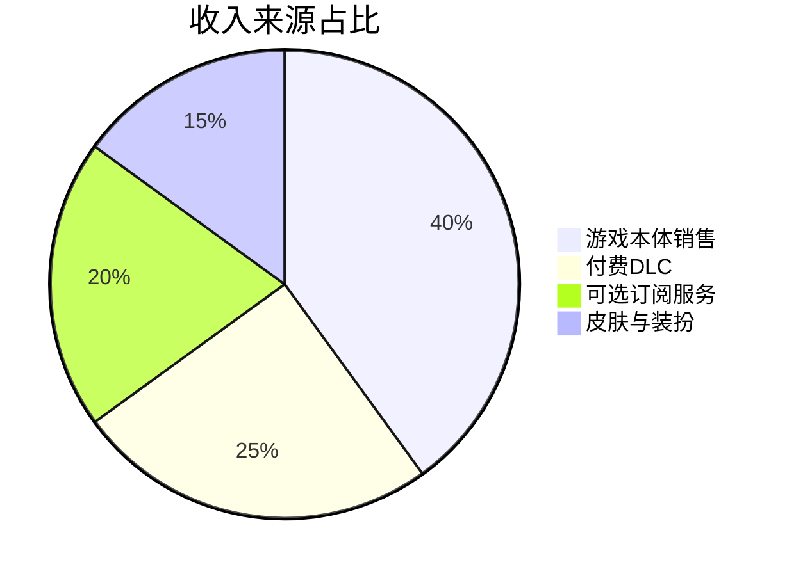
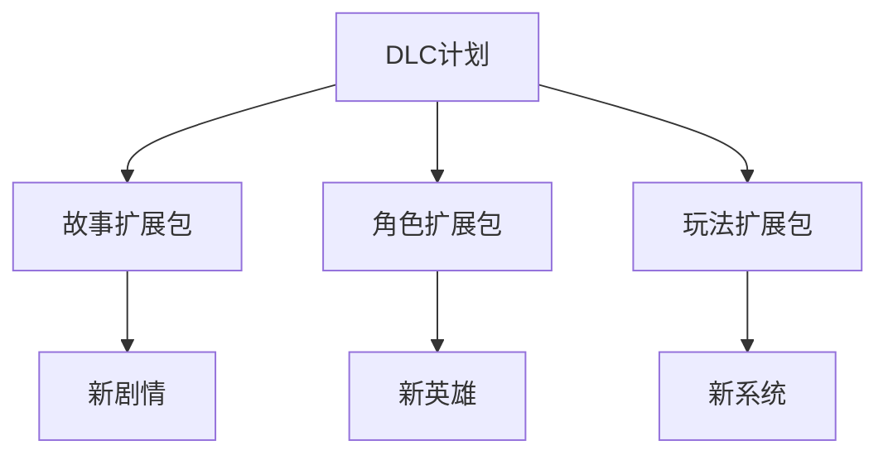
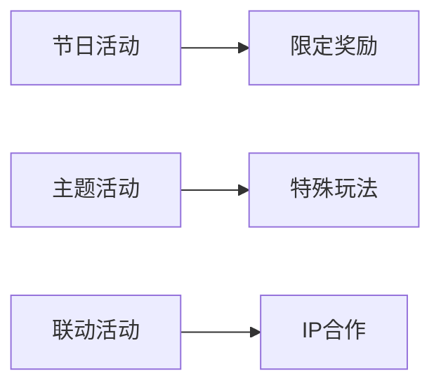
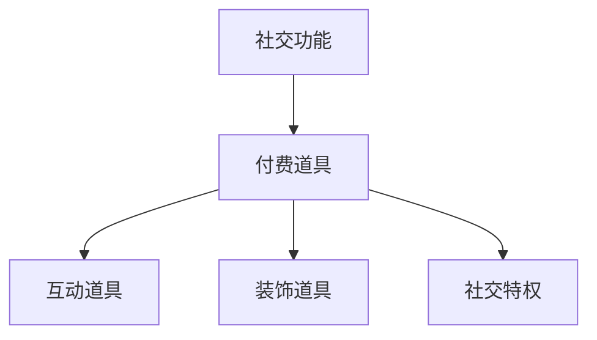
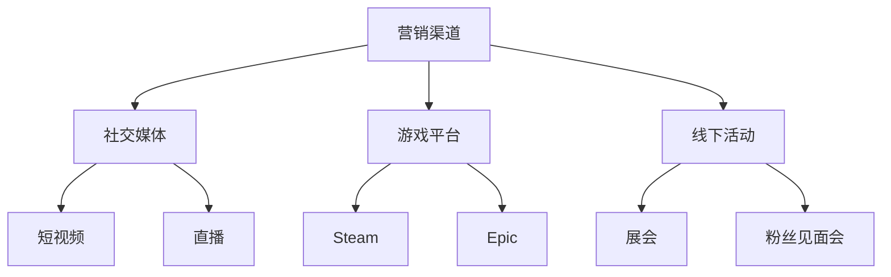
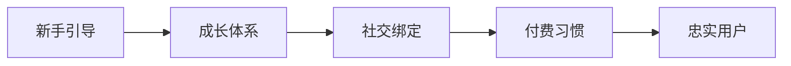
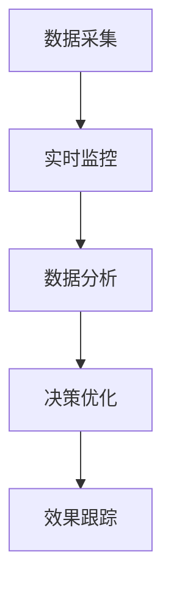

### 《水浒-fuk-u》商业化策略设计文档

---

#### 一、商业模式概述

**1.1 盈利模式设计**

**1.2 目标市场分析**
| 用户群体 | 占比 | 消费特征 | 营销策略 |
|----------|------|----------|----------|
| 职场人群 | 45% | 压力释放需求 | 共鸣营销 |
| 文化爱好者 | 30% | 文化认同感 | 传统致敬 |
| 游戏玩家 | 25% | 游戏体验 | 创新玩法 |

#### 二、价格策略

**2.1 基础定价**
| 版本 | 价格 | 内容 | 目标群体 |
|------|------|------|----------|
| 标准版 | ¥98 | 基础游戏 | 大众玩家 |
| 豪华版 | ¥158 | 含首发DLC | 核心玩家 |
| 收藏版 | ¥258 | 含全部DLC | 粉丝群体 |

**2.2 DLC规划**

#### 三、运营策略

**3.1 更新计划**
| 更新类型 | 周期 | 内容规模 | 盈利模式 |
|----------|------|----------|----------|
| 每周更新 | 7天 | 小型内容 | 免费 |
| 月度更新 | 30天 | 中型内容 | 部分收费 |
| 季度DLC | 90天 | 大型内容 | 付费 |

**3.2 活动系统**

#### 四、付费点设计

**4.1 基础付费项**
| 类别 | 价格区间 | 获取方式 | 稀有度 |
|------|----------|----------|---------|
| 角色皮肤 | ¥30-128 | 直购/抽取 | 普通-传说 |
| 特效装饰 | ¥15-68 | 直购 | 普通-稀有 |
| 语音包 | ¥12-38 | 直购 | 普通-限定 |

**4.2 高级付费项**
- **月卡福利**：
  | 等级 | 价格 | 主要权益 | 附加福利 |
  |------|------|----------|----------|
  | 基础月卡 | ¥30 | 每日资源 | 经验加成 |
  | 豪华月卡 | ¥68 | 专属道具 | VIP特权 |
  | 至尊月卡 | ¥128 | 限定皮肤 | 全套特权 |

#### 五、社交变现

**5.1 社交系统商业化**

**5.2 社交付费项**
| 功能 | 应用场景 | 价格策略 | 社交价值 |
|------|----------|----------|----------|
| 互动表情 | 日常交流 | ¥5-20 | 趣味性 |
| 特殊称号 | 身份展示 | ¥30-100 | 荣誉感 |
| 专属动作 | 社交互动 | ¥15-50 | 个性化 |

#### 六、营销推广

**6.1 推广策略**

**6.2 投放计划**
| 阶段 | 重点渠道 | 预算占比 | 预期效果 |
|------|----------|----------|----------|
| 预热期 | 社交媒体 | 30% | 话题热度 |
| 上线期 | 全平台 | 50% | 用户获取 |
| 维护期 | 精准投放 | 20% | 用户留存 |

#### 七、用户留存

**7.1 留存策略**

**7.2 用户路径**
| 阶段 | 关键举措 | 转化目标 | 留存手段 |
|------|----------|----------|----------|
| 新手期 | 优化体验 | 首充转化 | 新手礼包 |
| 成长期 | 社交建设 | 月卡购买 | 成长奖励 |
| 成熟期 | 深度内容 | 深度付费 | 专属特权 |

#### 八、数据分析

**8.1 核心指标**
| 指标 | 目标值 | 预警值 | 优化方向 |
|------|--------|--------|----------|
| DAU | 50万+ | <30万 | 活动激励 |
| 月流水 | 1000万+ | <500万 | 付费优化 |
| 留存率 | 30%+ | <20% | 内容更新 |

**8.2 监控体系**

#### 九、风险控制

**9.1 商业风险防控**
| 风险类型 | 防控措施 | 应急预案 | 责任部门 |
|----------|----------|----------|----------|
| 收入波动 | 多元变现 | 促销活动 | 商务组 |
| 用户流失 | 内容更新 | 回流活动 | 运营组 |
| 舆情危机 | 及时响应 | 危机公关 | PR组 |

#### 十、后续规划

1. 扩展商业化模式的多样性
2. 优化用户付费体验
3. 加强社交变现能力
4. 提升数据分析精准度
5. 完善风险控制体系
