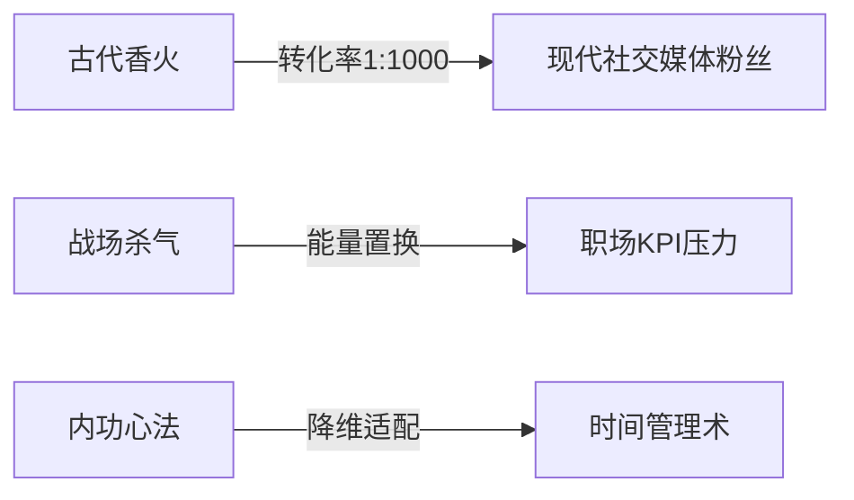
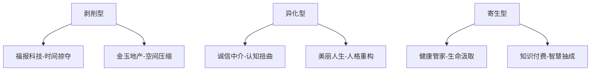
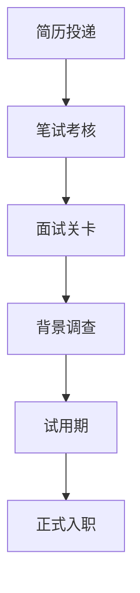

### 《水浒-fuk-u》世界观深化设计文档（完整逻辑链版）

---

#### **一、时空穿越核心逻辑体系**
**1.1 穿越机制科学解释**
- **触发源**：九天玄女宫开发的"天罡地煞管理系统"发生量子纠缠故障
- **穿越原理**：  
  英雄元神被转化为"星宿数据包"（.tianxing格式）  
  通过北宋年间的浑天仪虫洞传输至现代云计算中心  
- **锚定悖论**：  
  仅108将本体穿越，其历史记载被抹除  
  现代人记忆产生曼德拉效应（记得故事但认为虚构）

**1.2 能量守恒体系**


**1.3 时空管理局设定**
- **观测者组织**：锦衣卫第13代传人成立的"特别事务调查科"
- **核心矛盾**：  
  古代英雄需收集"存在证明"（社保/学历/征信记录）  
  企业联盟暗中篡改公民数据库进行"存在抹杀"

---

#### **二、社会结构重构方案**
**2.1 势力矩阵**
| 阵营        | 核心诉求                 | 标志建筑           | 典型角色改造案例         |
|-------------|--------------------------|--------------------|--------------------------|
| 反抗军      | 重建江湖道义             | 城中村武馆         | 鲁智深→工会谈判专家      |
| 企业联盟    | 维持资本异化体系         | 玻璃幕墙总部       | 高俅→人力资源总监        |
| 中立势力    | 利用穿越者谋利           | 网红直播基地       | 潘金莲→美妆带货主播      |
| 混沌势力    | 制造系统崩溃             | 暗网服务器群       | 方腊→黑客组织首领        |

**2.2 经济系统异化**
- **流通货币**：  
  阳间：经过加密的"工分券"（绑定钉钉打卡记录）  
  阴间：黑市流通的"阴德币"（通过职场陷害获取）
- **特殊交易**：  
  「林冲的委任状」：可抵销一次裁员危机  
  「武松的体检报告」：免疫35岁职场诅咒  

---

#### **三、黑心企业生态全解**
**3.1 企业类型谱系**


**3.2 典型企业运作机制**
**▎福报科技集团**  
- **核心科技**：  
  「大小周轮回系统」：每周随机重置时间感知  
  「OKR紧箍咒」：未达标者自动触发头痛DEBUFF  
- **Boss战机制**：  
  阶段1：强制进入"福报结界"（屏幕变黑白/操作延迟）  
  阶段2：召唤"福报尊者"分身（需同时击败7个钉钉图标）  
  阶段3：时间坍缩（倒计时速度提升300%）

**▎金玉地产**  
- **空间诡计**：  
  「公摊迷宫」：实际战斗区域仅为显示面积的29%  
  「期房幻境」：随机生成未完工建筑陷阱  
- **终极杀招**：  
  "资金链断裂"：所有角色持续掉血直至注入现金流  

---

#### **四、英雄现代生存法则**
**4.1 能力转化公式**
```
古代技能 = floor(现代适配度 × 行业系数 + 职场压力²)
示例：
张清飞石术 → 精准投放快递（物流业系数1.8）
戴宗神行法 → 外卖时效保障（服务业系数2.3）
```

**4.2 社会身份重构表**
| 古代身份   | 现代职业       | 技能改造案例                     | 隐藏属性       |
|------------|----------------|----------------------------------|----------------|
| 入云龙公孙胜 | 网络安全员     | 奇门遁甲→防火墙渗透              | 识破PUA话术    |
| 神医安道全   | 医保审核员     | 针灸术→找出病历漏洞              | 降低医疗支出   |
| 鼓上蚤时迁   | 商业间谍       | 轻功→避开监控系统                | 信息窃取成功率+25% |

---

#### **五、世界规则补完计划**
**5.1 三大基本法**
1. **存在守恒律**：  
   英雄现代活动消耗"存在力"，需通过签订劳动合同补充  
2. **技能降维律**：  
   超自然能力需包装为现代技术（例：内功→亚健康理疗）  
3. **因果缠绕律**：  
   过度使用古代技能会触发"历史反噬"（武松打虎→动保组织诉讼）

**5.2 特殊天气系统**
- **996暴雨**：  
  屏幕出现密集弹窗，非策略卡消耗加倍  
- **KPI沙尘暴**：  
  可见度降低，随机出现幻影目标  
- **融资寒冬**：  
  所有恢复类道具效果减半  

---

#### **六、核心矛盾推进逻辑**
**6.1 主线冲突链**


**6.2 暗线叙事矩阵**
- **企业联盟计划**："天罡地煞收割计划"（将英雄转化为AI训练数据）  
- **反抗军底牌**：破解《推背图》第45象"键盘侠破局谶"  
- **第三方势力**：自媒体集团暗中贩卖"英雄社死录像"  

---

#### **七、求职系统全解**
**7.1 求职流程全景图**


**7.2 关键数据指标**
- **简历匹配度**：受学历、技能、经验值影响
- **职场压力值**：动态变化，影响面试表现
- **人脉资源**：可通过支线任务积累

**7.3 求职阶段详解**
- **简历投递阶段**：
  ```mermaid
  pie
  title 简历评分权重
  "古代功绩转化" : 40
  "现代技能认证" : 30
  "人脉推荐信" : 20
  "简历包装度" : 10
  ```

- **笔试考核关卡**：
  | 类型       | 示例题目                         | 解题技巧                     |
  |------------|----------------------------------|------------------------------|
  | 行测题     | 计算鲁智深倒拔杨柳的力矩         | 使用"物理公式卡"             |
  | 性格测试   | 选择最符合你的动物（选项含老虎） | 武松需避免选择老虎           |
  | 专业题     | 设计梁山泊的KPI考核体系          | 使用"管理学知识卡"           |

- **面试关卡设计**：
  ```mermaid
  graph LR
  A[压力面试官] -->|连环追问| B[压力值+30]
  C[技术面试官] -->|专业深挖| D[技能匹配度检测]
  E[HR面试官] -->|薪资谈判| F[议价能力考验]
  ```

- **背景调查环节**：
  | 项目       | 古代记录影响               | 应对策略                     |
  |------------|----------------------------|------------------------------|
  | 征信记录   | 梁山泊是否上黑名单         | 使用"洗白卡"                 |
  | 学历认证   | 古代功名是否被承认         | 完成"学历转化任务"           |
  | 犯罪记录   | 是否被朝廷通缉             | 使用"特赦令"道具             |

- **试用期挑战**：
  ```mermaid
  pie
  title 试用期评分标准
  "KPI完成度" : 40
  "团队协作" : 25
  "创新能力" : 20
  "考勤记录" : 15
  ```

**7.4 求职系统特色玩法**
- **职业选择树**：
  ```mermaid
  graph TD
  A[求职方向] --> B[互联网]
  A --> C[金融]
  A --> D[房地产]
  B --> B1[程序员-武松]
  B --> B2[产品经理-吴用]
  C --> C1[基金经理-卢俊义]
  C --> C2[保险销售-燕青]
  D --> D1[中介-时迁]
  D --> D2[开发商-李逵]
  ```

- **求职技能培养**：
  ```
  古代技能 × 行业系数 + 现代认证 = 职场竞争力
  示例：
  林冲枪法 × 0.8（安保系数） + 保安证 = 高级保镖
  ```

- **求职道具系统**：
  | 道具名称       | 效果描述                     | 获取方式                     |
  |----------------|------------------------------|------------------------------|
  | 简历优化券     | 提升简历匹配度+20%           | 完成支线任务"拜访智联招聘"   |
  | 面试模拟器     | 提前体验面试场景             | 商城购买/任务奖励            |
  | 人脉扩展卡     | 增加内推机会                 | 参加"校友会"活动             |
  | 职场防护罩     | 免疫一次PUA攻击              | 完成"心理建设"课程           |

---

#### **八、伦理审查保护机制**
1. **隐喻转换系统**：  
   - 加班制度→"福报修炼体系"  
   - 裁员→"功德圆满毕业典礼"  
2. **因果律防护**：  
   - 所有现代企业采用虚构LOGO（福报科技→🐘象厂）  
   - 关键NPC使用星宿代号（高俅→天败星·资本形态）  

---

此世界观体系通过构建严密的科幻逻辑解释传统文化元素，将职场异化现象转化为可视化的游戏机制。每个设定都包含双向映射关系：古代江湖道义对应现代劳动权益，内功修为对应职业竞争力，派系斗争对应办公室政治，形成可供深度挖掘的叙事矿脉。