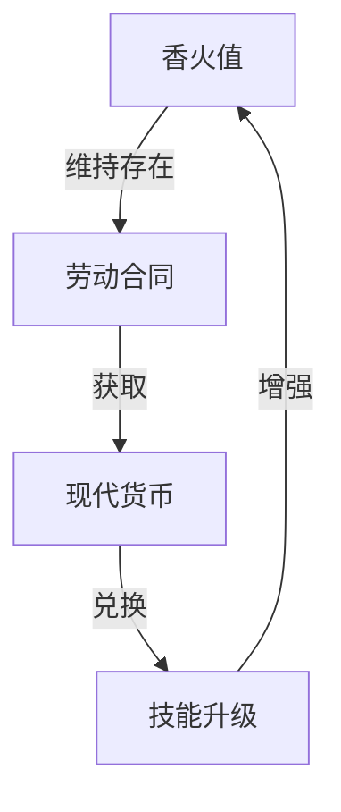
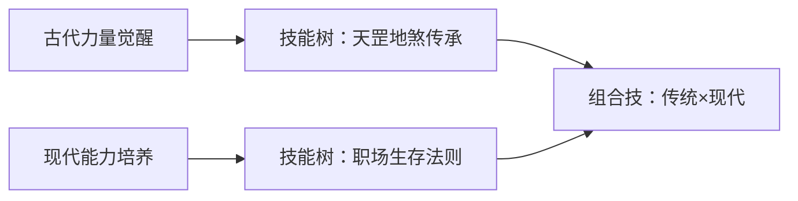
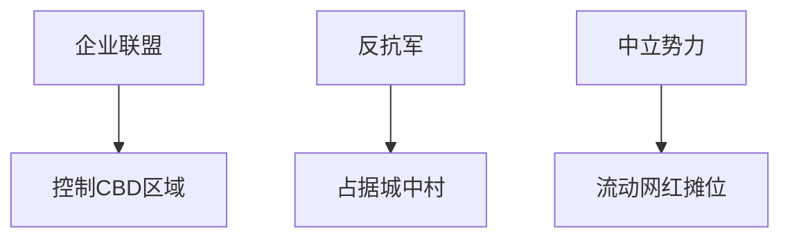
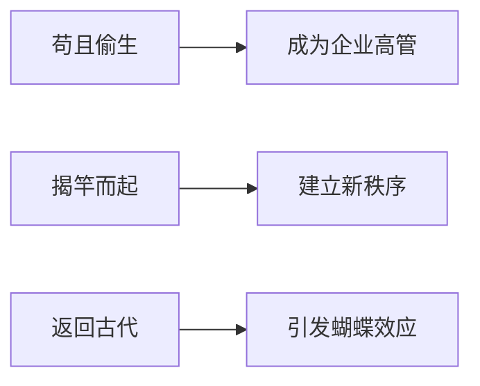

### 《水浒-fuk-u》核心玩法与成长体系全解（设定版）

---

#### **一、基础世界观运作机制（玩家视角版）**
**1.1 生存三要素**


**1.2 玩家行为闭环**
```
求职 → 入职 → 日常打工 → 企业挑战 → 团队组建 → 阵营战争 → 世界变革
```

---

#### **二、核心玩法流程详解**
**2.1 角色创建阶段**
- **英雄选择**：
  ```mermaid
  graph LR
  A[初始8选一] --> B[武松-外卖骑手]
  A --> C[林冲-网约车]
  A --> D[孙二娘-电子厂]
  A --> E[燕青-运营]
  A --> F[鲁智深-保安]
  A --> G[李逵-快递员]
  A --> H[史进-程序员]
  A --> I[武松-服务员]
  ```
- **关键参数**：
  - **香火槽**：随时间流逝减少（类似氧气机制）
  - **现代适应度**：影响技能转化效率
  - **职场压力**：动态变化影响战斗表现

**2.2 求职阶段（新手引导）**
- **简历构建小游戏**：
  ```mermaid
  pie
  title 简历要素配比
  "古代战功" : 40
  "现代证书" : 25
  "人脉背书" : 20
  "包装话术" : 15
  ```
- **笔试实战案例**：
  > 计算题："若鲁智深倒拔垂杨柳需3秒，求其外卖配送时速（需换算古代单位）"

**2.3 入职阶段（核心循环起点）**
- **每日工作流程**：
  1. 晨会（压力值+10）
  2. 处理OKR（消耗精力值）
  3. 茶水间社交（恢复压力）
  4. 突发事件处理（随机战斗）
  5. 下班打卡（结算奖励）

- **办公室生存法则**：
  - **摸鱼系统**：茶水间可触发隐藏剧情
  - **背锅机制**：随机转移其他NPC的KPI到玩家
  - **甩锅技能**：需要消耗"情商值"

**2.4 企业挑战（核心战斗）**
- **Boss战阶段示例（福报科技）**：
  | 阶段 | 机制描述                  | 破解策略                  |
  |------|---------------------------|---------------------------|
  | 1    | 强制996模式（时间压缩）   | 使用"劳动法卡"解除        |
  | 2    | OKR紧箍咒（持续掉血）     | 组合"效率提升+专注"卡组   |
  | 3    | 福报大自在（全屏AOE）     | 需3人团队配合打断施法     |

---

#### **三、成长体系深度解析**
**3.1 双重成长路线**


**3.2 具体成长模块**
- **卡牌升级系统**：
  ```mermaid
  graph LR
  A[工作表现] --> B[获得经验]
  B --> C[卡牌升级]
  C --> D[解锁星宿组合]
  D --> E[激活觉醒形态]
  ```

- **属性转化公式**：
  ```
  现代战斗力 = 
  (古代武力×0.3) + 
  (PPT技能×0.5) + 
  (法律知识×0.2) + 
  ln(粉丝数)×1.5
  ```

**3.3 特色成长事件**
- **35岁危机**：触发属性衰减，需完成"转职任务"
- **劳动仲裁**：败诉则丢失装备，胜诉解锁法律系技能
- **网红出道**：开通直播可转换香火值为打赏收益

---

#### **四、阵营对抗体系**
**4.1 势力分布地图**


**4.2 势力战争玩法**
- **日常争夺**：抢占共享单车停放点（资源点）
- **月度大战**：双11购物节数据争夺战
- **终极目标**：摧毁企业联盟的"福报服务器"

---

#### **五、社交系统设计**
**5.1 现代江湖关系网**
- **好友系统**：互点外卖可增加亲密度
- **仇敌系统**：抢车位触发PK模式
- **师徒系统**：老员工带新人有经验加成

**5.2 特殊交互事件**
- **工会组建**：需集齐5种职业的好汉
- **集体诉讼**：组队挑战劳动仲裁副本
- **直播带货**：可赚取额外香火值

---

#### **六、终极玩法说明**
**6.1 世界变革路线**


**6.2 多周目继承要素**
- 保留"现代知识"属性
- 解锁跨时代组合技
- 继承粉丝数和法律知识

---

### **设定理解关键点**
1. **生存压力可视化**：屏幕边缘会逐渐出现劳动合同倒计时
2. **能力冲突具象化**：使用古代技能时会出现系统报错弹窗
3. **成长反馈系统**：每提升现代技能会解锁对应古代记忆
4. **世界互动逻辑**：NPC对话包含现代黑话与水浒典故双关

此设定通过将职场生存法则游戏化，构建出"白天打工养号，晚上组团起义"的核心循环。玩家既能体验"武松送外卖超时暴走"的爽快战斗，也要面对"林冲修改劳动合同条款"的策略抉择，最终在黑色幽默中完成对现代职场生态的解构与重建。