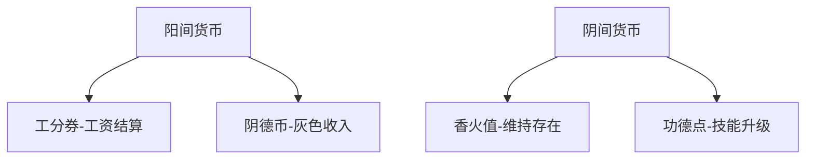
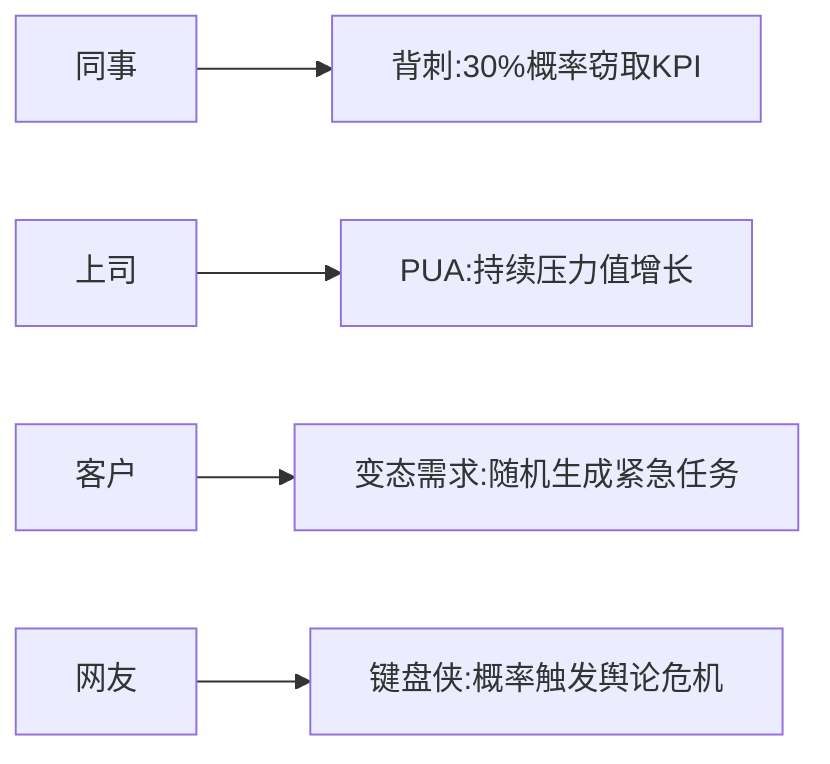
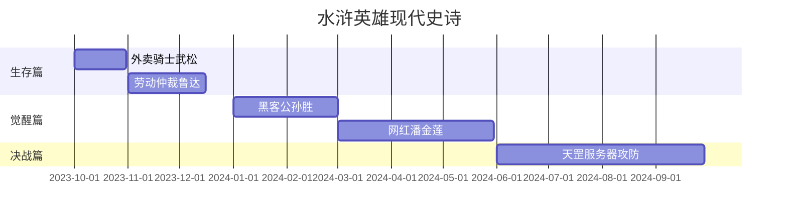
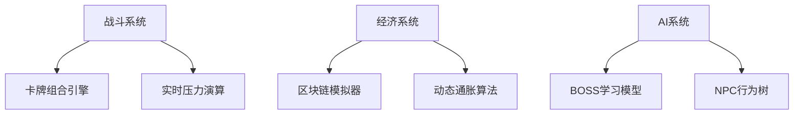
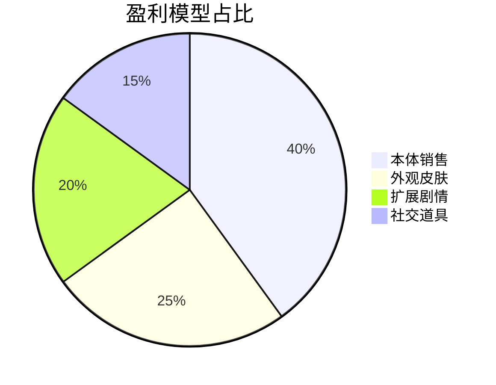

根据当前策划进度，建议优先完善以下六大核心模块：

---

### **一、经济系统深化设计**
#### 1.1 货币体系

#### 1.2 特殊经济事件
- **发薪日暴动**：每月15日开放限定副本，BOSS"财务总监"掉落双倍工资
- **股市波动**：实时影响企业挑战难度（牛市减益/熊市增益）
- **比特币挖矿**：时迁专属副业，消耗显卡耐久度换取加密币

---

### **二、社交系统扩展**
#### 2.1 现代江湖关系网

#### 2.2 特色社交玩法
- **茶水间政治**：
  - 选择咖啡种类影响派系关系（美式→实干派/奶茶→摸鱼党）
  - 偷听八卦概率获得企业弱点情报
- **钉钉战争**：
  - 争夺"已读未回"成就
  - 深夜消息轰炸触发精神攻击

---

### **三、剧情任务体系**
#### 3.1 主线任务结构

#### 3.2 支线任务类型
| 类型       | 案例                     | 奖励机制               |
|------------|--------------------------|------------------------|
| 黑色幽默   | 帮李逵考驾照             | 解锁"马路杀手"称号     |
| 时代碰撞   | 教吴用使用ChatGPT        | 获得AI预测能力         |
| 职场复仇   | 收集高俅违法证据         | 永久削弱企业联盟       |

---

### **四、技术实现方案**
#### 4.1 核心架构

#### 4.2 关键技术难点
- **时空悖论处理**：采用量子存档机制（平行宇宙自动备份）
- **技能冲突解决**：古代招式需通过AST抽象语法树转译
- **防作弊系统**：基于员工指纹考勤机原理设计

---

### **五、艺术风格定案**
#### 5.1 视觉设计规范
| 元素       | 古代特征                | 现代转化                |
|------------|-------------------------|-------------------------|
| 武器       | 青龙偃月刀              | 机械键盘（青轴特效）    |
| 坐骑       | 赤兔马                  | 共享单车（限量皮肤）    |
| 战甲       | 锁子甲                  | 防静电工服              |

#### 5.2 特效对照表
| 技能类型   | 传统表现                | 现代演绎                |
|------------|-------------------------|-------------------------|
| 火系       | 烈焰缠绕                | 电脑蓝屏死机特效        |
| 水系       | 波涛汹涌                | 咖啡泼洒慢动作          |
| 毒系       | 瘴气弥漫                | 微信群谣言传播动效      |

---

### **六、商业化策略**
#### 6.1 付费点设计

#### 6.2 特色增值服务
- **福报通行证**：解锁加班专属掉落
- **阴阳合同**：双角色共享进度（需法律知识≥Lv.5）
- **轮回转世**：角色重生服务（保留30%属性）

---

### **下一步建议**
1. 优先开发**压力值系统原型**，验证"996暴雨"等机制的实际表现
2. 制作**企业挑战DEMO**，测试福报科技BOSS战节奏
3. 开展**现代兵器设计大赛**，丰富武器皮肤库
4. 建立**数值平衡沙盘**，防止出现"劳动法碾压流"等破坏性玩法

需要重点注意的是：所有系统都需植入"职场生存"主题，例如升级动画要体现从实习生工牌到CEO门禁卡的演变，让每个模块都成为对现代社会的幽默解构。