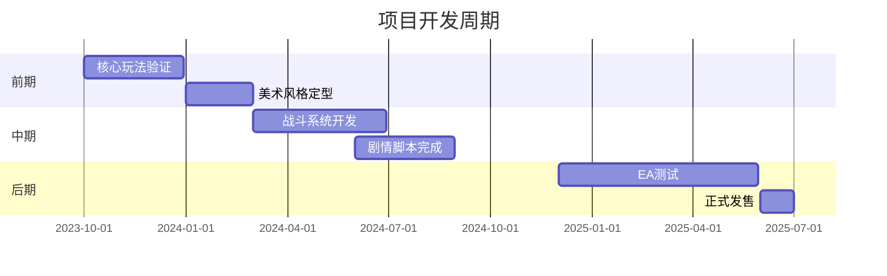

《水浒-fuk-u》游戏策划方案文档

一、立项概述
1.1 项目定位
- 类型：单机策略卡牌RPG（含轻度肉鸽元素）
- 平台：PC（Steam/Epic）优先，后续考虑移动端移植
- 受众：18-35岁策略游戏爱好者/职场人群/水浒文化爱好者
- 开发周期：24个月（含6个月EA测试）

二、世界观深化设计
2.1 时空穿越设定
- 触发事件：九天玄女实验性启动"天罡地煞服务器"导致时空错乱
- 世界规则：英雄能力需通过"香火值"（信仰值）维持，现代社会香火稀缺
- 阵营划分：
  • 反抗军（玩家阵营）：鲁智深（工会主席）、林冲（法务顾问）、孙二娘（HR主管）
  • 企业联盟：高俅转世（商业联合会会长）、蔡京转世（金融大鳄）

2.2 黑心企业图鉴
- 福报科技集团（互联网）：996福报系统/OKR暴政/大小周轮回
- 金玉地产（房地产）：公摊面积陷阱/期房幻境/资金链黑洞
- 诚信中介（服务业）：阴阳合同迷阵/押金吞噬者/信息差牢笼

三、核心系统设计
3.1 卡牌战斗系统（CTB战斗模式）
- 基础规则：
  • 时间槽制战斗（Time Slot Battle）
  • 卡牌消耗"精力值"（受角色属性影响）
  • 连携系统：108星宿组合技（如天魁+地煞触发特殊效果）

- 卡牌分类：
  ```mermaid
  graph TD
  A[技能卡] --> B[武技卡-物理输出]
  A --> C[法术卡-精神干扰]
  A --> D[策略卡-环境改造]
  A --> E[特殊卡-星宿联动]
  ```

3.2 职场模拟系统
- 压力值系统：
  • 动态压力条影响角色暴击率/失误概率
  • 解压方式：天台抽烟（临时减压）、茶水间摸鱼（持续恢复）

- 办公室政治：
  • 派系站队影响任务难度
  • 茶水间传闻触发隐藏事件

3.3 角色养成体系
- 现代适应性培养：
  ```mermaid
  pie
  title 能力转化系统
  "武力值" : 35
  "PPT制作" : 25
  "情商管理" : 20
  "法律知识" : 15
  "网络用语" : 5
  ```

- 觉醒系统：
  • 古代记忆复苏触发形态转换（例：林冲"八十万禁军教头"形态）

四、关卡设计模板
4.1 标准企业关卡结构
1. 应聘试炼（卡牌教学关）
2. 新人期（基础机制解锁）
3. 项目攻坚（Boss战预演）
4. 年终考核（肉鸽式随机事件）
5. 终极对决（企业Boss战）

4.2 特色Boss设计示例
- Boss名称："福报尊者"马道长
- 阶段技能：
  1. 福报金身（减伤99%，需破解三段弱点）
  2. 大小周轮回（时间流速改变）
  3. 终极奥义·福报大自在（全屏AOE）

五、商业化设计
5.1 付费模式
- 基础版：68元
- DLC计划：
  • 星宿扩展包（新增36天罡形态）
  • 职场皮肤包（西装配袈裟等）
  • 语音包（方言版/现代语版）

5.2 社区运营
- MOD工坊：支持玩家自制企业关卡
- 每周挑战：现实职场事件同步更新（如"金三银四求职季"特别活动）

六、艺术风格
6.1 视觉设计
- 角色造型：赛博水浒风（机械念珠/电子禅杖）
- UI设计：钉钉式办公界面（进度条伪装成OKR看板）

6.2 音效设计
- BGM融合：
  • 传统乐器（琵琶、筚篥）x 电子音乐
  • 环境音效：键盘声混搭兵器交击声

七、叙事设计
7.1 主线剧情架构
- 三幕式结构：
  1. 生存适应：外卖骑手武松vs算法系统
  2. 觉醒抗争：组建工会对抗企业联盟
  3. 终极抉择：返回古代/改造现代

7.2 支线任务示例
- 鲁智深的劳动仲裁：
  • 收集证据链（考勤记录/邮件截图）
  • 法庭辩论QTE玩法

- 时迁的比特币大盗：
  • 区块链迷宫解谜
  • 与网警的攻防战

八、技术方案
8.1 核心框架
- 战斗系统：基于Unity ECS架构开发
- AI系统：企业BOSS采用行为树+机器学习动态调整

8.2 数据安全
- 防破解设计：关键逻辑放在服务器验证
- 存档机制：区块链分布式存储（需消耗"香火值"）

九、市场策略
9.1 预热计划
- 话题营销：#如果水浒好汉来我司打工#
- KOL联动：邀请职场类UP主试玩

9.2 发行节奏
- 早期测试：DEMO登陆Next Fest
- 正式发售：定档金三银四求职季

十、开发里程碑


十一、风险控制
- 文化审查：建立多重隐喻保护机制
- 数值平衡：采用动态难度调节算法
- 内容储备：预埋20%可扩展内容

结语：
本方案通过将传统文化符号与当代社会议题有机结合，构建出具有现实批判性的游戏世界。在玩法层面，策略卡牌与职场模拟的创新融合，配合特色美术表现，有望在策略游戏红海中开辟新赛道。后续需重点打磨核心循环的成瘾性与叙事深度，使玩家在解压娱乐中产生情感共鸣。