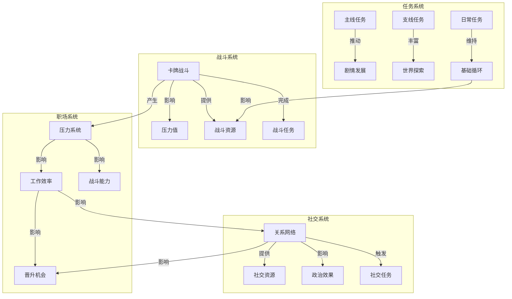
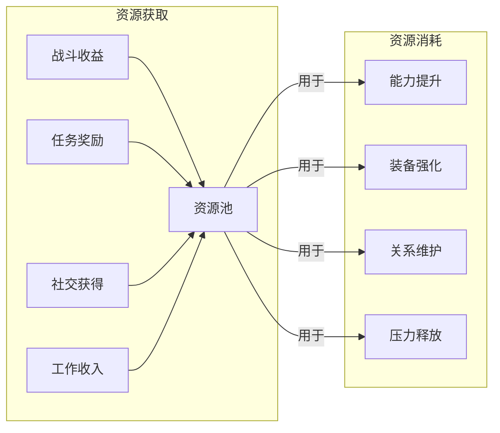
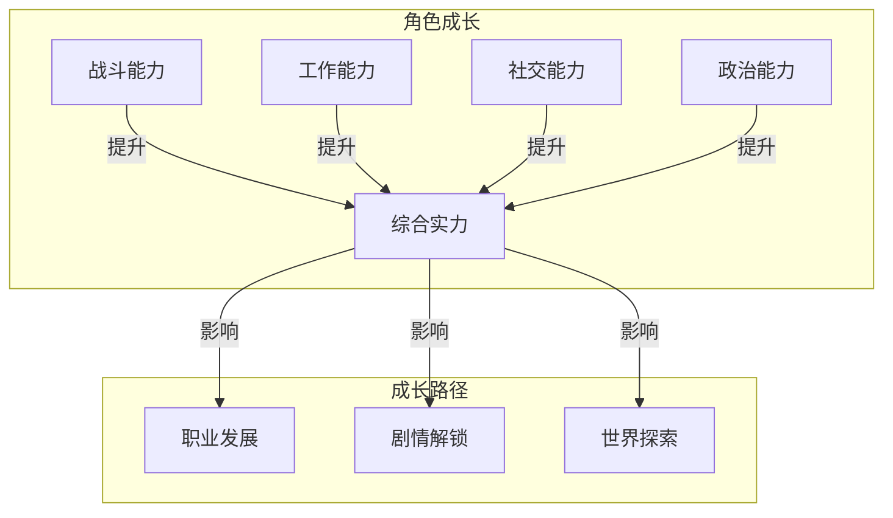
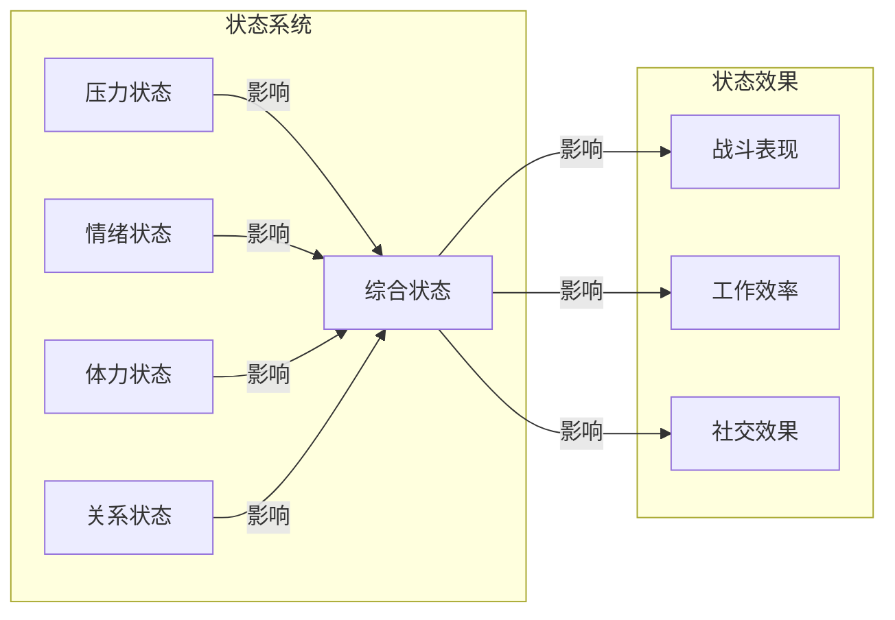
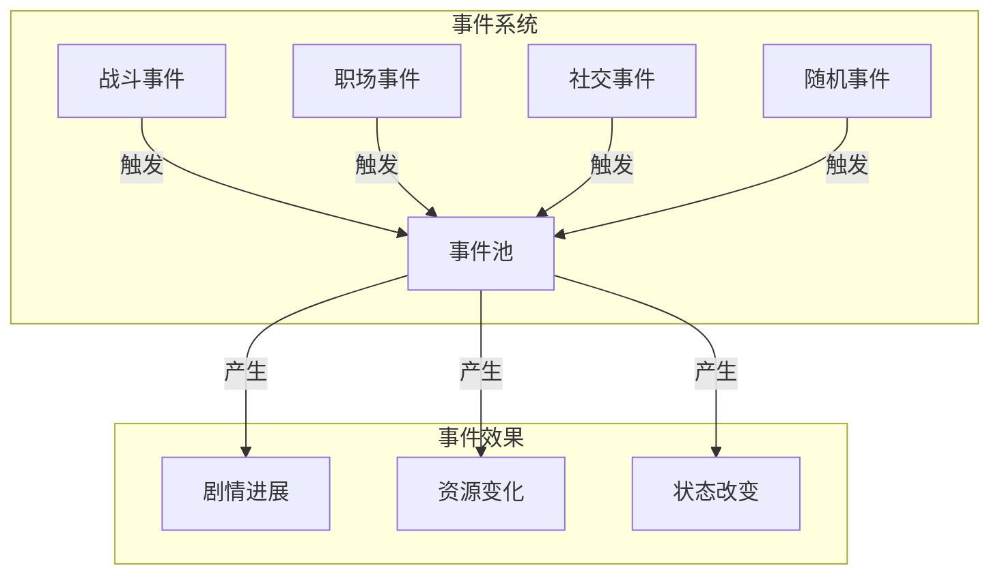

### 《水浒-fuk-u》系统联动总览图

---

#### 一、核心系统关系

#### 二、资源流转关系

#### 三、成长系统关联

#### 四、状态影响关系

#### 五、事件触发关系

---

#### 六、系统联动特点

1. **循环促进**
   - 战斗-压力循环
   - 社交-政治循环
   - 任务-资源循环

2. **多维成长**
   - 能力复合提升
   - 资源多向流转
   - 状态综合影响

3. **系统制衡**
   - 压力与收益平衡
   - 投入与产出平衡
   - 风险与回报平衡

4. **玩法互补**
   - 战斗提供刺激
   - 社交提供交互
   - 职场提供目标
   - 任务提供引导

---

#### 七、优化方向

1. **系统联动**
   - 加强系统间互动深度
   - 优化资源流转效率
   - 平衡各系统重要性

2. **玩家体验**
   - 简化复杂操作流程
   - 提供清晰反馈机制
   - 保持游戏节奏流畅

3. **内容扩展**
   - 增加系统交互方式
   - 丰富事件触发类型
   - 完善成长路线设计
